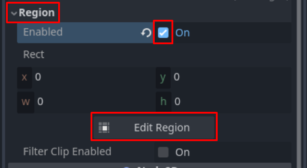
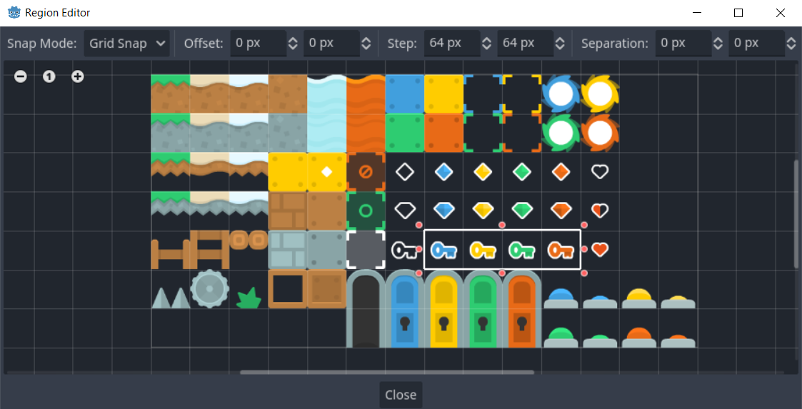
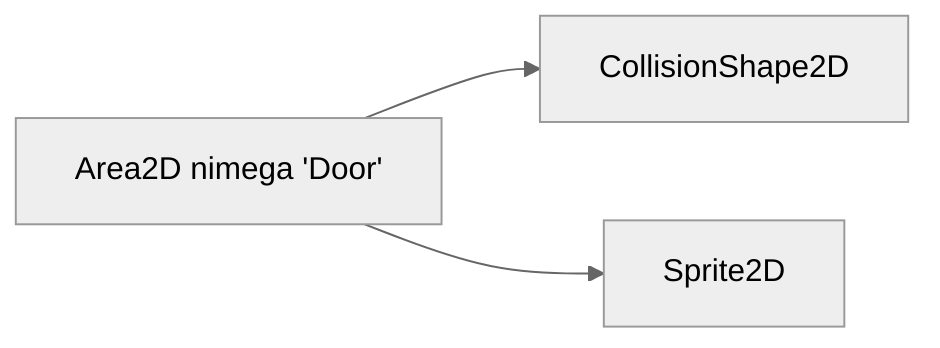
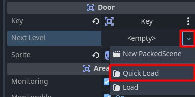
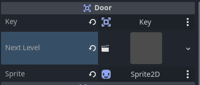

# Uksed, võtmed

Selles osas loome uksed, mis on lukus ja võtmed, mis nad lahti teevad.

## Võti

Alustame tegelikult võtme loomisega. Loo uus stseen ja tee juursõlmeks `Area2D` nimega `Key`. Area2D sõlm esindab mingit ala, millega saab küll kokku puutuda, aga teiste kehadega see kokku ei põrka. Area2D on ka klassi CollisionObject2D järglane, seega ka talle on vaja juurde lisada CollisionShape2D sõlm. Määra kujundiks ristkülik (`Shape -> RectangleShape2D`) ja tema suuruseks 64 x 64 pikslit. Loo ka `Sprite2D` sõlm, mille `texture` omaduse väärtuseks paned taas `platformPack_tilesheet.png`. Esineb probleem: terve see spraidileht on päris mahukas. Tahame vaid kasutada võtmete tekstuure, aga seal on lisaks kümneid teisi.

Probleemi lahendamiseks saame määrata, et Sprite2D kasutab ainult kindlat regiooni/ala sellest pildist. Leia inspektorist sektsioon `Region` ja vajuta selle all olevale `enabled` linnukesele. Paar asja ilmuvad juurde. Seda ala, mida Sprite2D kasutab, saaks lihtsalt arve kirjutades määrata, aga sedasi on päris tülikas. Vajuta hoopis nupule `Edit Region`.



Regiooni redaktor avaneb uues aknas.
Tee kindlaks järgnevad asjad:
-   Snap Mode väärtus on `Grid Snap`
-   Step väärtus on 64 x 64 pikslit

Seejärel saad hiirt kasutades regiooni piirjooni (paks valge joon) liigutada. Tee nii, et regioonis oleks vaid võtmete tekstuurid.



Võid nüüd regiooni redaktori akna sulgeda ja inspektoris leida `Animation -> Hframes` omadus. Pane selle väärtuseks 4 (eri värvi võtmete arv). Nüüd saad samas sektsioonis `frame` omadust muutes võtme värvi vahetada.

Loo uus skript nimega `Key.gd`, mis on ühendatud samanimelise sõlme külge.
Selle skripti puhul on oluline, et märgistaksime ta uue klassina võtmesõnaga `class_name`. Sedasi kindlustame, et hiljem ukse skripti kirjutades on lihtsam ukse võtmega tegeleda.
Lisaks loome signaali nimega `key_collected`, mida levitatakse siis, kui mängija saab võtme kätte.

Skripti algus võiks siis selline olla:

```gdscript
class_name Key 
extends Area2D

signal key_collected
```

### Ülesanne

Ühenda läbi koodi Area2D signaal `body_entered` skriptiga. Loo see ühendus Node klassi sisseehitatud funktsioonis `_enter_tree`. Signaalile reageerivas funktsioonis võiks edasi levitada `key_collected` signaali.

Lahendus oleks selline:

```gdscript
func _enter_tree() -> void:
	body_entered.connect(key_touched)

func key_touched(by: Node2D) -> void:
	key_collected.emit()
```

### Skriptis animatsiooni loomine

Lisame veel meie loodud `key_touched` funktsioonile läbi koodi ühe animatsiooni. Teeme nii, et kui võti kätte saadakse, siis see vaikselt haihtub ehk muutub läbipaistvaks.
Selleks for-tsüklit kasutada ei saa, kuna see toimuks kõik ühel kaadril. Oleks võimalik kasutada `_process` funktsiooni, aga kui mitut omadust on ühel sõlmel vaja animeerida, siis nende jaoks tingimuslauseid jm kirjutada läheb tülikaks.

Saame hoopis kasutada *tween* funktsionaalsust. Godot 3. versioonis oli see eraldi sõlm, aga 4. versioonis saab neid otse läbi koodi luua.

`var tween: Tween = create_tween()`

Tweenil kasutame praegu kahte funktsiooni: `tween_property` ja `tween_callback`. `tween_property`'ga määradki, mis omadusi animeerida tahad ja kuidas. `tween_callback`'iga määratud funktsioon kutsutakse välja, kui kõik animatsioonid on lõppenud.

Tahame muuta `modulate` omadust. See on põhimõtteliselt värvifilter, mis on sõlmele juurde lisatud. Kui muudame selle värvifiltri läbipaistvaks, siis sõlm haihtub.
Peale haihtumist tahame kustutada võtme sõlme, kuna see on kõik oma ülesanded ära täitnud. Selleks kasutame `queue_free` funktsiooni.

`key_touched` funktsioon on siis lõpuks selline:
```gdscript
func key_touched(by: Node2D) -> void:
	key_collected.emit()
	var tween: Tween = create_tween()
	tween.tween_property(
		self,               # mis objekti animeeritakse
		"modulate",         # millist objekti omadust muudetakse
		Color.TRANSPARENT,  # milline on selle omaduse lõppväärtus
		0.5                 # kui kiiresti animatsioon toimub
	)
	tween.tween_callback(queue_free)
```

Võtme sõlm ja klass on nüüd valmis! Võime edasi liikuda ust looma.

## Uks

Ukse stseen on samamoodi üles ehitatud, nagu võtme oma:



CollisionShape2D suuruseks läheb seekord 64 x 128 pikslit, sest uks on tavalistest tekstuuridest 2 korda pikem.

Ukse spraitide jaoks pead jälle regiooni määrama, aga seekord peavad kõik 5 ukse tekstuuri seal olema, sest uks läheb lahti, kui võti kätte saadakse.


Horisontaalseid tekstuure on seekord 5, seega `hframes` väärtuseks läheb 5.

Nüüd on aeg ukse skript luua, loomulikult nimega `Door.gd`.

### Ülesanne

Loo samasugune klass, nagu võtmele lõid, nimega `Door`.
Uksel on vaja teada järgnevaid asju:

-	võtme sõlm (Key)
-	spraidi sõlm (Sprite2D)
-	kas uks on avatud

Tee nii, et kui võti saadakse kätte, siis uks avaneb ka visuaalselt.

Lahendus oleks selline:
```gdscript
class_name Door
extends Area2D

@export var key: Key
@export var sprite: Sprite2D

var is_open: bool = false

func _enter_tree():
	key.key_collected.connect(key_collected)

func key_collected() -> void:
	is_open = true
	sprite.frame = 0
```

Lisaks on vaja reageerida sellele, kui mängu tegelane ust puutub. Kui võti on kätte saadud ja tegelane puutub ust, siis muudetakse stseen järgmise mängu taseme peale. Seda saab teha koodireaga `get_tree().change_scene_to_packed(scene)`, kus `scene` on `PackedScene`-tüüpi muutuja. Tee kindlaks ka, et järgmine tase on üldse olemas ja kui pole, kasuta juba tuttavat `print` käsku, et sellest teavitada.

Lõplik ukse skript peaks selline välja nägema:
```gdscript
class_name Door
extends Area2D

@export var key: Key # meie loodud võtme klass
@export var next_level: PackedScene # järgmine tase

@export var sprite: Sprite2D

var is_open: bool = false

func _enter_tree(): # signaalide ühendamine
	key.key_collected.connect(key_collected)
	body_entered.connect(door_entered)

func key_collected() -> void:
	is_open = true
	sprite.frame = 0 # uks avaneb

func door_entered(by: Node2D) -> void:
	if (not is_open): # uks pole avatud veel
		return
	if (next_level != null): # järgmine tase eksisteerib
		get_tree().change_scene_to_packed(next_level)
		return
	print("Järgmist taset pole")
```

Nüüd liigu mängu stseeni ja lisa sinna nüüd uks ja võti. Uksel peab ära määrama tema eksport-muutujate väärtused. Uue taseme võid ka luua, kuhu pead taas lisama vähemalt mängija ja maapinna. Kui uus tase on loodud, siis saad selle eksport-muutuja väärtuseks määrata `Quick Load` nupust.



Kui järgmine tase on valitud, peaks inspektoris umbes selline eelvaade ilmuma:


See projekt on nüüd peaaegu valmis, aga teised inimesed ei taha ju sinu mängu käivitada läbi Godot redaktori. Järgmisena õpime Godot projekti eksportima, et (näiteks) Windowsi kasutaja saaks käivitada hoopis .exe failist mängu!