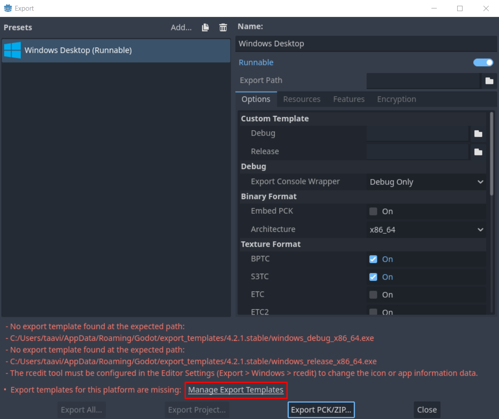

# Eksportimine

Et oma loodud mängu/rakendust levitada, peab selle eksportima käivitatavaks failiks. Windows operatsioonisüsteemi puhul oleks selleks *.exe* faili loomine.

Oma projekti eksportima saad suunduda valides redaktori ülemisel ribal `Project -> Export...`. Avaneb aken, kus täpsustad saad valida ja hallata eri platvormide konfiguratsioone, kuhu oma mängu eksportida saad.

## Windowsile eksportimine

Kuna kursuse autor kasutab Windows 10 operatsioonisüsteemi, on siin vaid dokumenteeritud W10 platvormile mängu eksportimine.

Kliki `Add... -> Windows Desktop`. Akna alumises osas on välja toodud paar veateadet, mis lühidalt tähendavad, et Godot ei tea, kuidas sinu projekti eksportida ilma mallideta. Need mallid on õnneks võimalik lihtsalt alla laadida. Veateadete lõpus on klikitav link `Manage Export Templates`. Vajuta sellele.

Lingile klikkimise järel avaneb taas üks aken, kus pead lihtsalt vajutama nupule `Download and Install`. Eksportimise mallide allalaadimine võib pisut aega võtta, seega kogu minut-paar kannatust.

Kui allalaadimine on valmis, võid selle akna sulgeda ja taas eksportimise aknasse suunduda. Praegu me enamat eksportimisel ei pea juurde tegema. Vajuta `Export Project` nupule, vali kuhu kausta mängu fail luuakse ja vajuta `Save`. Kuna meie projekt on päris väikse mahuga, siis eksportimine ei peaks üldse kaua võtma. Godot teeb selle ära, aga kaasneb paar hoiatusteadet, mis mainivad `rcedit` tööriista puudumist (Windowsile spetsiifiline tööriist .exe failide haldamiseks). Sulge see teadete aken ja nüüd peaks seal kaustas, kuhu mängu eksportisid, uus .exe fail olema!

Saad selle avada ja sulgeda nagu tavalist Windowsi programmi. Kui käivitad mängu, avaneb see sinu määratud põhistseenis. Veidi lihvitumas mängus oleks põhistseeniks siis määratud näiteks selle avamenüü.

Palju õnne! Oled loonud 2D mängu prototüübi ja isegi valmis meisterdanud .exe faili, mida saad teistega vabalt jagada!