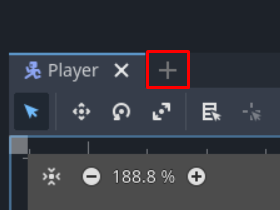
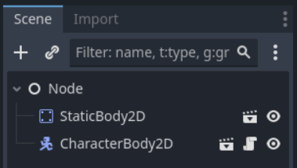

# Füüsika

## Gravitatsioon

Selleks, et mängu tegelane hiljem hüpata saaks, peab talle gravitatsioonijõud mõjuma. Gravitatsiooni võime kirja panna konstandina `Tegelane.gd` faili järgmiselt:

`const GRAVITATSIOON: float = 9.8`

Lisaks oleks hea horisontaalse liikumise ja vertikaalse liikumise loogika eraldi funktsioonidesse panna. See tähendab, et kaks funktsiooni eksisteerivad `velocity` X ja Y väärtuste määramiseks ning `move_and_slide` käsk jääb ikka `_physics_process` funktsiooni.
Tulemus võiks näha välja näiteks selline:

```gdscript
func _physics_process(delta: float):
	horisontaalne_liikumine()
	move_and_slide()

func horisontaalne_liikumine() -> void:
	var suund: float = Input.get_axis("liikumine_vasak", "liikumine_parem")
	velocity.x = suund * kiirus
```

Gravitatsiooni ja hüppamise jaoks loo uus funktsioon nimega `vertikaalne_liikumine`. Milline oleks koodirida, mis pidevalt tegelase langemist kiirendab?

Lühike ja loetav vastus oleks `velocity.y += GRAVITATSIOON`. Pane tegelase stseen korraks käima ja veendu, et ta liigub ekraanil aina kiiremini madalamale ja lõpuks kaob.

## Hüppamine

Nüüd tahaks nii teha, et tegelane suudab oma kukkumise vastu midagi teha ka. Kui mäletad, lõime tegevuse nimega `hüpe`, mis toimub, kui vajutatakse X-klahvi. Lisaks kasutasime eelmises osas funktsiooni `Input.is_action_pressed(tegevuse_nimi)`. Hüpe on ühekordne tugev tõuge maapinnalt, seega `is_action_pressed` ei sobi siia. Õnneks on väga sarnase nimega `is_action_just_pressed`, mis tagastab tõese väärtuse vaid siis, kui tegevus just hakkas toimuma. Loo veel eksporditud muutuja nimega `huppejoud`, mis kasutab `@export_range` annotatsiooni ja aktsepteerib väärtusi 250-750 vahel 25 kaupa ning mille vaikimisi väärtus on 500.
Võiksid sarnase valmis kirjutada:

```gdscript
@export_range(250, 750, 25) var huppejoud: int = 500

... (vahepealsed koodiread)

func vertikaalne_liikumine() -> void:
	velocity.y += GRAVITATSIOON
	if (Input.is_action_just_pressed("hüpe")):
		velocity.y = -huppejoud
```

Kui käivitad stseeni, siis tegelane peaks X-klahvi vajutuse peale hüppama (üles liikuma) ja mingi aja pärast taas langema.

## Maapind

On aeg luua uus stseen maapinna jaoks. Uut stseeni saab luua põhivaate ülemiselt ribalt, plussmärgi disainiga nupust.



Eelmises osas sai korraks mainitud, et maapinna jaoks on sobiv `StaticBody2D` sõlm. Tee sellest juursõlm. Lisa talle vajalik füüsiline kuju, mis on mängu akna suurune (mina panin maapinna suuruseks 1152 * 40 pikslit). Kui tegelase stseeni käivitasid mitu korda, võisid tähele panna, et CollisionShape2D sinine kast käivitatud mängus ei ilmunud. Seda on näha vaid Godot redaktoris. Praegune maapind ka siis ei ilmu (aga töötab), kui teda kasutusele tahame võtta. Ajutise visuaalina tekita stseeni juurde `ColorRect` sõlm. Tee see sama suureks, kui füüsiline kuju (Transform -> Size kaudu). Kasuta tal `Center` ankrute eelseadistust ja veendu, et see katab CollisionShape2D sinise kasti ära. Salvesta stseen nime all `Maapind.tscn`.


Selleks, et kontrollida, kas kõik on siiani õigesti tehtud, peame tegelase ja maapinna ühte põhistseeni panema. Loo uus stseen ja määra tema juursõlmeks `Node` (mitte Node2D ega Node3D). Leia failisüsteemi dokist maapinna stseen (nimega `Maapind.tscn`) ja loo see oma uues stseenis kas parem-kliki menüüst valides `Instantiate` või faili hiirega lohistades Node sõlme peale. Tee sama tegelase stseeniga (`Tegelane.tscn`) ka. Salvesta stseen nimega `Mang.tscn`.



Kui heitsid pilgu stseeni dokki, siis võib-olla panid tähele, et nii maapind kui ka tegelane on esindatud oma juursõlme nimega. Siin see segadust ei põhjusta, aga mida mahukam su mäng on, seda enam stseene ja sõlmi on korraga kasutuses. Õnneks on võimalik sõlme nime muuta. Suundu tagasi tegelase stseeni samalt ribalt, kust uue stseeni lõid. Vali juursõlm (CharacterBody2D) ja määra tema nimeks `Tegelane` kas:

-	parem-kliki menüüst vajutades nupule `Rename`
-	selle peal uuesti klikkides
-	F2 klahvi vajutades

Peale seda saad kirjutada uue nime, mis sõlmel peaks olema. Peale sõlme nime muutmist peab stseeni taas ära salvestama. Korda seda protsessi maapinna stseeniga, vaheta nimi StaticBody2D `Maapind` vastu.

Selleks, et uusi nimesid näha, pead vanad koopiad nendest stseenidest ära kustutama ja uued looma. Edaspidi uut stseeni luues on hea praktika juursõlmele kohe mõistetav ja unikaalne nimi anda. Nimeta ka mängu stseeni Node ümber `Mäng`uks. Liiguta maapind koordinaatidele x: 576, y: 628, sedasi on maapind ilusti mängu akna alumises pooles. Määra mängu stseen peastseeniks ja käivita see.

Peaksid saama tegelast ringi liigutada mängu akna mõõtmetes (kui liigud sellest välja, kukud alla).

## Hüppamise viimistlemine

Nüüd on tegelasega mure: ta saab ju õhus ikka niisama hüpata. Lahendus on tegelikult väga lihtne: CharacterBody2D klassil on meetod `is_on_floor`, mis tagastab, kas tegelane puutus eelmisel kaadril maad. Lisaks on olemas meetodid `is_on_wall` ja `is_on_ceiling` vastavalt seinapuute ja laepuute kontrollimiseks. Selle uue meetodi pead juurde lisama funktsioonile `vertikaalne_liikumine`. Sealne *if*-tingimuslause peab kontrollima, kas hüppe tegevus just toimus ning kas tegelane üldse puutub maapinda.

Tulemus peaks selline olema:

```gdscript
func vertikaalne_liikumine() -> void:
	velocity.y += GRAVITATSIOON
	if (Input.is_action_just_pressed("hüpe") and is_on_floor()):
		velocity.y = -huppejoud
```

Lisa juurde eksporditud muutuja nimega `mass`, mille väärtused saavad olla vahemikus 1-10. Selle muutuja töö on gravitatsiooni mõju suurendada, et tegelase hüpe nii "hõljuv" ei oleks. Lisaks sellele muuda ka hüppejõu vahemik 1000-2500 peale, et arvestada lisatud gravitatsioonijõuga.

Järgnevad väärtused sobivad tegelasele päris hästi:

-	kiirus: 300
-	hüppejõud: 1000
-	mass: 5

Muuda ka seda rida, kus gravitatsioonijõu `velocity.y`-le liidad. Gravitatsioonijõu peab korrutama massiga.

Järgnev rida saavutab seda:

```gdscript
@export_range(1, 25) var mass: int = 1

... (vahepealsed koodiread)

func vertikaalne_liikumine() -> void:
	velocity.y += GRAVITATSIOON * mass
```

## Ronimine

Lisame tegelasele lõpuks ronimise funktsionaalsuse. Tegelane saab ronida vajutades Z-klahvi, et seinast kinni hoida ja X-klahvi (hüppamise klahv), et üles ronida.

{: .todo }
-   ronimine
-   collision layer ja mask