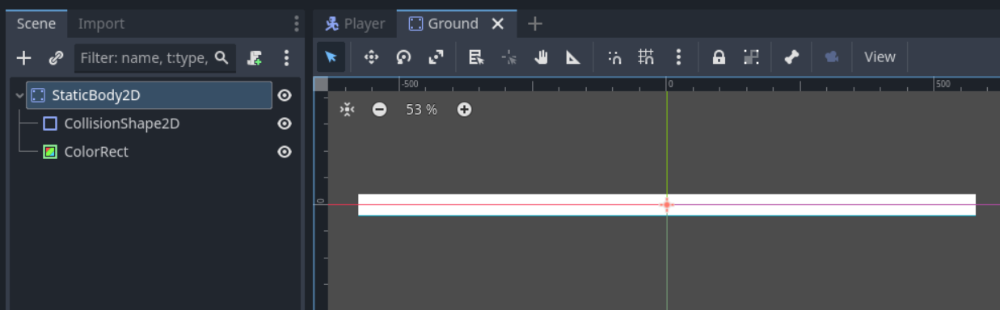

# Füüsika

## Gravitatsioon

Selleks, et mängu tegelane hiljem hüpata saaks, peab talle gravitatsioonijõud mõjuma. Gravitatsiooni võime kirja panna konstandina `Tegelane.gd` faili järgmiselt:

`const GRAVITATSIOON: float = 9.8`

Lisaks oleks hea horisontaalse liikumise ja vertikaalse liikumise loogika eraldi funktsioonidesse panna. See tähendab, et kaks funktsiooni eksisteerivad `velocity` X ja Y väärtuste määramiseks ning `move_and_slide` käsk jääb ikka `_physics_process` funktsiooni.
Tulemus võiks näha välja näiteks selline:

```gdscript
func _physics_process(delta: float):
	horisontaalne_liikumine()
	move_and_slide()

func horisontaalne_liikumine() -> void:
	var suund: float = Input.get_axis("liikumine_vasak", "liikumine_parem")
	velocity.x = suund * kiirus
```

Gravitatsiooni ja hüppamise jaoks loo uus funktsioon nimega `vertikaalne_liikumine`. Milline oleks koodirida, mis pidevalt tegelase langemist kiirendab?

Lühike ja loetav vastus oleks `velocity.y += GRAVITATSIOON`. Pane tegelase stseen korraks käima ja veendu, et ta liigub ekraanil aina kiiremini madalamale ja lõpuks kaob.

## Hüppamine

Nüüd tahaks nii teha, et tegelane suudab oma kukkumise vastu midagi teha ka. Kui mäletad, lõime tegevuse nimega `hüpe`, mis toimub, kui vajutatakse X-klahvi. Lisaks kasutasime eelmises osas funktsiooni `Input.is_action_pressed(tegevuse_nimi)`. Hüpe on ühekordne tugev tõuge maapinnalt, seega `is_action_pressed` ei sobi siia. Õnneks on väga sarnase nimega `is_action_just_pressed`, mis tagastab tõese väärtuse vaid siis, kui tegevus just hakkas toimuma. Loo veel eksporditud muutuja nimega `huppejoud`, mis kasutab `@export_range` annotatsiooni ja aktsepteerib väärtusi 250-750 vahel 25 kaupa ning mille vaikimisi väärtus on 500.
Võiksid sarnase valmis kirjutada:

```gdscript
@export_range(250, 750, 25) var huppejoud: int = 500

... (vahepealsed koodiread)

func vertikaalne_liikumine() -> void:
	velocity.y += GRAVITATSIOON
	if (Input.is_action_just_pressed("hüpe")):
		velocity.y = -huppejoud
```

Kui käivitad stseeni, siis tegelane peaks X-klahvi vajutuse peale hüppama (üles liikuma) ja mingi aja pärast taas langema.

## Maapind

On aeg luua uus stseen maapinna jaoks. Uut stseeni saab luua põhivaate ülemiselt ribalt, plussmärgi disainiga nupust.


Eelmises osas sai korraks mainitud, et maapinna jaoks on sobiv `StaticBody2D` sõlm. Tee sellest juursõlm. Lisa talle vajalik füüsiline kuju, mis on mängu akna suurune (mina panin maapinna suuruseks 1152 * 40 pikslit). Kui tegelase stseeni käivitasid mitu korda, võisid tähele panna, et CollisionShape2D sinine kast käivitatud mängus ei ilmunud. Seda on näha vaid Godot redaktoris. Praegune maapind ka siis ei ilmu (aga töötab), kui teda kasutusele tahame võtta. Ajutise visuaalina tekita stseeni juurde `ColorRect` sõlm. Tee see sama suureks, kui füüsiline kuju (Transform -> Size kaudu). Kasuta tal `Center` ankrute eelseadistust ja veendu, et see katab CollisionShape2D sinise kasti ära. Salvesta stseen nime all `Maapind.tscn`.



{: .todo }
-   ronimine
-   collision layer ja mask