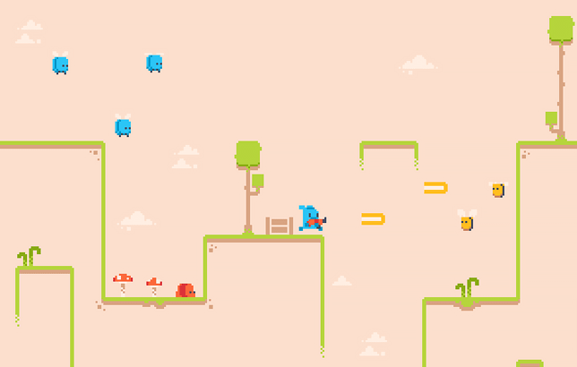

See peatükk on töös!
{: .todo }

Planeeritud struktuur:

-   mängija tegelase loomine
-   füüsika õppimine
-   vastase loomine
-   TileMapiga taseme loomine
-   Eksportimine

# 2D mäng

Selles peatükis lood prototüübi 2D videomängu jaoks. Tegu on platvormimänguga, kus tegelane saab ringi liikuda, hüpata ja oma relva lasta. Tegelase eesmärk on vastaseid hävitades punkte koguda.

Kuna nüüd oskad natuke GDScripti kirjutada, siis nüüdsest on kood, failinimed jne sujuvamaks lugemiseks kirjutatud inglise keeles.

Õpid järgnevaid asju:
-   Godot 2D füüsikamootor
-   Tegelase animeerimine
-   Sprite2D, AnimatedSprite2D sõlmed
-   CharacterBody2D, CollisionShape2D, Area2D, TileMapLayer sõlmed
-   Eksportimine

## Mänguvarad

Mängu jaoks vajalikud spraidid, mis on loodud Kenney poolt, leiad aadressilt <https://www.kenney.nl/assets/pixel-line-platformer>. Vajuta seal lehel `Download` nupule, seejärel `Continue without donating`. Laed alla faili nimega `kenney_pixel-line-platformer.zip`. Meie projekti jaoks on vaja kaustast `Tilemap` faili `tilemap.png`.

Lõpuks võiks mäng välja näha sarnane järgnevale pildile:

Jõudu tööle!