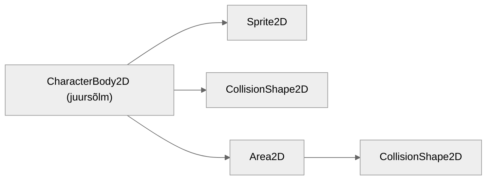
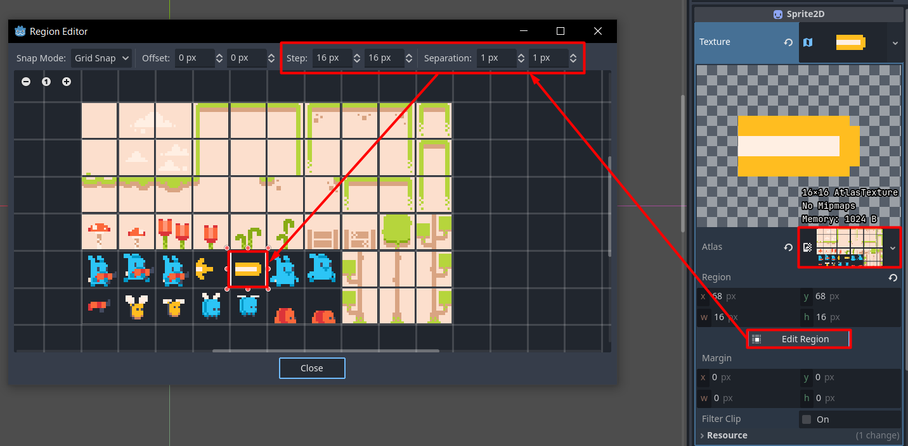
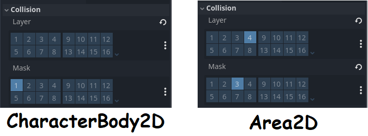
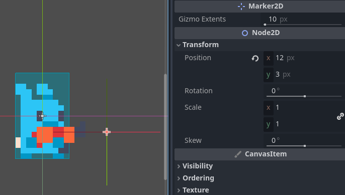

# Laskmine

Selleks, et meie tegelane vastaseid lasta suudaks, peame looma talle eraldi stseeni sellest kuulist, mida ta pidevalt tulistama hakkab.

## Kuuli stseen

Kuuli stseeni ehitus on järgmine:


Kasutame siin kaht uut sõlme:

### Sprite2D

Sprite2D on sarnane AnimatedSprite2D sõlmele, aga ei sisalda sisse ehitatud võimalust animatsioone luua. Kui tahad Sprite2D (ja teisi sõlmi, millel pole animatsiooni võimekust sisse ehitatud) animatsiooni jaoks kasutada, pead sellega koos kasutama AnimationPlayer sõlme.

### Area2D

Kaks füüsika keha põrkavad kokku. Üks neist on vastane ja teine on sinu lastud kuul, mis vastasel elusid peaks maha võtma. Kuid lisaks elude maha võtmisele kuul lükkab teda kontrollimatult eemale ning selle juhtumist me ei tahaks. Siin tulebki appi Area2D sõlm - see tuvastab füüsika kehasid (ja teisi Area2D sõlmi), kuid ei lükka neid. Kui oled videomängudes kuulnud mõistest *hitbox* ehk löögiala, siis Area2D kasutataksegi Godot's löögialade loomiseks.

## Kuuli stseen, jätk

Meie kuul on ikkagi CharacterBody2D, et ta seinaga kokku põrgates ära kustuks. Ta põrkabki vaid tasemega kokku, vastase ära tundmine jääb Area2D ülesandeks.

Selleks, et kindlaks teha, kui suur kuuli füüsika kuju tuleb, peame talle ennem spraidi andma. Vali stseeni dokis oma värskelt loodud Sprite2D, leia inspektoris Texture omadus ja loo sinna väärtuseks uus AtlasTexture. AtlasTexture võimaldab suuremalt spraidilehelt vajaliku tüki eraldamist, mis teeb spraidiga töötamise lihtsamaks. Ava AtlasTexture ja määra selle `Atlas` väärtuseks meie suur spraidileht `tilemap.png`. Seejärel vajuta `Edit Region` nuppu, et paika panna, kus meie kuuli sprait täpselt on.

AtlasTexture regiooni muutmise aknas vali `Step` jaoks (16, 16) pikslit ja `Separation` jaoks (1, 1) pikslit. Kuuli sprait on viiendas reas, vasakult viies tükk.



Nüüd, kus oleme spraidi paika pannud, saame oma kuulile korrektse füüsika kuju anda. Kuuli CollisionShape2D (**mitte Area2D oma**) `Shape` väärtuseks saagu `RectangleShape2D` suurusega (12, 6) pikslit.

Kohe tee ka Area2D'le füüsika kuju, kuid tal olgu see `CircleShape2D` raadiusega 6 pikslit.

Veel peame nii CharacterBody2D'le kui ka Area2D'le määrama õiged füüsika kihid.

CharacterBody2D (juursõlm):
-	pole ühelgi kihil (*collision layer*)
-	tuvastab esimest kihti ehk *level*/taset (*collision mask*)

Area2D (*hitbox*/löögiala):
-	on neljandal kihil ehk *projectile*/viskekeha
-	tuvastab kolmandat kihti ehk *enemy*/vastane



## Skript

On aeg luua meie kuulile skript nimega `bullet.gd`. Kuulil on sarnaselt peategelasele vaja kiiruse muutujat ja suuna muutujat, et teada, kuhu ta lendab. Lisaks on vaja eksportmuutujat Sprite2D jaoks, sest me plaanime spraiti pöörata `_ready` funktsioonis olenevalt kuuli suunast. Spraidi pööramiseks on olemas käepärane omadus `flip_h`, mis vaikimisi on **väär**.

### Ülesanne 1

Kirjuta kuuli skripti siis järgnevad asjad:

-	muutujad kiiruse, suuna ja Sprite2D sõlme jaoks
	-	suuna väärtus võiks vaikimisi 1.0 olla ehk paremale
-	`_ready` funktsioon, kus Sprite2D pöörad
-	`_process` funktsioon
	-	`velocity.x` väärtuse määramine
	-	kuuli liikuma panemine

Kui kuuli stseeni käima panemisel kuul liigub ja kõik tundub töötavat, kontrolli ja võrdle minu skriptiga:

[Ülesande lahendus](../lahendused/ulesanne-1)

## Skript, jätk

Lisaks liikumisele peab see kuul hävinema, kui tasemega kokku puutub. Kui kuul lendab horisontaalses joones, siis ainus võimalus tal tasemega kokku puutuda on vastu seina lennates. Ennem kasutasime `is_on_floor()` funktsiooni, aga eksisteerib ka `is_on_wall()` seina kokkupõrke kontrolliks. Lisa oma `_process` funktsiooni enne `move_and_slide()` käsku järgmised read juurde:

```gdscript
	if (is_on_wall()):
		queue_free() # kustutab sõlme
```

Meie löögiala väljastab signaali, kui vastast puutub, aga midagi ei juhtu vastasega veel. Selleks vali stseeni dokis Area2D sõlm, liigu sõlme dokki (inspektori dokist parempoolse nupu kaudu). Leia signaal `body_entered(body: Node2D)` ja ühenda see kuuliga. Skripti tekib funktsioon `_on_area_2d_body_entered`. Seal kontrollime, kas meie `body` argument on ikka `CharacterBody2D` tüüpi. Kui on tegu `CharacterBody2D`'ga, siis kustutatakse see tegelane, mille kuul tuvastas.

Kuuli skripti lõppu läheks siis selline kood kirja:

```gdscript
func _on_area_2d_body_entered(body: Node2D) -> void:
	# eelnevates versioonides kasutati "not is", sest "is not" on üks uus võtmesõna, aga "not" ja "is" on eraldi
	if (body is not CharacterBody2D):
		return
	# kustutab pihta saanud sõlme ja iseenda
	body.queue_free()
	queue_free()
```

## Vajutame päästikule

Nüüd, kus kuuli stseen valmis, on vaja peategelasel seda lasta. Selleks peab tegelane signaaliga põhistseenile teada andma, et on aeg tulistada ja siis põhistseen loob kuuli stseenist instantsi ja lisab selle stseenide puusse.

Peategelane peab teada andma põhistseenile, mis koordinaatidelt ja mis suunas kuuli lasta. Kasutame selleks abisõlme Marker2D, mis näitab redaktoris märki, millega on kergem asju paika sättida.

Lisame siis peategelase stseeni Marker2D. Mina liigutasin selle enda stseenis positsioonile (12, 3).



Skriptis loo eksportmuutuja markeri jaoks nimega `bullet_marker` ja enda signaal nimega `shot_projectile(spawn_position: Vector2, direction: float)`. Kui toimub laskmise tegevus, siis seda signaali saadetakse laiali koos vastavate argumentidega.

`_process` funktsioonile lisatakse juurde siis järgnev kood enne `move_and_slide()` käsku:

```gdscript
if (Input.is_action_just_pressed("shoot")):
	shot_projectile.emit(
		bullet_marker.global_position,
		direction
	)
```

## Signaalile reageerimine

Nagu varasemalt mainitud, meie `shot_projectile` signaalile peab põhistseen reageerima ja kuuli looma. See tähendab, et põhistseenile on vaja juurde luua skript `main.gd`. Skript peab teadma, milline on kuuli stseen, aga me ei taha põhistseeni üht suvalist ringi lendavat kuuli lisada. Sel juhul laeme skripti kaudu kuuli stseeni. 

Kõik stseenid on salvestatud PackedScene **resurssina**, mitte **sõlmena**. See tähendab, et PackedScene me otse stseeni juurde lisada ei saa, aga kui loome PackedScene'ist instantsi (mis on sõlm), siis see on võimalik. Kuuli stseeni saad konstandina kirja panna ja laadida funktsiooniga `preload`.

```
extends Node2D

const PLAYER_BULLET_SCENE: PackedScene = preload("res://bullet.tscn")
```

Kui nüüd sõlme dokki liigud, siis seal peaks olema nähtav ka meie vastselt loodud signaal. Ühenda see peastseeniga ja peaks tekkima funktsioon nimega `_on_peategelane_shot_projectile`.

Signaalile reageerivasse funktsiooni läheb järgnev kirja:

```gdscript
func _on_peategelane_shot_projectile(spawn_position: Vector2, direction: float) -> void:
	var bullet = PLAYER_BULLET_SCENE.instantiate()
	# tavaline position on oma vanem-stseeniga seotud
	bullet.global_position = spawn_position
	bullet.direction = direction
	# lisab praeguse stseeni laps-sõlmena selle
	add_child(bullet)
```

Kui nüüd mängu tööle paned, siis tegelane peaks suutma liikuda, hüpata ja lasta. Laskmine on aga veel katki, sest kui lased, aga ei liigu, siis kuul ei liigu. Lisaks meie kuuli jaoks loodud Marker2D on ainult ühel meie tegelase poolel.

Selle probleemi parandame järgmises alapeatükis, kus võtame tegelase animatsioonid lõpuks käiku ning loome ka lihtsa vastase, keda lasta lõpuks saame.