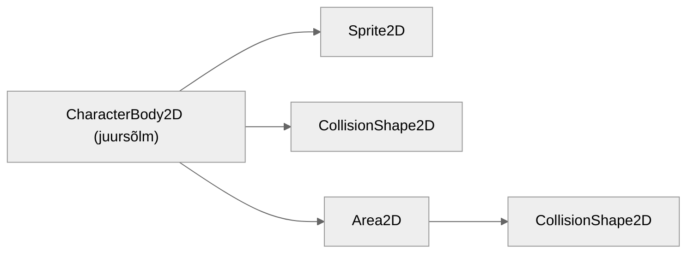

# Laskmine

Selleks, et meie tegelane vastaseid lasta suudaks, peame looma talle eraldi stseeni sellest kuulist, mida ta pidevalt tulistama hakkab.

## Kuul

Kuuli stseeni ehitus on järgmine:

Kasutame siin kaht uut sõlme:

### Sprite2D

Sprite2D on sarnane AnimatedSprite2D sõlmele, aga ei sisalda sisse ehitatud võimalust animatsioone luua. Kui tahad Sprite2D (ja teisi sõlmi, millel pole animatsiooni võimekust sisse ehitatud) animatsiooni jaoks kasutada, pead sellega koos kasutama AnimationPlayer sõlme.