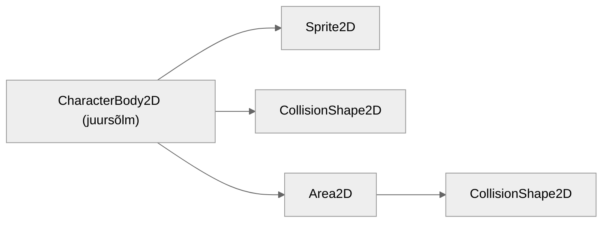

# Laskmine

Selleks, et meie tegelane vastaseid lasta suudaks, peame looma talle eraldi stseeni sellest kuulist, mida ta pidevalt tulistama hakkab.

## Kuuli stseen

Kuuli stseeni ehitus on järgmine:

Kasutame siin kaht uut sõlme:

### Sprite2D

Sprite2D on sarnane AnimatedSprite2D sõlmele, aga ei sisalda sisse ehitatud võimalust animatsioone luua. Kui tahad Sprite2D (ja teisi sõlmi, millel pole animatsiooni võimekust sisse ehitatud) animatsiooni jaoks kasutada, pead sellega koos kasutama AnimationPlayer sõlme.

### Area2D

Kaks füüsika keha põrkavad kokku. Üks neist on vastane ja teine on sinu lastud kuul, mis vastasel elusid peaks maha võtma. Kuid lisaks elude maha võtmisele kuul lükkab teda kontrollimatult eemale ning selle juhtumist me ei tahaks. Siin tulebki appi Area2D sõlm - see tuvastab füüsika kehasid (ja teisi Area2D sõlmi), kuid ei lükka neid. Kui oled videomängudes kuulnud mõistest *hitbox* (löögiala?), siis Area2D kasutataksegi Godot's *hitbox*ide loomiseks.

## Kuuli stseen, jätk

Meie kuul on ikkagi CharacterBody2D, et ta seinaga kokku põrgates ära kustuks. Ta põrkabki vaid tasemega kokku, vastase ära tundmine jääb Area2D ülesandeks.

Selleks, et kindlaks teha, kui suur kuuli füüsika kuju tuleb, peame talle ennem spraidi andma. Vali stseeni dokis oma värskelt loodud Sprite2D, leia inspektoris Texture omadus ja loo sinna väärtuseks uus AtlasTexture. AtlasTexture võimaldab suuremalt spraidilehelt vajaliku tüki eraldamist, mis teeb spraidiga töötamise lihtsamaks. Ava AtlasTexture ja määra selle `Atlas` väärtuseks meie suur spraidileht `tilemap.png`. Seejärel vajuta `Edit Region` nuppu, et paika panna, kus meie kuuli sprait täpselt on.

AtlasTexture regiooni muutmise aknas vali `Step` jaoks (16, 16) pikslit ja `Separation` jaoks (1, 1) pikslit. Kuuli sprait on viiendas reas, vasakult viies tükk.

Nüüd, kus oleme spraidi paika pannud, saame oma kuulile korrektse füüsika kuju anda. Kuuli CollisionShape2D (**mitte Area2D oma**) `Shape` väärtuseks saagu `RectangleShape2D` suurusega (12, 6) pikslit.

Kohe tee ka Area2D'le füüsika kuju, kuid tal olgu see `CircleShape2D` raadiusega 6 pikslit.

Veel peame nii CharacterBody2D'le kui ka Area2D'le määrama õiged füüsika kihid.

CharacterBody2D (juursõlm):
-	pole ühelgi kihil (*collision layer*)
-	tuvastab esimest kihti ehk *map*/taset (*collision mask*)

Area2D (*hitbox*):
-	on neljandal kihil ehk *projectile*/viskekeha
-	tuvastab kolmandat kihti ehk *enemy*/vastane

## Skript

On aeg luua meie kuulile skript nimega `kuul.gd`. Kuulil on sarnaselt peategelasele vaja kiiruse muutujat ja suuna muutujat, et teada, kuhu ta lendab. Lisaks on vaja eksportmuutujat Sprite2D jaoks, sest me plaanime spraiti pöörata `_ready` funktsioonis olenevalt kuuli suunast. Spraidi pööramiseks on olemas käepärane omadus `flip_h`, mis vaikimisi on **väär**.

### Ülesanne 1

Kirjuta kuuli skripti siis järgnevad asjad:

-	muutujad kiiruse, suuna ja Sprite2D sõlme jaoks
	-	suuna väärtus võiks vaikimisi 1.0 olla ehk paremale
-	`_ready` funktsioon, kus Sprite2D pöörad
-	`_process` funktsioon
	-	`velocity.x` väärtuse määramine
	-	kuuli liikuma panemine

Kui kuuli stseeni käima panemisel kuul liigub ja kõik tundub töötavat, võrdle minu skriptiga järgneval lingil:

[Ülesande lahendus](../lahendused/ulesanne-1)