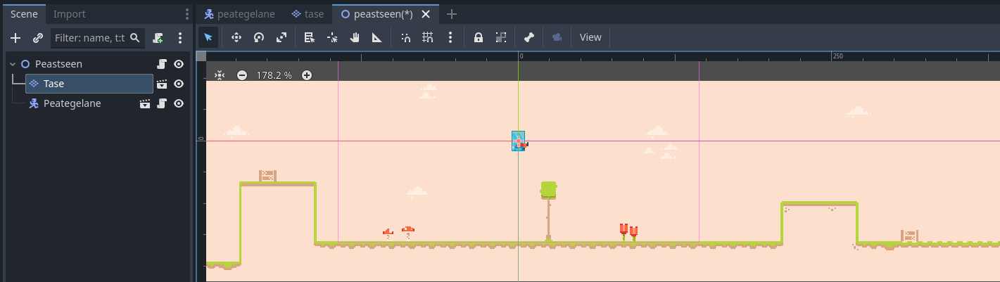

# Liikumine

## Liikumise skript

Loo peategelase jaoks skript nimega `peategelane.gd`. Tegelasel on vaja liikumiseks teada tema maksimumkiirust ja liikumissuunda. Seega esimesed read, mis võiks skripti juurde kirjutada, on:

```gdscript
@export_range(0.0, 500.0) var max_speed: float = 200.0
var direction: float = 1.0
```

`@export_range(minimum_value, maximum_value, step)` annotatsioon on sarnane tavalise `@export` annotatsiooniga, aga võimaldab muutujale piiride määramist. Kuna meil on kiirus ja liikumissuund eraldi muutujad, siis kiirus ei tohi alla 0 minna, sest tegelane hakkaks vastassuunas liikuma. Suund ei pea eksportmuutuja olema, kuna see muutub pidevalt tegelase liikudes. Lisaks jääb suuna väärtus -1 ja 1 vahele.

Kustuta `_ready` funktsioon. Kirjutame `_process` funktsiooni tegelase algelise liikumise loogika. Esiteks peame nüüd tegelase liikumissuuna määrama. Seda saame teha funktsiooniga `Input.get_axis(negative_action, positive_action)`. Kuna `action` tähendab tegevust, siis argumentideks saavad tegevuste nimed. Negatiivne tegevus tähendab siin seda, et tegelane liigub X-telje negatiivsel suunal ja positiivne tegevus vastupidist. Seega meie negatiivne tegevus olgu `move_left` ja positiivne olgu `move_right`. 

Tegelase liikumine sõltub suunast ja kiirusest, seega nüüd määrame CharacterBody2D `velocity.x` väärtuseks `direction * max_speed`. Lisaks, et tegelane peale `velocity` määramist lõpuks liikuma hakkaks, peame `_process` lõppu lisama käsu `move_and_slide()`.
Võid nüüd oma mängu tööle panna ülariba nupust `Run Current Scene (F6)` ja veenduda, et tegelase liikumist on akna ülaosas näha, kui nooleklahve vajutad.

Lisa peategelasele juurde kaamera sõlm `Camera2D` ja määra selle `Zoom` väärtuseks `(4, 4)`. Niimoodi näeme pikslikunsti paremini. Kui uuesti stseeni käivitad, ei näe tegelast liikumas enam, sest olles tema laps-sõlm kaamera püsib pidevalt tema peal.


## Kollisioonide süsteem

Said eelmises alapeatükis teada, et füüsika kehad töötavad CollisionShape2D sõlmede abil. Mäng kontrollib, kas kaks keha on kokku põrganud omavahel ja kohandab neid ringi, et nad enam ei põrkaks kokku. Füüsika kehad saavad olla erinevatel kihtidel, et nad üldse kokku ei põrkaks. Neil on muutujad `Collision Layer` ja `Collision Mask` - *layer*i alla saab märkida need kihid, kus füüsika keha on ja *mask*i alla need kihid, millega see füüsika keha peaks kokku põrgata suutma.

Meie projektis kasutame nelja erinevat füüsika kihti:

1.	*map*
2.	*player*
3.	*enemy*
4.	*projectile*

Füüsika kihtidele saame nimed anda Project Settings -> General -> Layer Names -> 2D Physics alt.


Peategelane peaks olema siis *player* kihil ja tema mask peaks tuvastama *map* ja *projectile* kihte. Neid saad määrata CollisionObject2D -> Collision alt.


## Taseme loomine

Selleks, et tegelane hüpata saaks, on tal vaja maapinda, mille pealt hüpata. Loo uus stseen, kus `TileMapLayer` on juursõlm. Tee sellele inspektori kaudu uus TileSet resurss ja TileSeti sätete all Physics Layers alamenüüs lisa talle füüsikakihid juurde. Kuna see on maapind, siis see on *map*-nimelisel kihil.

Ava alumise riba kaudu TileSet moodul. Vajuta plussmärgiga nupule ja leia meie maapinna spraitide kogum `tilemap.png`. *Setup*-nimelises vahekaardis tee kindlaks, et `Separation` oleks (1, 1) pikslit ja `Texture Region` (16, 16) pikslit.


Liigu edasi `Paint` vahekaardile ja seal vali `Paint Properties` jaoks `Physics Layer 0`. Nüüd, kui erinevatele spraidi lõikudele hiirega vajutad, lisatakse neile juurde füüsiline kuju. Kuna meie mängus on taevas ja maapind sama värvi, ole ettevaatlik, mis lõikudele kuju annad. Salvesta stseen näiteks nimega `tase.tscn`.


## Peastseen

Loo uus stseen, kus Node2D on juursõlm. Sellest stseenist saab meie mängu peastseen praeguseks. Lisa juurde meie vastselt loodud taseme stseen ja peategelase stseen, kas hiirega lohistades seda failisüsteemi dokist stseeni dokki või klaviatuuri otseteega `CTRL + SHIFT + A`. Nüüd, kui valid taseme sõlme stseeni dokis ja avad alumiselt ribalt TileMap mooduli, saad hiirega valida, milliseid maapinna ja taeva spraite tahad oma stseeni maalida. Maalida saad nüüd põhivaates oma hiirt vajutades ning lohistades. Vasaku klikiga saad juurde teha, paremaga kustutada.



## Hüppamine

Nüüd õpetame oma tegelase hüppama. Hüppamiseks peame talle algul gravitatsiooni tutvustama. Loo tegelase skriptis uus muutuja nimega `gravity`, mille väärtus on näiteks 25. Gravitatsioon on meie mängu maailmas kiirenev positiivne liikumine Y-teljel. Seega lisa enne `move_and_slide` käsku rida, kus määrad `velocity.y` väärtuse. Iga kaader lisatakse sellele gravitatsiooni jõud uuesti juurde, seega kirjutatav rida olgu `velocity.y += gravity`.

Hüppamiseks on vaja uut eksportmuutujat nimega `jump_strength`. See võiks olla näiteks 0 - 1000 vahemikus ja vaikimisi väärtuseks panin 400. Selleks, et tegelane hüppaks, peab ta puutuma maapinda ja hüppamise tegevus peab just olema toimunud. Hüppamine on gravitatsiooni vastand - ühekordne negatiivne Y-telje jõud.

Meie tegelane hüppab siis järgnevate koodiridadega:

```gdscript
if (is_on_floor() and Input.is_action_just_pressed("jump")):
	velocity.y = -jump_strength
```

Nüüd, kui meie uue peastseeni tööle paned, peaks tegelane maha kukkuma ning hüppamise nuppu vajutades peaks ta ajutiselt õhku tõusma ja siis taas maha kukkuma.

---

Kasuta siin kirjutatut järgmises-ülejärgmises alapeatükis ja mõtle välja kas pöörata sprite scale kaudu või flip_h kaudu
{: .todo }

## Animatsioonid tööle

Meie AnimatedSprite2D sõlmel on 3 animatsiooni: "default", "run" ja "jump". Tead nüüd, et funktsioon `is_on_floor()` tagastab tõeväärtuse. On vaja ka kontrollida suuna muutuja abil, kas tegelane liigub. Kui tegelane ei liigu, on suund 0.

Lisaks peame muutma tegelase spraidi suunda, et mängijal oleks visuaalne tagasiside oma liikumisest. `AnimatedSprite2D` sõlmel on selleks `flip_h` muutuja.

```gdscript
extends CharacterBody2D

@export_range(0, 500, 10) var max_speed: float = 200.0
@export_range(0, 1000, 10) var jump_strength: float = 400.0

@export var sprite: AnimatedSprite2D

var gravity: float = 25.0
var direction: float = 0.0

func _physics_process(delta: float) -> void:
	direction = Input.get_axis("move_left", "move_right")
	velocity.x = direction * max_speed
	velocity.y += gravity
	if (is_on_floor() and Input.is_action_just_pressed("jump")):
		velocity.y = -jump_strength
	
	if (is_on_floor()): # kas tegelane on maas
		if (is_zero_approx(direction)): # kas suund on 0
			sprite.play("default")
		else:
			sprite.play("run")
	else:
		sprite.play("jump")
	
	move_and_slide()
```

Video pooleli 14:20 sprite flipimise juures
