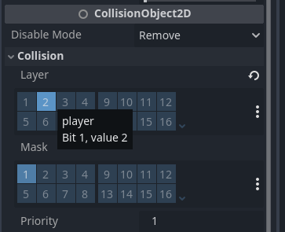

# Liikumine

## Liikumise skript

Loo peategelase jaoks skript nimega `player.gd`. Tegelasel on vaja liikumiseks teada tema maksimumkiirust ja liikumissuunda. Seega esimesed read, mis võiks skripti juurde kirjutada, on:

```gdscript
@export_range(0.0, 500.0) var speed: float = 200.0
var direction: float = 1.0
```

`@export_range(minimum_value, maximum_value, step)` annotatsioon on sarnane tavalise `@export` annotatsiooniga, aga võimaldab muutujale piiride määramist. Kuna meil on kiirus ja liikumissuund eraldi muutujad, siis kiirus ei tohi alla 0 minna, sest tegelane hakkaks vastassuunas liikuma.

Suund ei pea eksportmuutuja olema, kuna see muutub pidevalt tegelase liikudes. Suuna väärtus jääb -1 ja 1 vahele ning väärtustel on järgnev tähendus:

-	-1: vasakule liikumine
-	0: seismine
-	1: paremale liikumine

Kustuta `_ready` funktsioon. Kirjutame `_process` funktsiooni tegelase algelise liikumise loogika. Esiteks peame nüüd tegelase liikumissuuna määrama. Seda saame teha funktsiooniga `Input.get_axis(negative_action, positive_action)`. Kuna `action` tähendab tegevust, siis argumentideks saavad tegevuste nimed. Negatiivne tegevus tähendab siin seda, et tegelane liigub X-telje negatiivsel suunal ja positiivne tegevus vastupidist. Seega meie negatiivne tegevus olgu `move_left` ja positiivne olgu `move_right`. 

CharacterBody2D liigub, kui muudad tema `velocity` muutujat ja kasutad `move_and_slide()` funktsiooni. `velocity` on Vector2 klassi isend, mis on 2-dimensiooniline vektor `x` ja `y` muutujaga. Näiteks on ka Node2D klassi muutuja `position` Vector2 klassi isend.

Tegelase liikumine sõltub suunast ja kiirusest, seega nüüd määrame CharacterBody2D `velocity.x` väärtuseks `direction * speed`. Lisaks, et tegelane peale `velocity` määramist lõpuks liikuma hakkaks, peame `_process` lõppu lisama käsu `move_and_slide()`.
Võid nüüd oma mängu tööle panna ülariba nupust `Run Current Scene (F6)` ja veenduda, et tegelase liikumist on akna ülaosas näha, kui nooleklahve vajutad.

Nii *velocity* kui ka *speed* tähendavad eesti keeles kiirust, aga *velocity* puhul on ka suund oluline. See tähendab, et meie tehe selle arvutamiseks `direction * speed = velocity` on õige.
{: .tip }

Lisa peategelasele juurde kaamera sõlm `Camera2D` ja määra selle `Zoom` väärtuseks `(4, 4)`. Niimoodi näeme projekti käivitades mängus olevat pikslikunsti paremini. Kui uuesti stseeni käivitad, ei näe tegelast liikumas enam, sest olles tema laps-sõlm kaamera püsib pidevalt tema peal.


## Kollisioonide süsteem

Said eelmises alapeatükis teada, et füüsikakehad töötavad CollisionShape2D sõlmede abil. Mäng kontrollib, kas kaks keha on kokku põrganud omavahel ja liigutab neid üksteisest eemale nii, et nad enam ei oleks koos. Füüsikakehad saavad olla erinevatel kihtidel, et nad üldse kokku ei põrkaks. Neil on muutujad `Collision Layer` ja `Collision Mask` - *layer*i alla saab märkida need kihid, kus füüsikakeha on ja *mask*i alla need kihid, millega see füüsikakeha peaks kokku põrgata suutma.

Meie projektis kasutame nelja erinevat füüsikakihti:

1.	*level* (tase)
2.	*player* (mängija)
3.	*enemy* (vastane)
4.	*projectile* (viskekeha)

Füüsikakihtidele saame nimed anda Project Settings -> General -> Layer Names -> 2D Physics alt.


Peategelane peaks olema siis *player* kihil ja tema mask peaks tuvastama *level* kihti. Neid saad määrata CollisionObject2D -> Collision alt.



## Taseme loomine

Selleks, et tegelane hüpata saaks, on tal vaja maapinda, mille pealt hüpata. Loo uus stseen, kus `TileMapLayer` on juursõlm. Pane tema nimeks `Level`. Tee sellele inspektori kaudu uus TileSet resurss ja TileSeti konfiguratsioonis Physics Layers alamenüüs lisa talle füüsikakihid juurde. Kuna see on maapind, siis see on *level*-nimelisel kihil.

Ava alumise riba kaudu TileSet moodul. Vajuta plussmärgiga nupule ja leia meie maapinna spraitide kogum `tilemap.png`. *Setup*-nimelises vahekaardis tee kindlaks, et `Separation` oleks (1, 1) pikslit ja `Texture Region` (16, 16) pikslit.


Liigu edasi `Paint` vahekaardile ja seal vali `Paint Properties` jaoks `Physics Layer 0`. Nüüd, kui erinevatele spraidi lõikudele hiirega vajutad, lisatakse neile juurde füüsiline kuju. Kuna meie mängus on taevas ja maapind sama värvi, ole ettevaatlik, mis lõikudele kuju annad. Salvesta stseen näiteks nimega `level.tscn`.


## Põhistseen

Loo uus stseen, kus Node2D on juursõlm. Sellest stseenist saab meie mängu põhistseen. Lisa juurde meie vastselt loodud taseme stseen ja peategelase stseen, kas hiirega lohistades seda failisüsteemi dokist stseeni dokki või klaviatuuri otseteega `CTRL + SHIFT + A`. Nüüd, kui valid taseme sõlme stseeni dokis ja avad alumiselt ribalt TileMap mooduli, saad hiirega valida, milliseid maapinna ja taeva spraite tahad oma stseeni maalida. Maalida saad nüüd põhivaates oma hiirt klõpsates ning lohistades. Vasaku klõpsuga saad juurde teha, paremaga kustutada. Proovi erinevaid tööriistasid, mis TileMap moodulis olemas on.


## Hüppamine

Nüüd õpetame oma tegelase hüppama. Hüppamiseks peame talle algul gravitatsiooni tutvustama. Loo tegelase skriptis uus muutuja nimega `gravity`, mille väärtus on näiteks 25. Gravitatsioon on meie mängu maailmas kiirenev positiivne liikumine Y-teljel. Igal kaadril lisatakse `velocity`le gravitatsiooni jõud uuesti juurde, seega kirjutatav rida olgu `velocity.y += gravity`. Sedasi tekib efekt, et tegelane hakkab ühe kiiremini kukkuma.

Hüppamiseks on vaja uut eksportmuutujat nimega `jump_strength`. See võiks olla näiteks 0 - 1000 vahemikus ja vaikimisi väärtuseks panin 400. Selleks, et tegelane hüppaks, peab ta puutuma maapinda ja hüppamise tegevus peab just olema toimunud. Hüppamine on gravitatsiooni vastand - ühekordne negatiivne Y-telje jõud. Gravitatsiooni pidev jõud vaikselt neutraliseerib hüppamise ühekordse jõu.

Meie tegelane hüppab siis järgnevate koodiridadega:

```gdscript
if (is_on_floor() and Input.is_action_just_pressed("jump")):
	velocity.y = -jump_strength
```

Nüüd, kui meie uue põhistseeni tööle paned, peaks tegelane maha kukkuma ning hüppamise nuppu vajutades peaks ta ajutiselt õhku tõusma ja siis taas maha kukkuma.