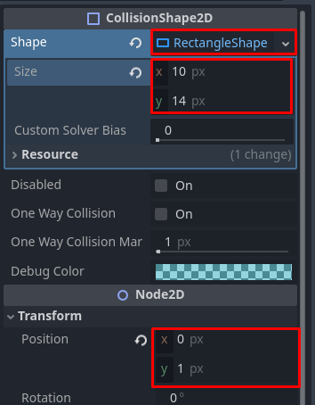

# Projekt Laskur

## Uus projekt

Loo uus projekt nimega `Laskur`, mis kasutab taaskord Compatibility renderdajat. Kasutame [peatüki sissejuhatuses](https://taavippp.github.io/godot/2d-mang/) allalaetud `tilemap.png` spraidifaili ning liiguta see projekti kausta. Godot peaks selle faili automaatselt importima.

## Peategelase stseen

Esimese asjana loome mängu peategelase stseeni. Peategelane suudab ringi joosta, hüpata ja oma relva lasta. Stseeni algne struktuur on järgnev:

Uurime lähemalt neid 3 uut sõlme:

### CharacterBody2D

Meie mäng kasutab Godot sisse ehitatud füüsika süsteemi. See süsteem on arendaja jaoks lihtsustatud **füüsika keha sõlmedega**. CharacterBody2D on üks neist ning seda sõlme liigutatakse läbi koodi.

Lisaks on olemas ka **RigidBody2D** ja **StaticBody2D**. RigidBody2D liigub kasutades impulsside süsteemi (üks pidev impulss oleks näiteks gravitatsioon), seda sõlme kasutatakse veidi täpsema füüsika simulatsiooni loomisel. StaticBody2D ei liigu, seega seda sõlme kasutatakse näiteks maapinna või seina jaoks.

### CollisionShape2D

Füüsika kehadel on vaja kuju, et nad üksteist mõjutada saaksid. Siin tuleb appi CollisionShape2D sõlm, mis on ühine lahendus kõikidel 2D füüsika kehadel kuju loomiseks. Keha kuju saab olla ristkülik, ring jne.

### AnimatedSprite2D

Selle sõlmega on lihtne oma spraidi animatsioonid kokku panna kaadrihaaval ja neid redigeerida. Eksisteerib ka sõlm Sprite2D, millel pole juurdeehitatud animatsiooni võimekust.

## Animatsioon

Selleks, et teada, kui suur ja milline CollisionShape tulema peaks, paneme ennem paika spraidi. Loo inspektoris AnimatedSprite2D -> Animation -> Sprite Frames jaoks uus SpriteFrames resurss, vajutades nupule `<empty>`.

Peale SpriteFrames loomist ava see. Alumisel ribal avaneb uus moodul. Vaikimisi on olemas animatsioon "default", aga me tahame juurde luua ka "run" ja "jump". Uue animatsiooni saad luua vasakus "Animations" menüüs, vajutades **rohelise ristiga paberi** ikooni peale. Loodud animatsiooni saad ümber nimetada
selle peale klikkides.

Peale animatsioonide loomist on vaja neile kaadrid juurde lisada. Vali animatsioon "default" ja leia parempoolses "Animation Frames" menüüs ruudustiku nupp `Add frames from sprite sheet`. Avaneb faili valimise aken, vali meie `tilemap.png`.

Avaneb uus aken, kus saad valida, mis kaadritest animatsioon koosneb. Esiteks peame seda akent sätestama, kasutades paremal pool olevaid sätteid. Pilt jaotub 10 x 6 = 60 kaadriks ja kaadritel on ühe piksline vahe ehk _separation_.

Meie peategelase animatsioonid koosnevad vaid kahest kaadrist viienda rea vasakul pool. "default" animatsioon kasutab vaid esimest neist, "run" kasutab mõlemat ja "jump" kasutab teist. Minu arvates tundus "run" animatsioon aeglane, seega määrasin, et see oleks `10 FPS` (_frames per second_ ehk kaadrit sekundis).

Meie tegelane tundub küll natuke hägune. Tegu on automaatse filtriga Godot poolt, kuid meie pikslikunsti jaoks see ei sobi. Paranda seda valides ülaribalt Project -> Project Settings. Seejärel kirjuta otsingusse `texture filter` ja väärtuse `Linear` asemel olgu `Nearest`. Nüüd peaks pikslikunst kenam välja nägema.

## Füüsika kuju

Nüüd, kus animatsioonid loodud, võiks tegeleda CollisionShape2D sõlmega. Loo inspektoris CollisionShape2D -> Shape -> RectangleShape2D resurss. Määra selle suuruseks 10 x 16 pikslit.

## Tegevuste loomine

Paljud mängud pakuvad erinevaid skeeme tegelase liigutamiseks - klaviatuur, hiir, konsoolipult jne. Godot lihtsustab seda protsessi kasutades tegevuste süsteemi. Näiteks tegevuse "move_right" alla saab määrata klaviatuuri klahvi vajutuse ja konsoolipuldi liigutuse. Vaja on vaid kontrollida siis, kas tegevus "move_right" toimub.

Tegevusi saab luua Project Settings menüüs Input Map saki alt. Lahtrisse `Add New Action` saad kirjutada oma tegevuse nime ja selle kõrval olevast `Add` nupust selle lisada. Meil on tarvis järgnevaid tegevusi:

-	move_right
-	move_left
-	jump
-	shoot

Peale tegevuste deklareerimist, saab määrata, mis sisend mängija poolt selle tegevuse käivitab **paremas ääres olevast risti** nupust. Saad lihtsalt vajutada sellele klahvile, mis sinu arust sobib ja siis `OK` vajutada.

Mina kasutan liikumiseks nooleklahve, hüppamiseks Z klahvi ja laskmiseks X klahvi.

Valides stseeni dokis juursõlm (CharacterBody2D) ja sellele topeltklikkides/`F2` vajutades/paremkliki menüüs `Rename` vajutades anna talle uus nimi `Peategelane`. Salvesta stseen, vajutades `CTRL + S`. Godot pakub faili salvestada nimega `player.tscn`. See sobib meile.

Järgmises alapeatükis õpime Godot füüsikamootorit tundma, kirjutades tegelase liigutamiseks skripti.
