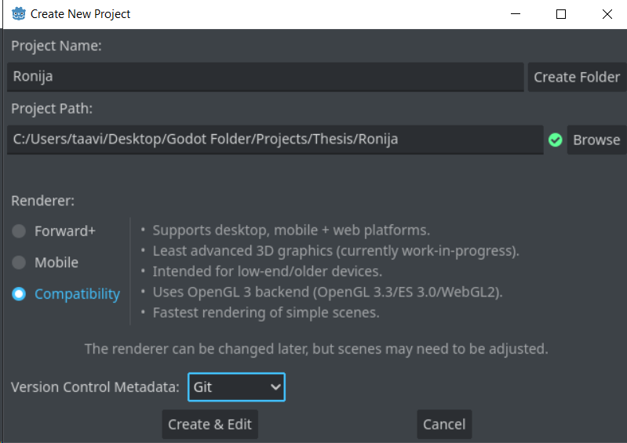
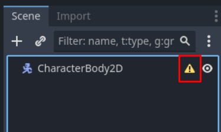
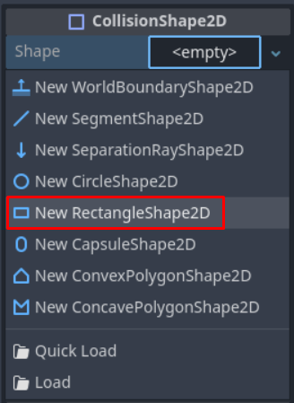
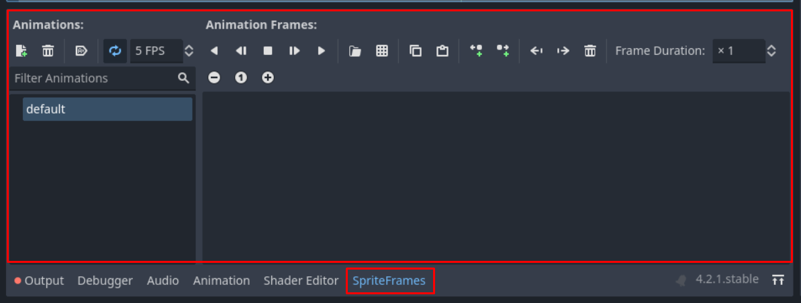
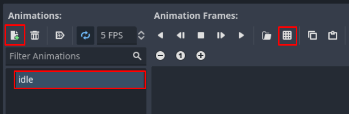
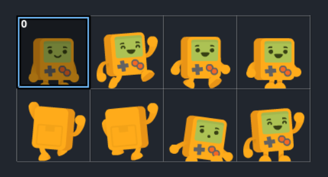
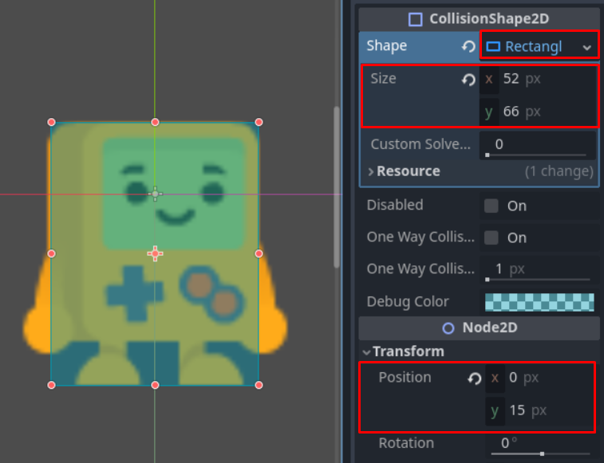
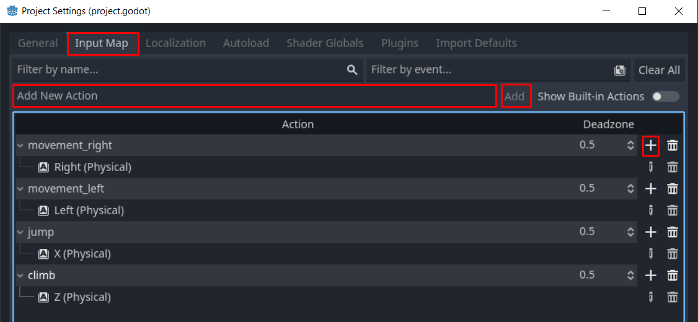
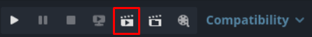

# Ronija

## Ettevalmistused

Hakkame siis ronija mängu looma. Suundu projektihaldurisse ja hakka uut projekti looma. Sobilik nimi sellele olekski `Ronija`. Tee kindlaks, et kataloog/kaust, kus mängu hakkad looma, ei sisalda muid faile. Kuna taas on tegu lihtsa 2D mänguga, siis kasutame jälle `Compatibility` renderdajat.



Animeeritud tegelase ja muude toredate visuaalide jaoks on meil vaja vastavaid pilte, mis neid sisaldavad. Kasutame Kenney loodud tasuta materjale. Kenney on loonud palju mängude jaoks materjale, mis on kaitstud Creative Commons Zero litsentsiga, mis tähendab, et neid võib kasutada ükskõik kuidas. Link materjalidele, mis selles projektis kasutame, on selle lõigu all.

<https://www.kenney.nl/media/pages/assets/simplified-platformer-pack/80861da94b-1677693200/kenney_simplified-platformer-pack.zip>

Alla laetakse 670-kilobaidine .zip fail. See sisaldab mitut teist faili, mis on üheks suureks failiks kokku pakitud. Eeldatavasti tunned, kuidas .zip faili avada, aga kui mitte, siis soovitan Windows operatsioonisüsteemi kasutajale soojalt 7-Zip tööriista, mille saad alla laadida [siit](https://www.7-zip.org/). Paki failid lahti ja liiguta kaust nimega `Tilesheet` enda projekti kausta. Saad seda näiteks teha, tirides hiirega see kaust oma failihaldurist Godot'sse. Godot peaks selle peale automaatselt kõik need failid importima ja nende jaoks looma `Tilesheet` nimelise kausta. Failihalduris olev kaust peaks ka alles olema, Godot tegi koopia sellest.

Failisüsteemi dokis peaks `Tilesheet` kaust sisaldama 4 faili. Kaks neist on tegelase erinevate animatsioonide jaoks ja ülejäänud kaks sisaldavad mängu keskkonna erinevaid osi. Failid, mille lõpus on kirjas `@2`, on suuremad, seega spraidid on natuke kvaliteetsemad. Meie kasutame väiksemaid spraite, seega kustuta ära failid, mille lõpus on `@2`. Saad seda teha sarnaselt sõlme kustutamisele, valides faili ja kasutades kas klaviatuuril `Delete` nuppu või parema-kliki menüüst valikuga `Delete`.

## Tegelase koostisosad

Loo selle projekti esimeses stseenis juursõlmeks `CharacterBody2D`. Selle sõlme eesmärk ongi olla läbi skripti käskusid saav füüsiline keha. On olemas veel RigidBody2D, mis on sobivam mingisuguse füüsika simulatsiooni jaoks. Sellega sobiks teha näiteks põrkava ja veereva palli. Lisaks on olemas ka StaticBody2D, mille eesmärk on olla liikumatu füüsiline objekt nagu maapind.

Peale CharacterBody2D loomist panid äkki tähele stseeni dokis, et kollane hoiatusmärk on selle sõlme juures. Kui vajutad hiirega selle peale, teavitab Godot, et sellel sõlmel on vaja laps-sõlme, mis on kas CollisionShape2D või CollisionPolygon2D tüüpi. Teeme siis nii, et lisamegi juurde `CollisionShape2D` sõlme. Nüüd on aga sellel sõlmel mingi mure, taas märgitud kollase hoiatusmärgiga.



CollisionShape sõlme `shape` omadusel on vaja kindlat väärtust. Füüsilisel kehal on loomulikult vaja kuju, et ta saaks ülejäänud maailmaga suhelda ja selle kuju puudumist Godot näitabki nende kahe hoiatusega välja. Leia inspektori dokist siis Shape omaduse koht ja tekita talle `New RectangleShape2D`.



Nüüd on see CharacterBody2D ristküliku kujuline. Kuid tegelane pole ainult sinine ristkülik - ta peaks ju robot olema, nagu failides. Esiteks salvesta stseen nimega `Tegelane.tscn` ja siis loo `AnimatedSprite2D` nimeline sõlm. See sõlm võimaldab lihtsaid, juba spraidi failis erinevate kaadritega 2D animatsioonid ellu tuua. Sprait tähendab mingit pilti, mida arvutiekraanil saab ringi liigutada. Äsja loodud sõlm hoiatab, et tema "Sprite Frames"-nimelisel omadusel on kindlasti väärtust vaja, muidu on see sõlm kasutu. Ehk leia ja vajuta inspektoris AnimatedSprite2D -> Animation -> Sprite Frames -> New SpriteFrames. Ennem oli muutuja väärtust kuvavas kastis sõna `<empty>`, nüüd on `SpriteFrames`. Vajuta selle peale uuesti ja alumisel ribal avaneb sellele sõlmele omane moodul, millega saame oma animatsioone luua.



Saame oma animatsioonid luua päris lihtsalt - loome uue animatsiooni, paneme talle sobiva nime ja valime spraidi pildilt, milliseid kaadreid see animatsioon kasutab. Looma pead järgnevate nimedega animatsioonid:

-   `seisab`
-   `hüppab`
-   `jookseb`
-   `ronib`

Kuna üks animatsioon nimega `default` on juba olemas, siis võid alustada sellega, et annad talle uue nime `seisab`. Seda saad teha nime peale ühe korra hiirega vajutades ja siis kirjutades. Järgmisena otsi üles Animation Frames sektsioonis ruudukujuline 9 osaks jagatud nupp. Hiirt selle nupu peal hoides näidatakse vihjet "Add frames from sprite sheet (CTRL+Shift+O)". Vajuta sellele nupule.



Avaneb uus aken, mis palub sul spraidi faili valida. Leia üles tegelase fail (nimega `platformerPack_character.png`) ja ava see. Järjekordne aken avaneb, kus on näha, kuidas spraidi fail ära tükeldatud on. Algul peaks ta olema 16 osaks tükeldatud - 4 horisontaalselt ja 4 vertikaalselt. See pole õige. Muuda akna paremas pooles muutuja `Vertical` väärtuseks 4 asemel 2. Seejärel vajuta hiirega **vasaku ülemise** kasti peale. All peaks olema nüüd nupp, kus on kirjas `Add 1 Frame(s)`. Vajuta sellele, et valitud kaadrid lisada. Seismise animatsioon on nüüd olemas! See koosneb lihtsalt ühest kaadrist, seega ei näe see väga muljetavaldav välja.



Nüüd loome animatsiooni nimega `jookseb`. Animatsiooni loomiseks leia mooduli Animations sektsioonis paberilehe disainiga nupp, kus on juures roheline plussmärk (see on märgitud ka üleeelmisel pildil punasega) ja vajuta sellele. Peaks ilmuma uus animatsioon nimega `new_animation`. Nüüd juba tead, mida teha: muuda ära nimi, leia spraidi fail ja märgi ära animatsiooni kaadrid. Kaadreid saab valida ka hiire vasakut nuppu all hoides ja seda kaadrite üle liigutades. Selle animatsiooni jaoks on tarvis **ülemise rea parempoolseid** kaadreid.

Loo `hüppab` animatsioon, kasutades **ülemise rea vasakult teist** kaadrit ning `ronib` animatsioon kasutab neid **alumise rea** kaadreid, kus tegelane on seljaga. Nüüd on tegelase animatsioonid valmis! Nüüd on aeg lahendada üks probleem, nimelt tegelase füüsiline kuju on liiga väike. Tegelane ise on ka enam-vähem ristküliku kujuline, aga füüsilist kujundit pole näha. Esmalt lohista hiirega stseeni dokis CollisionShape2D sõlm AnimatedSprite2D-st allapoole, et see tegelase ees ilmuks. Seejärel leia inspektoris taas `Shape` omadus ja vajuta väärtuse peale. Selle alla peaks ilmuma nüüd alamenüü, kuhu saad kujundi suurust kirjutada. X väärtus peaks olema 52 ja Y väärtus 66. Lisaks pead kujundi positsiooni natuke allapoole viima - pane seal Y väärtuseks 15.



## Tegelase liikuma panemine

Tegelase liikuma saamiseks on esiteks vaja tekitada võimalused mängijal sisendeid saata. Selleks ava tööriistaribalt projekti seaded (Project -> Project Settings...). Projekti seadete aknas vaheta ülevalt vaade `Input Map` peale. Siin saad deklareerida erinevaid tegevusi, mida mängija saab teha, näiteks vasakule liikumine, hüppamine jms. Lahtrisse `Add New Action` kirjuta `liikumine_parem` ja lisa see kas `Add` nupust või `Enter` klahvile vajutades. Tahame, et tegelane liiguks nooleklahvidega. Leia tegevuste loetelust enda vast loodud tegevus ja vajuta paremal olevalt plussmärki. Avaneb aken, kus saad ära märkida, mis kasutaja sisendiga see tegevus toimub. Vajuta lahtri `Listening for input...` peale ja vajuta paremat nooleklahvi, siis kliki `OK` nuppu, et kinnitada, et see tegevus juhtub sellise sisendi korral.

Kokku on vaja luua neli tegevust:

-   `liikumine_parem` parema nooleklahviga (selle lõime)
-   `liikumine_vasak` vasaku nooleklahviga
-   `hüpe` X klahviga
-   `ronimine` Z klahviga



Kõik tegevused, mis lõpuks peaksid olema.
{: .text-center .fs-3}

Nüüd võime lõpuks CharacterBody2D jaoks skripti luua. Kui salvestasid oma stseeni nimega `Tegelane.tscn`, siis peaks Godot skripti nimeks pakkuma `Tegelane.gd`, mis sobib. Algul paneme tegelase lihtsalt vasakule-paremale liikuma. Selleks kasutame funktsiooni `_physics_process`. See on ka sisseehitatud funktsioon ja sarnase põhimõttega nagu `_process`. Vahe on neil see, et `_physics_process` üritab käivituda maksimaalselt 60 korda sekundis, aga `_process` funktsioonil sellist piiri pole. 

Võid algse koodi järgnevaga asendada:

```gdscript
extends CharacterBody2D

func _physics_process(delta):
	if (Input.is_action_pressed("liikumine_parem")):
		velocity.x = 1
	elif (Input.is_action_pressed("liikumine_vasak")):
		velocity.x = -1
	move_and_slide()
```

Input objekt laseb sul pärida igasugust infot kasutaja sisendite kohta. Kasutamegi selle klassi meetodit `is_action_pressed(tegevuse_nimi)`, mis tagastab tõese või väära väärtuse. Kui mängija vajutab paremat nooleklahvi, siis CharacterBody2D muutuja `velocity` X väärtuseks määratakse 1. Vasaku nooleklahviga on vastupidine. `move_and_slide` funktsioon kasutab `velocity` muutujat ja liidab selle tegelase positsioonile. Lisaks võtab see funktsioon automaatselt arvesse muutuja `delta`, mis tähistab sekundeid eelmisest korrast, millal see funktsioon käivitus. Lõpuks see funktsioon veel parandab erinevate füüsiliste kehade kattumist ja asetab nad sobivasse kohta tagasi.

Tahaks näha, kas kood töötab, aga ei taha tegelast ennast mängu põhistseeniks teha. Samal ribal on paremalt kolmas nupp vihjega `Run Current Scene (F6)`. Vajuta sellele, et hetkel redaktoris lahti olevat stseeni käivitada.



Kui lähedalt vaadata, siis tegelane liigub küll, kui paremat ja vasakut nooleklahvi vajutad, aga kohutavalt aeglaselt. Selleks võiks luua tegelasele kiiruse redaktorisse eksporditud muutuja, mis on täisarv. Selleks sobib järgmine koodirida:

`@export var kiirus: int = 100`

See laseb meil aga panna tegelase kiiruseks ükskõik mis täisarvu. Kirjuta `@export` asemele hoopis `@export_range(100, 300, 10)`. Nüüd on inspektoris nupp kiiruse valimiseks, mida saad 100-300 vahel libistada 10 kaupa. Siin tähendab kiirus seda, mitu pikslit tegelane ühe sekundi jooksul vasakule-paremale liikuda saab.

Lisaks on lühem viis kontrollida, kas vajutatakse vasakut või paremat nooleklahvi. Funktsioon `Input.get_axis(negatiivne_sisend, positiivne_sisend)` tagastab ujuvkomaarvu -1 ja 1 vahel. See arv tähistaks suunda, -1 oleks vasak ja 1 oleks parem. Seega `_physics_process` funktsioon saab selline olema:

```gdscript
func _physics_process(delta: float):
	var suund: float = Input.get_axis("liikumine_vasak", "liikumine_parem")
	velocity.x = suund * kiirus
	move_and_slide()
```

Nüüd peaks tegelane märgatavalt liikuma, aga ikka veidi aeglaselt. Pole hullu! Selle parandame järgmises osas, kus tekitame maapinna, kus tegelane saaks käia ja siis anname talle võime hüpata maapinnalt üles ja ronida kõrgest seinast üles.