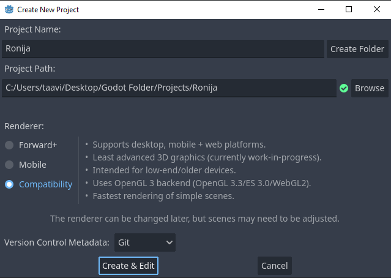

# Ronija

## Ettevalmistused

Hakkame siis ronija mängu looma. Suundu projektihaldurisse ja hakka uut projekti looma. Sobilik nimi sellele olekski `Ronija`. Tee kindlaks, et kataloog/kaust, kus mängu hakkad looma, ei sisalda muid faile. Kuna taas on tegu lihtsa 2D mänguga, siis kasutame jälle `Compatibility` renderdajat.

Animeeritud tegelase ja muude toredate visuaalide jaoks on meil vaja vastavaid pilte, mis neid sisaldavad. Kasutame Kenney loodud tasuta materjale. Kenney on loonud palju mängude jaoks materjale, mis on kaitstud Creative Commons Zero litsentsiga, mis tähendab, et neid võib kasutada ükskõik kuidas. Link materjalidele, mis selles projektis kasutame, on selle lõigu all.

<https://www.kenney.nl/media/pages/assets/simplified-platformer-pack/80861da94b-1677693200/kenney_simplified-platformer-pack.zip>

Alla laetakse 670-kilobaidine .zip fail. See sisaldab mitut teist faili, mis on üheks suureks failiks kokku pakitud. Eeldatavasti tunned, kuidas .zip faili avada, aga kui mitte, siis soovitan Windows operatsioonisüsteemi kasutajale soojalt 7-Zip tööriista, mille saad alla laadida [siit](https://www.7-zip.org/). Paki failid lahti ja liiguta kaust nimega `Tilesheet` enda projekti kausta. Saad seda näiteks teha, tirides hiirega see kaust oma failihaldurist Godot'sse. Godot peaks selle peale automaatselt kõik need failid importima ja nende jaoks looma `Tilesheet` nimelise kausta. Failihalduris olev kaust peaks ka alles olema, Godot tegi koopia sellest.

Failisüsteemi dokis peaks `Tilesheet` kaust sisaldama 4 faili. Kaks neist on tegelase erinevate animatsioonide jaoks ja ülejäänud kaks sisaldavad mängu keskkonna erinevaid osi. Failid, mille lõpus on kirjas `@2`, on suuremad, seega spraidid on natuke kvaliteetsemad. Meie kasutame suuremaid spraite, seega kustuta ära failid, mille lõpus ei ole `@2`. Saad seda teha sarnaselt sõlme kustutamisele, valides faili ja kasutades kas klaviatuuril `Delete` nuppu või parema-kliki menüüst valikuga `Delete`.

## Tegelase koostisosad

Loo selle projekti esimeses stseenis juursõlmeks `CharacterBody2D`. Selle sõlme eesmärk ongi olla läbi skripti käskusid saav füüsiline keha. On olemas veel RigidBody2D, mis on sobivam mingisuguse füüsika simulatsiooni jaoks. Sellega sobiks teha näiteks põrkava ja veereva palli. Lisaks on olemas ka StaticBody2D, mille eesmärk on olla liikumatu füüsiline objekt nagu maapind.

Peale CharacterBody2D loomist panid äkki tähele stseeni dokis, et kollane hoiatusmärk on selle sõlme juures. Kui vajutad hiirega selle peale, teavitab Godot, et sellel sõlmel on vaja laps-sõlme, mis on kas CollisionShape2D või CollisionPolygon2D tüüpi. Teeme siis nii, et lisamegi juurde `CollisionShape2D` sõlme. Nüüd on aga sellel sõlmel mingi mure, taas märgitud kollase hoiatusmärgiga.

