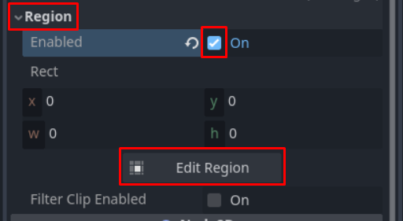
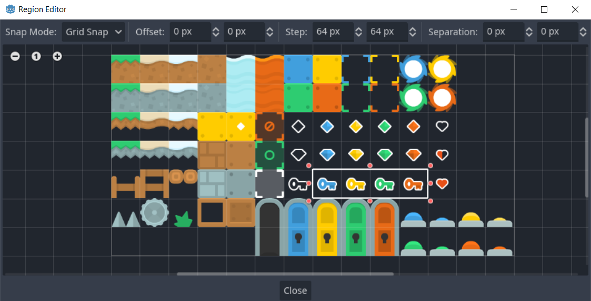

# Uksed, võtmed

Selles osas loome uksed, mis on lukus ja võtmed, mis nad lahti teevad.

## Võti

Alustame tegelikult võtme loomisega. Loo uus stseen ja tee juursõlmeks `Area2D` nimega `Key`. Area2D sõlm esindab mingit ala, millega saab küll kokku puutuda, aga teiste kehadega see kokku ei põrka. Area2D on ka klassi CollisionObject2D järglane, seega ka talle on vaja juurde lisada CollisionShape2D sõlm. Määra kujundiks ristkülik (`Shape -> RectangleShape2D`) ja tema suuruseks 64 x 64 pikslit. Loo ka `Sprite2D` sõlm, mille `texture` omaduse väärtuseks paned taas `platformPack_tilesheet.png`. Esineb probleem: terve see spraidileht on päris mahukas. Tahame vaid kasutada võtmete tekstuure, aga seal on lisaks kümneid teisi.

Probleemi lahendamiseks saame määrata, et Sprite2D kasutab ainult kindlat regiooni/ala sellest pildist. Leia inspektorist sektsioon `Region` ja vajuta selle all olevale `enabled` linnukesele. Paar asja ilmuvad juurde. Seda ala, mida Sprite2D kasutab, saaks lihtsalt arve kirjutades määrata, aga sedasi on päris tülikas. Vajuta hoopis nupule `Edit Region`.

Regiooni redaktor avaneb uues aknas.
Tee kindlaks järgnevad asjad:
-   Snap Mode väärtus on `Grid Snap`
-   Step väärtus on 64 x 64 pikslit

Seejärel saad hiirt kasutades regiooni piirjooni (paks valge joon) liigutada. Tee nii, et regioonis oleks vaid võtmete tekstuurid.

Võid nüüd regiooni redaktori akna sulgeda ja inspektoris leida `Animation -> Hframes` omadus. Pane selle väärtuseks 4 (eri värvi võtmete arv). Nüüd saad samas sektsioonis `frame` omadust muutes võtme värvi vahetada.