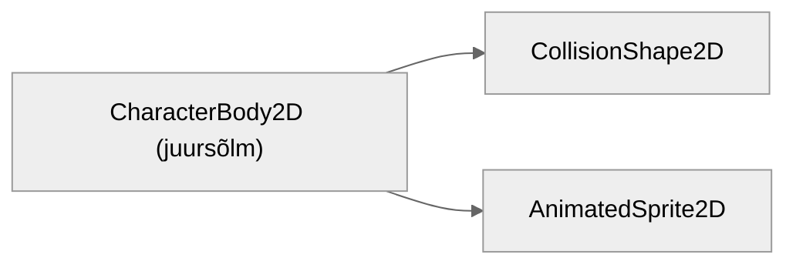
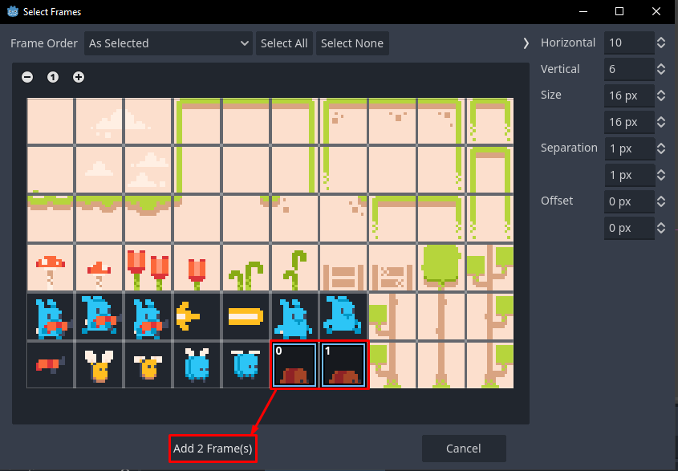
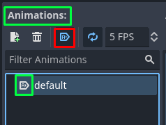
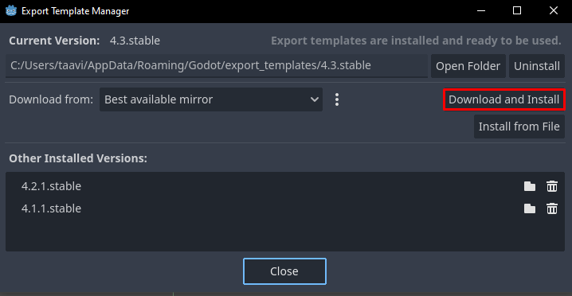
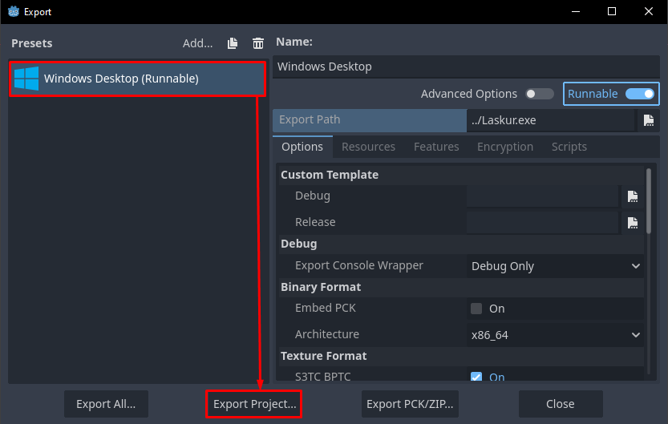
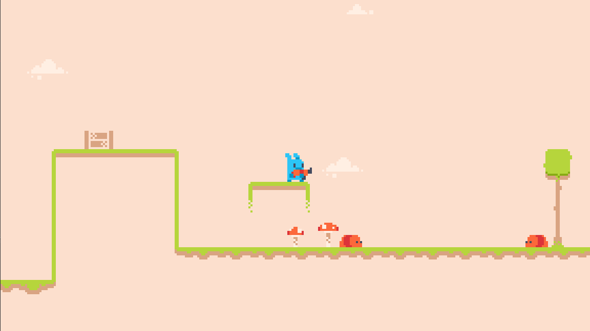

# Vastane

Lõpuks võtame kasutusele peategelase animatsioonid ning teeme talle ka mõned parandused. Pärast loome vastase, keda lasta saab. Lõpuks ekspordime oma projekti, et seda maailmaga jagada saaks.

## Peategelase lõpetamine

### Ülesanne 2

Meie peategelase AnimatedSprite2D sõlmel on 3 animatsiooni: "default", "run" ja "jump". AnimatedSprite2D väärtusega eksportmuutuja suudab animatsiooni mängida `play()` funktsiooniga. Lisaks peab sprait vastavalt suunale end pöörama.

Tead, et funktsioon `is_on_floor()` tagastab, kas tegelane on maapinnaga kontaktis. On vaja ka tuvastada suuna muutuja abil, kas tegelane liigub. Selleks, et kontrollida, kas ujukomaarv on null, on olemas funktsioon `is_zero_approx(x: float)`.

Suuna muutmiseks on AnimatedSprite2D sõlmel selleks sarnaselt Sprite2D'le `flip_h` muutuja.

Mina panin enda lahenduses animeerimisega seotud koodiread eraldi funktsiooni.

[Ülesande lahendus](../lahendused/ulesanne-2)

## Peategelase lõpetamine, jätk

Nüüd parandame laskmisega seotud probleemid. Need olid järgnevad:

1.	kui tegelane ei liigu kuuli lastes, siis ka kuul ei liigu
2.	vasakule liikudes ja lastes luuakse kuul tegelase selja tagant

Mõtleme, miks need vead tekkida võivad.

### Probleem 1

Kuul saab suuna peategelase käest. Suuna muutujat kasutatakse `velocity.x` arvutamiseks **korrutustehtes**. Peategelase suuna väärtus saab olla 0. Kui kiiruse muutujat korrutatakse nulliga, siis `velocity.x` on olenemata kiiruse muutuja väärtusest alati 0.

Selgub, et probleem on meie suuna muutujas. Kindlasti eksisteerib ka teisi lahendusi, aga minu valik on kasutada suuna jaoks kahte muutujat:

-	üks neist on mängija toore sisend (-1 ja 1 vahel, saab 0 olla) nimega `direction_input`
-	teine on tegelik suund (ei saa 0 olla) nimega `direction`

Loo siis juurde `direction_input` muutuja. Kui kutsud välja `Input.get_axis()` funktsiooni, siis selle väärtus antakse nüüd sellele muutujale. Peale seda peame kohe oma `direction` muutujale ka väärtuse andma `direction_input` põhjal.

```gdscript
... (muu kood)
var direction_input: float = 0.0
var direction: float = 1.0

func _process(delta: float) -> void:
	direction_input = Input.get_axis("move_left", "move_right")
	# kui toimub liikumine, võib tegelik suund muutuda
	if (not is_zero_approx(direction_input)):
		direction = sign(direction_input)
	... (muu kood)
```

Funktsioon `sign(x: float)` tagastab:

-	-1, kui `x` on negatiivne
-	0, kui `x` on 0 (meil seda juhtu pole, sest kasutame `not is_zero_approx(x)`)
-	1, kui `x` on positiivne

Nüüd peame mõtlema, kus kasutame mängija suuna sisendit ja tegeliku suuna muutujat.

Proovi aru saada igast juhust:

-	`velocity.x` arvutamisel kasutame `direction_input` muutujat
-	kuuli loomise signaali levitamisel kasutame `direction` muutujat
-	spraidi pööramise tingimuslauses kasutame `direction` muutujat
-	spraidi animatsiooni valikul kasutame `direction_input` muutujat

`direction_input` kasutame, kui on oluline teada, kas tegelane üldse liigubki. `direction` kasutame, kui meid huvitab puhtalt tema suund.

### Probleem 2

Tegelane laseb vasakule liikudes kuuli oma selja tagant. Kuuli luuakse vastavalt tegelase Marker2D asendile. Marker2D on asetatud peategelase stseenis temast paremale, tema relva juurde. See tähendab, et paremale liikudes tundub kõik õige, kuid Marker2D ei muuda asendit, kui tegelane vasakule liigub.

Kui paneme Marker2D asendit muutma vastavalt suunale, siis see viga on läinud. Saame selle probleemi tegelikult ühe koodireaga parandada:

```gdscript
... (muu kood)
	# sätib markeri asendi õigeks olenevalt suunast
	bullet_marker.position.x = abs(bullet_marker.position.x) * direction
	if (Input.is_action_just_pressed("shoot")):
	... (muu kood)
```

Võtame markeri praeguse asendi absoluutväärtuse ja korrutame selle suunaga.

## Roomav vastane

Loome nüüd lõpuks vastase, keda võimalik lasta oleks. Vastase on roomaja ehk nimi olgu `Crawler`. Tema stseeni struktuur on sarnane teistele:



Roomaja asub füüsikakihil nr 3 ehk *enemy* ja tuvastab füüsikakihti nr 1 ehk *level*.

Roomajal on ainult üks animatsioon `default` ja selle saame kohe luua. Kasutame sõlme `AnimatedSprite2D`, nii et loo inspektoris `SpriteFrames` resurss ja leia `default` animatsioon alumise riba kaudu. Kasutame spraidilehe viimasel real olevat punast elukat roomaja animatsiooni jaoks.



Kuna roomajal on vaid üks animatsioon, pole vaja koodis seda `AnimatedSprite2D.play()` käsuga tööle pannagi. SpriteFrames mooduli Animations menüüs on nupp `Autoplay on Load`, mis paneb animatsiooni automaatselt mängima, kui sõlm stseenide puusse lisatakse. See nupp asub animatsiooni kustutamise (prügikasti ikooniga) nupu kõrval.



Nüüd saame CollisionShape2D'le kuju anda. Olgu see taas lihtne `RectangleShape2D` suurusega (10, 7). Pead selle sõlme asendit natuke muutma, et see samal tasandil spraidiga oleks. Mina liigutasin selle (0, 4.5) juurde.

### Ülesanne 3

Loome vastasele skripti `crawler.gd`.

Roomaja on sarnane meie peategelasele - ta liigub kahes suunas ning talle mõjub gravitatsioon. Kui ta on seinaga kontaktis, ta muudab suunda. Sprait muudab ka muidugi suunda.

[Ülesande lahendus](../lahendused/ulesanne-3)

Vastane ei suuda praeguses seisus peategelasele haiget teha nii, nagu kuul vastasesele teeb. Selle funktsionaalsuse loome järgmises peatükis [Laskur 2.0](../laskur-2.0/index).

Lisa põhistseeni paar roomajat ja tee tase ilusaks!

## Eksportimine

Praeguseks on meie projekt valmis. Järgmises peatükis küll arendame seda edasi, aga mõne olulisema Godot osaga oleme nüüdseks tutvunud ning ehk tunned end juba mugavamalt selle mängumootoriga.

Valminud projekti oleks tore ka teistele näidata. See ongi ju meie videomängude (ja muude rakenduste) eesmärk. Selleks peame oma projekti eksportima.

Esiteks peame alla laadima eksportimismallid. Need ei ole vaikimisi kaasas Godot programmiga, et võimaldada kiirem allalaadimise kogemus. Leia ülaribalt `Editor -> Manage Export Templates...`. Vajuta nupule `Download and Install`, et need paigaldada. Kuna eksportimismallid on päris mahukad, läheb arvatavasti paar minutit. Kui allalaadimine on valmis, võid selle akna sulgeda.



Nüüd ava ülaribalt `Project -> Export...`. Nupust `Add...` saad valida, mis operatsioonisüsteemile sa eksportida tahad. Mina kasutan Windows 10 operatsioonisüsteemi, seega valisin Windows Desktop. Meie projekt pole väga keeruline, siis saad kohe vajutada `Export Project`.



Vali kataloog/kaust, kuhu eksporditud rakendus luuakse ja vajuta `Save`. Godot teeb selle ära, aga kaasneb paar hoiatusteadet, mis mainivad `rcedit` tööriista puudumist (Windowsile spetsiifiline tööriist .exe failide haldamiseks). Sulge see teadete aken ja nüüd peaks seal kaustas, kuhu mängu eksportisid, uus Laskur.exe fail olema!

Saad selle avada ja sulgeda nagu tavalist Windowsi programmi. Kui käivitad mängu, avaneb see sinu määratud põhistseenis. Veidi lihvitumas mängus oleks põhistseeniks siis määratud näiteks selle avamenüü.

Palju õnne! Oled loonud 2D mängu prototüübi ja isegi valmis meisterdanud .exe faili, mida saad teistega vabalt jagada!

