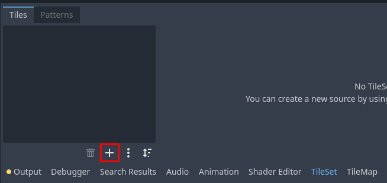
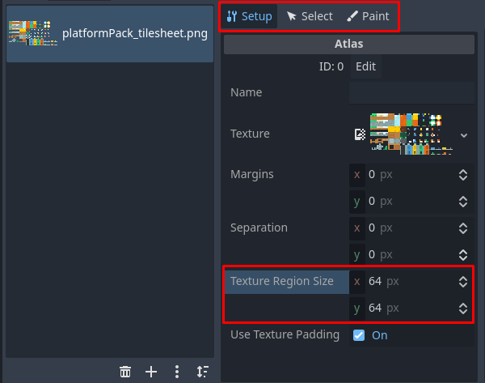
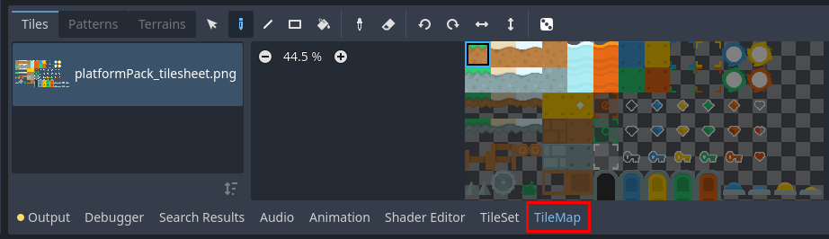
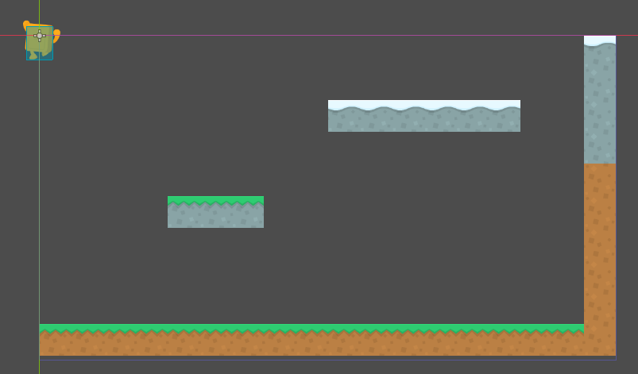

# Visuaalid

Selles osas paneme tegelase animatsioonid tööle. Pärast võtame kasutusele TileMap sõlme, millega on mugav mängu tasemeid luua.

## Animatsioonid

Kui mäletad, lõime AnimatedSprite2D sõlme, millel juba panime animatsioonid paika. Nendeks olid: `climb`, `idle`, `jump` ja `run`. Nüüd on vaja see sõlm skriptifailis kasutusele võtta. Loo uus eksporditud muutuja `animated_sprite_2d` selle sõlme jaoks ja määra talle väärtus. Uus muutuja ilmub ilusti inspektoris, aga see, et tegelase füüsikaga ja visuaalidega seotud muutujad on koos, võib segadust tekitada. Kasutame annotatsiooni `export_group`, et grupeerida sarnase otstarbega ühe menüü alla. Selle annotatsiooni saab kasutusele võtta nii:

```gdscript
@export_group("Physics")

@export_range(100, 300, 10) var speed: int = 100
@export_range(1000, 2500, 25) var jump_force: int = 1000
@export_range(1, 25) var mass: int = 1
@export_range(100, 300, 10) var climb_speed: int = 150

@export_group("Nodes")

@export var animated_sprite_2d: AnimatedSprite2D
```

Nüüd on animatsioonidega sõlme võimalik koodis kasutada. Kui mäletad, siis kasutame `_physics_process` funktsiooni, sest seda kutsutakse välja maksimaalselt 60 korda sekundis. Animatsioonide puhul pole oluline, mitu korda sekundis nad uuenevad, seega võime kasutusele võtta `_process` funktsiooni. Kuna `_process` funktsioonis midagi muud peale animatsiooni loogika ei saa olema, siis ei pea animatsioonidega tegelemiseks eraldi funktsiooni looma.

### Ülesanne

Mõtle, mis kriteeriumite puhul mis animatsioon mängima peaks ja kirjuta vastav kood.
Selleks, et kontrollida, kas `velocity` x-koordinaat on 0, kasuta sisseehitatud funktsiooni `is_zero_approx` (kasutame seda, sest `velocity` kasutab ujuvkomaarve).
AnimatedSprite2D'l on funktsioon `play`, mis võtab argumendina animatsiooni nime.

Lahendusi on selle jaoks mitmeid, aga üks neist oleks järgmine:

```gdscript
func _process(delta: float) -> void:
	if (is_on_floor()):
		if (is_zero_approx(velocity.x)):
			animated_sprite_2d.play("idle")
		else:
			animated_sprite_2d.play("run")
	elif (is_climbing):
		animated_sprite_2d.play("climb")
	else:
		animated_sprite_2d.play("jump")
```

Kui käivitad mängu, tegelane teeb oma animatsioone küll, aga ta ei pööra ümber, kui liigud vasakule. Õnneks on AnimatedSprite2D'l olemas omadus `flip_h` (horisontaalne pööramine). Kirjuta juurde, et paremale liikumise puhul on `flip_h` väär ja vasakule liikumise puhul tõene.

```gdscript
func _process(delta: float) -> void:
    if (Input.is_action_pressed("movement_right")):
        animated_sprite_2d.flip_h = false
    elif (Input.is_action_pressed("movement_left")):
        animated_sprite_2d.flip_h = true
    # ...
```

Kui nüüd mängu käivitad, siis tegelane on animeeritud ja pöörab. Näeb päris vägev välja!

## TileMap sõlm

Nüüd kus üks spraidileht on ilusti kasutusele võetud, on aeg ka seda kasutada, kus on erinevad maapinna ja muude objektide tekstuurid. Eesmärk on teha parem versioon eelmises osas loodud maapinnast. Selleks kasutame `TileMap` sõlme. Loo uus stseen ja tee sellest juursõlm. Võid talle nimeks panna `TileGround`.

TileMap sõlmega saame erinevaid tasemeid palju lihtsamini luua, sest temaga on võimalik kasutada erinevaid spraite ja nendega tase nii-öelda "maalida" või "ehitada".

Inspektoris on oluline esimese asjana tekitada uus `Tile Set`. TileSetis määrad, milliseid spraite see TileMap üldse kasutada saab. Lisaks avaneb TileSeti redigeerimise moodul. Et tööga alustada, vajuta vasakul menüüs olevale plussmärgile ja avanenud alamenüüs valikule `Atlas`.



Vali fail `platformPack_tilesheet.png`. Godot pakub, et suudab automaatselt pildi ilusti ära tükeldada, aga meil pole seda vaja kasutada, kuna ta pakub veidi valesti. Määra muutuja `Texture Region Size` suuruseks 64 x 64 pikslit. Vali mõned spraidid (hiirega klikkides/üle lohistades), millest tahad pärast oma taseme ehitada. Need peaksid oma tumeda varju kaotama. Seejärel sama menüü kohalt liigu `Paint` menüüsse.



Algul ilmub vaid nupp, millel on kirjas `Select a property editor`. Sellele vajutades näeme, et siit on ka võimalik TileSeti erinevatele tükkidele füüsika kehad tekitada, kuid hetkel mitte. Peame algul inspektori TileSet alamenüüst üldse deklareerima, et see sõlm ka füüsikaga tegeleda võib. Tee seda vajutades `Physics Layers > Add Element`. Kui eelmisest osast mäletad, siis maapinna kollisioonikiht on 2 ja kollisioonimaski pole vajagi, kuna selles mängus ei reageeri maapind kuidagi sellele, et tema peal liigutakse. Lisaks määra `Tile Size` väärtuseks ka 64 x 64 pikslit.

Nüüd, kui tagasi minna `Select a property editor` nupu juurde, saad selle alt valida `Physics Layer 0`. Kuna oleme menüüs "Paint", saame "maalida" (jälle hiirega vajutades/üle lohistades) nüüd TileSeti erinevatele tükkidele füüsika kehad. Kõik sinu valitud tükid peaksid olema kerge sinise värviga kaetud.

Nüüd on sinu TileMap sõlm valmis. Salvesta see. Liigu mängu peastseeni ja kustuta ära vanad Ground sõlmed. Lisa uus TileGround ja nüüd avaneb `TileMap`-nimeline moodul.

Selles moodulis saad valida, mis TileSeti tükkidega hetkel taset ehitada tahad, juba tuttava klikkimise/hiire lohistamise süsteemiga. Võid ka mitu TileSeti tükki korraga valida.



Kui oled valinud, millega taset ehitada tahad, siis hakka tööle: stseeni vaates hiirt ringi liigutades on nüüd hiire ümber ruudustik. Kliki ning tekitad maapinna tüki. Kui vajutad nuppude D, L ja R vahel saad vastavalt üksikuid maapinna tükke maalida, neid ühe joonena maalida või lausa terve ristküliku ala ära täita.

On üpris lihtne ehitada järgmisel pildil olev tase:



Nüüd saad tegelasega ilusas tasemes ringi liikuda! Välimus on mängule ikka väga oluline.

Järgmises osas tekitame uksed, mis lasevad meil erinevate tasemete vahel liikuda ja võtmed, millega lukustatud uksed avada.

{: .todo }
Tegelase kollisioon seinaga on *wonky*, kui näiteks safe margin 0.5px, siis enam pole.