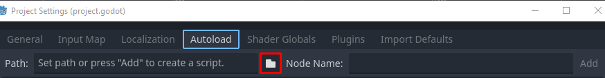

# GDScript

## Tühikud

Selles osas tutvume lähemalt GDScripti erinevate osadega. Selles peatükis oled juba natuke õppinud seda Godot'le loodud keelt, aga nüüd saad teada, mida täpsemalt GDScriptiga teha saab.

GDScript on süntaksi poolest kohati sarnane Python keelele - mõlemal keelel on iga rea taane oluline.
Esimene funktsioon siin koodiplokis viskaks veateate, teine mitte.

```gdscript
# Valesti taandatud kood
func _ready() -> void:
print("tere")

# Korrektselt taandatud kood
func _process(delta: float) -> void:
    print("Möödus " + delta + " sek")
```

Vaikimisi üritab Godot redaktor sulle õiget taanet pakkuda. Kui deklareerid näiteks funktsiooni, tingimuslause või tsükli (*if*/*while*/*for*), siis järgnev rida algab automaatselt tabulaatoriga.

## Andmetüübid

Godot's on järgnevad andmetüübid:

-   null
    -   tühi/puuduv väärtus
-   bool
    -   true/false ehk tõene/väär või 1/0 väärtus
-   int
    -   täisarv
-   float
    -   ujuvkomaarv
-   string
    -   tekst

Lisaks võtmesõna `void` kasutatakse, kui funktsioon ei peaks mingit väärtust tagastama.

## Funktsioonid, tsüklid, tingimuslaused

Eelnevalt õppisime deklareerima funktsioone `func` võtmesõnaga.
GDScriptis on võimalik luua nii `while` kui ka `for` tsükleid.
Tingimuslausete jaoks on võtmesõnad `if`, `elif`, `else` ja `match`.
`match` on sarnane teistest keeltest `switch` võtmesõnale, aga väga paindlik.
Näiteks:
```gdscript
func _ready() -> void:
    var num_1: int = 10
    var num_2: int = 5
    
    # muutuja i eksisteerib siin ainult for-tsükli ajal
    for i in num_1:
        print(i)
    
    # siin loodud muutuja i ei ole for-tsükli omaga seotud
    var i: int = 0
    while i < num_2:
        print(i)
        i += 1
    
    if i == 4:
        print("neli")
    elif i == 5:
        print("viis")
    else:
        print("midagi muud")
    
    match num_1:
        5:
            print("viis")
        7:
            print("kümme")
        [8, 9, 10]:
            print("arv 8 ja 10 vahel")
    
    match typeof(num_2):
        TYPE_STRING:
            print("muutuja on string")
        TYPE_INT:
            print("muutuja on arv")
```

Lisaks toetab `match` veel sõnastik-tüüpi mustreid ka.

## Konteinerid

GDScriptis on erinevad konteinerid mitme ühte andmetüüpi muutuja hoidmiseks.

-   Array
    -   massiiv
    -   Godot 4. versioonist alates on neile võimalik andmetüüpe määrata nii: `Array[tüüp]`, nt `Array[int]`
-   Packed Array
    -   kuna tavaline massiiv on loodud igasuguseid andmetüüpe ja klasse sisaldama, siis suurte andmekogustega tegelemiseks on mõne andmetüübi jaoks olemas PackedArray, millega opereerimine on palju kiirem ja tõhusam
    -   PackedStringArray, PackedInt32Array jne
-   Dictionary
    -   sõnastik-konteiner, kus väärtustel on indeksite asemel võtmed
-   Signal
    -   ka signaali võib muutuja väärtuseks määrata (eelnevalt mainitud)
-   Callable
    -   ka funktsiooni võib muutuja väärtuseks määrata (eelnevalt mainitud)

## Võtmesõnad ja operaatorid

### Võtmesõnad

{: .todo }
Kontrolli breakpoint võtmesõna üle, preload

Lisaks teistele siin lehel mainitud võtmesõnadele eksisteerivad veel:

-   `break` & `continue`
    -   `break` on tsükli lõpetamiseks
    -   `continue` on tsükli iteratsiooni vahele jätmiseks
-   `is`
    -   tingimuslauses klassi kontrollimiseks
    -   näide: `a is Label`
-   `in`
    -   tingimuslauses kontrollimiseks, kas väärtus on stringis/massiivis/sõnastikus/sõlmes
-   `as`
    -   muuda väärtuse andmetüüpi
    -   näide: `var y: int = x as int`
-   `self`
    -   viide praegusele klassi instantsile
-   `signal`
    -   signaali deklareerimiseks
    -   näide: `signal liikus_paremale`
-   breakpoint
    -   peatab programmi seal real, kus see on kirjas*
-   preload
    -   laeb faile konstantidena
-   await
    -   peatab skripti töö kuni saab signaali või kaasrutiin lõpeb
-   assert
    -   kui talle antud tingimus on vale, siis programm viskab veateate
-   konstandid
    -   PI
    -   TAU
    -   INF
        -   lõpmatus
    -   NAN
        -   võimatu number

### Operaatorid

Tehete tegemiseks on saadaval operaatorid `+`, `-`, `*`, `/`, `%` ja `**`.
`%` annab tulemuseks jagamise jäägi. `**` on astendamise operaator.

Tehete operaatoritele saab lisada ette `=`, et määrata tehte tulemus muutuja väärtuseks.

Võrdluste tegemiseks on olemas `==`, `<`, `>`, `<=`, `>=` ja `!=` operaatorid.
On olemas võtmesõnad `not`, `and` ja `or`.

## Klassid

On kaks võtmesõna klasside jaoks, `class` ja `class_name`.
`class` on tavaline klass, mis on ligipääsetav ainult tema skriptiga ühendatud sõlme kaudu.
`class_name` deklareerib uue klassi, mis on nähtav sõlmede loetelus. Seda kasutatakse siis, kui üht ja sama klassi soovid taaskasutada. Seda võtmesõna võib vaid kord ühes skriptifailis kasutada.
Näiteks on siis järgnev võimalik:
```gdscript
extends Node2D

class_name MinuKlass

var taisarv: int = 5

class KlassMinuKlassis:
    var komaarv: float = 0.5

    func mis_on_komaarv() -> float:
        return self.komaarv
```

Saad teises skriptifailis nendele klassidele niimoodi ligi:

```gdscript
var minu_klass: MinuKlass = MinuKlass.new()
var klass_minu_klassis: MinuKlass.KlassMinuKlassis = MinuKlass.KlassMinuKlassis.new()
```

Tegelikult, kui klassi instantsi alles lood, siis võid lasta kompileerijal ka andmetüüpi lihtsalt järeldada. Sedasi kirjutad vähem koodi.

```
var minu_klass:= MinuKlass.new()
var klass_minu_klassis:= MinuKlass.KlassMinuKlassis.new()
```

Pane tähele, et on kasutatud nii : (koolon) kui ka = (võrdusmärk) kirjamärke.

### Enumeraator ehk loenditüüp

Võtmesõnaga `enum` on võimalik deklareerida sõnastiku moodi konstantsete väärtustega klass, kus võtmetel on automaatselt väärtused antud. Saad ka ise väärtuse lisada.

```gdscript
# Nimetu enumeraator
enum {
    VAARTUS_1,
    VAARTUS_2,
    VAARTUS_3,
}

enum Nimega {
    VAARTUS_4,
    VAARTUS_5,
}

func _ready() -> void:
    var vaartus_a = VAARTUS_2
    var vaartus_b: Nimega = Nimega.VAARTUS_4
```

## Staatilised muutujad ja funktsioonid

Võtmesõna `static` saab kasutada nii muutuja kui ka funktsiooni kirjutamisel.
Staatiline muutuja hoiab oma väärtust läbi klassi erinevate instantside, kuid seda saab ikka muuta.
Näide:

```gdscript
extends Node

class NaiteKlass:
    static var arv: int = 10

var a: NaiteKlass = NaiteKlass.new()
var b: NaiteKlass = NaiteKlass.new()

func _ready():
    print(a.arv) # 10
    print(b.arv) # 10
    a.arv = 15
    print(a.arv) # 15
    print(b.arv) # 15
```

Staatilise funktsiooni jaoks ei pea klassi instantsi looma, saad selle lihtsalt välja kutsuda.

## Autoload

Kui leiad, et skriptifail peaks olema teistest skriptifailidest globaalselt juurdepääsetav, aga ei taha luua eraldi klassi selleks, võid kasutada *autoload* funktsionaalsust. Sellega luuakse programmi avades *singleton*-tüüpi skripti instants, mis tähendab, et vaid üks globaalne koopia sellest eksisteerib.

Autoloadi saab luua Godot redaktoris ülaribalt nupult Project -> Project Settings. Siis avaneb sinu projekti konfigureerimise aken, kus on vaheleht `Autoload`. Siin on võimalik teha olemasolev skript autoloadiks või luua uus, mis on koheselt autoload.



Järgmises osas alustame uue peatükiga, kus loome Godot 2D füüsika mootoriga mängu.