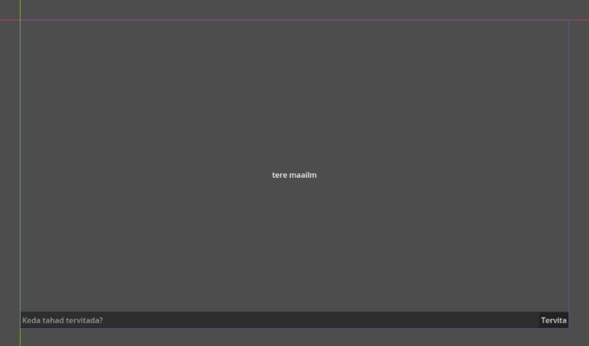
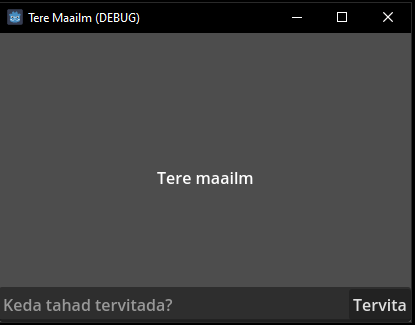

# Graafiline kasutajaliides

Selles osas on eesmärk eelnevas osas tutvustatud Label sõlm panna tervitama kasutaja sisestatud nime. Selleks kasutame paari uut sõlme ja õpime veidi Godot graafilise kasutajaliidese süsteemi.

## Sõlmed

Kustuta praegune Label sõlm ja määra juursõlmeks hoopis Control. Lisa Control laps-sõlmedeks Label, TextEdit ja Button.


Stseen peaks olema sedasi üles ehitatud.
{: .text-center .fs-3}

Control sõlm on Godot graafilise kasutajaliidese sõlmede alustala. Label, TextEdit ja Button on Control sõlme pärijad.
Label sõlme eesmärk ongi teksti kuvamine. Leidub veel sõlm RichTextLabel, mis suudab Rich Text formaadis teksti kuvada.
TextEdit sõlme otstarve on nimest tuletatav - kasutaja saab sinna sisse teksti kirjutada.
Ka Button sõlme ülesanne on selge, see on lihtsalt nupp, mida saab hiirega vajutada.

Tahame teha nii, et teksti sisestamise riba ja nupp oleksid programmi allpool ja tervitust kuvatakse keskel.

## Ankrud

Graafilise kasutajaliidese sõlmed arvestavad erinevate mängu akna suurustega kasutades ankrute süsteemi. On neli ankrut - ülemine, alumine, vasak, parem. Ankru väärtus on tavaliselt 0 ja 1 vahel. Kui vasaku ankru väärtus on 0, tähendab see, et sõlme vasak külg alustab ekraani vasakust küljest. Kui see oleks 0.5, algaks sõlme vasak külg ekraani keskelt. Kui see oleks 1, algaks sõlme vasak külg ekraani paremast küljest.

Vali Control sõlm ja inspektoris pane Control -> Layout -> Anchors Preset muutuja väärtuseks mall `Full Rect`. See teeb Control sõlme mängu akna suuruseks ja sätib ankrute väärtused järgmiseks:

-	vasak ankur: 0 (sõlm algab ekraani vasakust äärest)
-	ülemine ankur: 0 (sõlm algab ekraani ülemisest äärest)
-	parem ankur: 1 (sõlm lõpeb ekraani paremas ääres)
-	alumine ankur: 1 (sõlm lõpeb ekraani alumises ääres)


Kuna tahame tervet mängu akna ala kasutada, siis Control sõlmele see sobib. Tahtsime, et Label oleks ekraani keskel. Selleks otsi üles Control -> Layout -> Layout Mode muutuja ja tee kindlaks, et tema väärtus oleks `Anchors`. Seejärel ilmub Anchors Preset muutuja taas selle alla. Milline väärtus sealt sobiks Labeli ekraani keskele sobitamiseks?

Vastus on loomulikult `Center` - see hoiab Label sõlme nii horisontaalselt kui ka versikaalselt keskel. Kontrollimiseks võid Labelile jälle teksti `Tere maailm!` kirjutada. Pane tähele, et teksti juurde kirjutades ja ära kustutades püsib sõlm ikka ilusti ekraani keskel, kuigi tema suurus muutub.

TextEdit sõlmel pane muutuja Placeholder Text väärtuseks `Keda tahad tervitada?`. Kui kasutaja teksti sinna kirjutanud pole, siis seda sõnumit kuvatakse. Tegeleme TextEditi ankrutega. Pane temal Anchors Preset väärtuseks `Bottom Wide`. See sätib ta ekraani allaossa, kogu ekraani pikkuseks. Hetkel pole asendusteksti näha. Muuda Anchors Preset väärtuseks `Custom`, et inspektori dokk näitaks teisi ankrutega seotud muutujaid. Äsja ilmunud Anchor Offsets -> Top ehk ülemise ankru nihke väärtuseks pane näiteks -35 pikslit.

Määra Button sõlm TextEditi lapseks, lohistades teda stseeni dokis hiirega või paremklõpsu menüü -> Reparent kaudu. Buttoni tekst olgu "Tervita" ja tema Anchors Preset olgu `Center Right`. See asetab ta TextEditi paremasse äärde. See juhtus, sest nüüd Button on piiratud TextEditi väiksesse alasse. Nii on ka TextEditi ja Label sõlmega - nemad on piiratud Control sõlme alasse ja kuna Control sõlm on selle stseeni juursõlm, siis tema piirang on projekti akna suurus.

Põhivaade peaks nüüd selline välja nägema:



## Kood

### Muutujad

Vali Control juursõlm ja ühenda talle taas `tere.gd` külge. Skripti ühendamise aken peaks mainima, et fail juba eksisteerib ning et seda taaskasutatakse. Vajuta nupu `Load` peale.


Praegu peaks skriptifail olema selline:

```gdscript
extends Node2D

# Called when the node enters the scene tree for the first time.
func _ready():
	print("Tere maailm!")

# Called every frame. 'delta' is the elapsed time since the previous frame.
func _process(delta):
	pass
```

Kohe esimesel real on viga. Kuna nüüd on juursõlm Control tüüpi, siis peaks kirjas olema hoopis `extends Control`. Järgmiseks on meil vaja ligi pääseda skriptist Label, TextEdit ja Button sõlmedele. Selleks on Godot's kaks viisi:

1.	`@export` annotatsiooniga muutujad
2.	`@onready` annotatsiooniga muutujad

Esiteks tutvume sellega, kuidas deklareerida muutujaid.
Üldine muutuja süntaks on järgmine: `var muutuja_nimi: muutuja_andmetüüp = väärtus`. Muutujatel ei pea klassi kirja panema, aga seda tehakse sellel kursusel, kuna see on hea praktika. Muutujatel ei pea ka väärtuseid kohe määrama. Lisaks on olemas võtmesõna `const` konstandi deklareerimiseks samal viisil. Konstantidel peab olema väärtus koodis kohe olemas.

Funktsiooni tagastatava väärtuse andmetüüpi on ka võimalik deklareerida järgneva süntaksiga: `func funktsiooni_nimi(parameeter: parameetri_andmetüüp) -> tagastatav_andmetüüp:`.

Annotatsioonid on @-märgiga algavad märgistused. Need eelnevad muutuja deklaratsioonile ja annavad sellele muutujale erinevaid omadusi juurde. Näiteks `@export` annotatsioon teeb muutuja inspektoris nähtavaks ja saad sealt talle väärtuse määrata. `@onready` annotatsioon määrab muutujale väärtuse alles siis, kui skriptiga ühendatud sõlme `_ready()` funktsioon on käivitunud ehk tema ja ta laps-sõlmed on stseenide puusse sisestatud.

Label sõlmele saaks skriptist siis mõlemat viisi sedasi ligi:

```gdscript
# get_node() funktsioon hakkab skriptiga ühendatud sõlme laste seast sellise nimega sõlme otsima
# nimi peab ühtima stseeni dokis oleva nimega
# $ märk on lühend get_node() funktsiooni jaoks.
@onready var label_onready_a: Label = get_node("Label")
@onready var label_onready_b: Label = $Label

# pead inspektori dokis talle ise väärtuse määrama
@export var label: Label
```

Parem praktika on kasutada `@export` annotatsiooni, kuna selleks ei pea kirjutama koodis välja sõlme nime, mis võib hiljem muutuda. Seega kasutame sellel kursusel `@export`iga muutujaid. Proovi nüüd samas vormis `@export var label: Label` muutujale deklareerida TextEdit ja Button sõlmede muutujad. Skripti algus peaks nüüd selline välja nägema:

```gdscript
@export var label: Label
@export var text_edit: TextEdit
@export var button: Button
```

Lisaks on inspektori dokis ilmunud sektsioon nimega `tere.gd`, kus on skripti `@export` annotatsiooniga avalikustatud muutujad. Pane tähele, et kuigi kirjutasid koodis `text_edit`, kuvatakse seda inspektoris kui Text Edit. Redaktor üritab muutuja nimed inspektoris loetavamaks teha. Vajutades nupule `Assign...` avaneb uus aken, kus on kujutatud kõik sinu stseenis sobivad sõlmed, mis selle muutuja väärtuseks võivad sobida. Meil on sobivaid sõlmi iga muutuja jaoks vaid üks. Vali õige sõlm ja kas topeltklõpsa selle peal või vajuta all olevat `OK` nuppu.


Muutuja erinevate omadustega saad toimetada kasutades järgnevat süntaksi: `muutuja.omadus` Näiteks Label sõlme muutujale Text saad ligi kirjutades `label.text`. Proovi nüüd `_ready()` funktsioonis `print()` käsu asemel Labeli kuvatavaks tekstiks panna "Tere Godot!". Tulemus peaks olema selline:

```gdscript
func _ready() -> void:
	label.text = "Tere Godot!"
```

Kui nüüd rakenduse käivitad, kuvatakse teksti "Tere Godot!". See tähendab, et oled kogu koodi korrektselt kirjutanud. Kirjutasime `_ready()` funktsioonile juurde ka tagastava andmetüübi, milleks on `void`, sest see funktsioon ei tagasta midagi.

Siinkohal ei pidanud palju arutlema Text muutuja andmetüübi üle, aga mis siis, kui sa ei tea, milline muutuja väärtus võib olla? Kasutada saaksid redaktoriga kaasnevat sõlmede dokumentatsiooni. Sellele saad ligi skripti kirjutamise alast üleval paremal olevast nupust `Search Help`. Siin saad otsida erinevate sõlmede ja nende muutujate järgi endale vajalikku informatsiooni. Enamikel sõlmedel on ingliskeelsed selgitused head ja aitavad iseseisvalt hakkama saada.

Lisaks järgmises peatükis uurime täpsemalt GDScripti, tema andmetüübid ja muud detailid läbi.

### Signaalid

Nüüd peame välja nuputama, kuidas skriptis teha nii, et Buttoni nupuvajutuse peale läheb TextEditisse kirjutatud tekst Label sõlme. Vali inspektoris Button sõlm ja seejärel liigu inspektori dokist sõlme/`Node` dokki.


Kohe peaks näha olema Button sõlme erinevad signaalid, mida ta välja saadab. Meid huvitab signaal `pressed`, mis reageeribki Buttoni vajutuse peale. Signaali mingi sõlme skriptiga ühendamiseks on ka kaks viisi:

1.	teed seda graafilise kasutajaliidesega
2.	kirjutad selle koodis välja

Kursuse autori isiklik eelistus on teine variant, kuna niikuinii peab signaaliga toimetamiseks koodi kirjutama. Õpime mõlemat tegema, aga edaspidi koodinäidetes on esimest varianti kasutatud kursuse kasutaja mugavuseks.

Esimene viis on sealsamas sõlme dokis topeltklõpsida `pressed` signaali peale. Seejärel avaneb aken, mis küsib detaile signaali sõlmega ühendamise kohta. Oluline on, et ta ühendaks Control sõlmega. Kõik muu võid jätta samaks. Seejärel vajuta nupule `Connect`. Skriptis on nüüd genereeritud algne `_on_button_pressed()` funktsioon, aga signaali ühendusest skriptis endas tõendit ei ole, kuid redaktoris on, nii sõlme dokis kui ka stseeni dokis selle sõlme juures.

Teise meetodiga näeks `_ready()` funktsioon välja selline:

```gdscript
func _ready() -> void:
	button.pressed.connect(_on_button_pressed) # uus rida
	label.text = "Tere Godot!"

func _on_button_pressed() -> void:
	pass
```

Godot kolmandas versioonis ei saanud signaalidele ligi sedasi ja pidi jälle stringe kasutama, aga neljandas versioonis on see mugavamaks ja kindlamaks tehtud. Signaalidel on funktsioon `connect()`, mille argumendiks on koodinäite lõpus deklareeritud `_on_button_pressed()` funktsioon. Nii funktsioonidele kui ka signaalidele saab sedasi viidata neljandas versioonis. `connect()` funktsioon teeb nii, et kui Buttonit vajutatakse ja see laseb välja `pressed` signaali, siis kutsub Control sõlm välja sellele signaalile reageeriva funktsiooni `_on_button_pressed()`.

`_process()` funktsiooni pole meil selles skriptis vaja, kuna ta ei tee igal kaadril midagi uut. Proovi nüüd `_on_button_pressed()` funktsioon panna Outputi mingit sõnumit väljastama `print()` käsuga, et kindlaks teha, et nupuvajutuse peale tõesti saab Control sõlm signaali kätte ja reageerib sellele.

Viimaseks asjaks pead nii tegema, et Label sõlm võtab TextEdit sõlme teksti ja kuvab seda. Seejärel tee nii, et TextEdit sõlmel pole enam teksti ning ta taas kuvab oma instruktsiooni.

Kogu skript peaks lõpuks olema järgnev:

```gdscript
extends Control

@export var label: Label
@export var text_edit: TextEdit
@export var button: Button

# Called when the node enters the scene tree for the first time.
func _ready() -> void:
	button.pressed.connect(_on_button_pressed) # kui kasutasid teist meetodit
	label.text = "Tere Godot!"

func _on_button_pressed() -> void:
	label.text = "Tere " + text_edit.text
	text_edit.text = ""
```

Nüüd on esimene projekt valmis. Käivita see, sisesta teksti ja vajuta nupule. Kui akna keskel kuvatav sõnum muutub, oled hakkama saanud! Lisaks peaks akna suurust muutes kõik sõlmed ilusti mahtuma.



Järgnevas peatükis lood 2D mängu ja õpid Godot 2D füüsika sõlmi ja paljut muud kasutama.