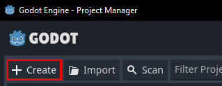
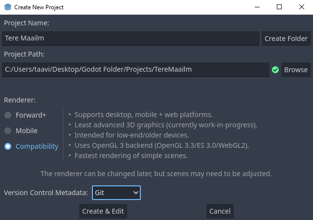
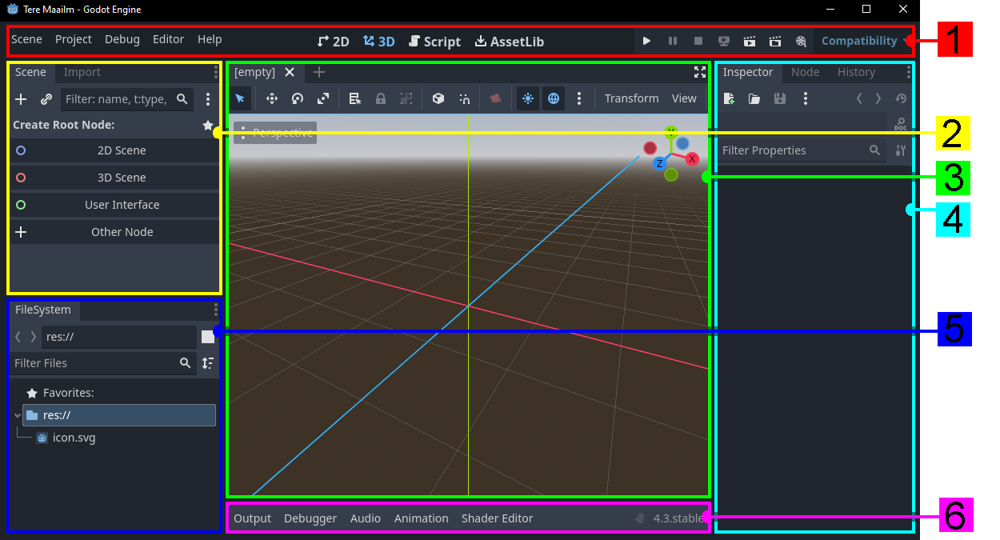
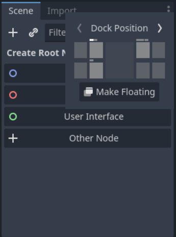

# Redaktor

## Projekti loomine

Ava Godot programm. Esimesena kuvatakse projektide haldamise lehekülge. Ülemiselt ribalt on näha, et vaatad praegu `Local Projects` ehk enda arvutis olemasolevaid Godot projekte. Selle kõrval on ka valik `Asset Library Projects`. Sealt võid hiljem omal tahtel leida erinevaid näidiseid ja malle, mida teised Godot kasutajad on loonud. Praegu aga suundu tagasi enda projektide lehele ning vajuta nuppu `New`, et hakata uut projekti looma.

Avaneb uus aken, kus saad kirja panna oma uue projekti nime, valida kus kaustas/kataloogis ta asub, valida mis renderdajat ta kasutab ja kas soovid, et Godot looks ka Git versioonihaldusega seotud failid. Esimene projekt, mille loome sellel kursusel, on sõlmede süsteemi tutvustav "Tere maailm!" rakendus.

Mõistlik nimi sellisele projektile oleks "Tere Maailm". Järgnevalt vali/loo tühi kaust, kus su projekt asub. Saad seda teha läbi `Browse` nupu. Võid luua näiteks Godot-le oma töölauale eraldi kausta, kuhu paned redaktori failid ja lood veel ühe kausta sinna sisse, mis hakkab su projektide faile hoidma. Nii on tehtud ka alumisel pildil. Kuna tegu on 2D rakendusega, siis kõige sobivam renderdaja on `Compatibility` - see sobib sellise lihtsa 2D projekti jaoks väga hästi. Git Versioonihaldust soovitan kasutada, kui oskad.

Lõpuks vajuta nuppu `Create & Edit`. Seejärel loob Godot mängu algsed failid ja lõpuks avaneb projekti redaktori aken.

## Redaktori aken

Esimesel pilgul võib redaktor tunduda väga kirju. Sellepärast on ülemisel pildil ta jagatud 6 osaks, minnes vasakult paremale, ülevalt alla:

1.  tööriistariba/ülemine riba
    -    siit saad salvestada oma stseeni, projekti sätteid muuta, 2D, 3D, skriptide ja eelnevalt mainitud *Asset Library* vahel liikuda, oma projekti jooksutada või renderdajat vahetada
2.  stseeni ning importimise (`Scene`/`Import`) dokid
    -   siit saad oma valitud stseeni hakata looma erinevate sõlmedega
    -   importimise kuvas saad muuta, kuidas Godot erinevaid faile käsitleb
3.  vaateaken
    -   see osa redaktorist alustab 3D vaates ja näitab eelvaadet eelmises punktis mainitud stseenist
    -   kui vajutad tööriistariba keskel asuvate `2D`, `3D`, `Script` või `AssetLib` nuppude vahel, kuvatakse vastavat sisu
4.  inspektori, sõlme ja ajaloo (`Inspector`/`Node`/`History`) dokid
    -   inspektor kuvab stseeni dokis valitud sõlme erinevaid muutujaid, mille väärtuseid saad muuta
    -   sõlme kuva näitab stseeni dokis valitud sõlme signaale ja gruppe ning laseb nendega toimetada
    -   ajaloo kuva näitab kõiki hiljuti tehtud muutusi ja laseb neid tagasi võtta
5.  failikataloogi (`FileSystem`) dokk
    -   siin kuvatakse stseenide, spraitide, helide ja kõik muud võimalikud failid, mida Godot saab kasutada
    -   see tähendab, et näiteks .txt laiendusega faile siin ei kuvata, sest Godot-l pole nendega midagi peale hakata
6.  moodulite riba/alumine riba
    -   siin leiad `Output` kuva, mis näitab veateateid ja olulisi sõnumeid
    -   `Debugger` näitab rakenduse jooksutamise ajal tähtsat informatsiooni
    -   muud valikud esindavad mooduleid, kus on tööriistad mingite sõlmedega töötamiseks
        -   näiteks `Animation` kuvaga saad luua animatsioone kasutades *AnimationPlayer* sõlme

Külgedel leiduvaid dokkide asukohti saad ka muuta, vajutades doki üleval paremal nurgas asuvale kolmele täpile. Selle kursuse piltidel on aga dokid oma vaikimisi paikades.

Loodetavasti ei tundu redaktor nüüd nii hirmus ja saad tööle hakata!