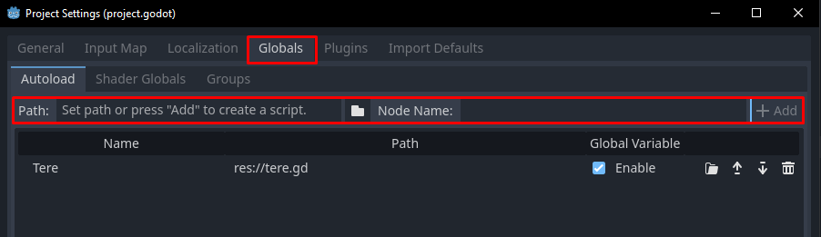

# GDScript

Selles osas tutvume lähemalt GDScripti erinevate osadega.

## Tühikud

GDScript on süntaksi poolest kohati sarnane Python keelele - mõlemal keelel on iga rea taane oluline.
Esimene funktsioon siin koodiplokis annaks veateate, teine mitte.

```gdscript
# Valesti taandatud kood
func _ready() -> void:
print("tere")

# Korrektselt taandatud kood
func _process(delta: float) -> void:
	print("Möödus " + delta + " sek")
```

Vaikimisi üritab Godot redaktor sulle õiget taanet pakkuda. Kui deklareerid näiteks funktsiooni, tingimuslause või tsükli (*if*/*while*/*for*), siis järgnev rida algab automaatselt tabulaatoriga.

## Põhilised andmetüübid

Godot's on järgnevad põhilised andmetüübid:

| Andmetüüp | Tähendus                    |
|-----------|-----------------------------|
| null	    | tühi/puuduv väärtus	      |
| bool	    | tõene või väär, ehk 1 või 0 |
| int	    | täisarv	                  |
| float	    | ujukomaarv	              |
| String	| tekst	                      |

Võtmesõna `void` kasutatakse, kui funktsioon ei peaks mingit väärtust tagastama.

## Funktsioonid, tsüklid, tingimuslaused

Funktsioone on võimalik deklareerida `func` võtmesõnaga.s
GDScriptis on võimalik luua nii `while` kui ka `for` tsükleid.
Tingimuslausete jaoks on võtmesõnad `if`, `elif`, `else` ja `match`.
`match` on sarnane teistest keeltest `switch` võtmesõnale, aga paindlikum.
Näiteks:

```gdscript
func _ready() -> void:
	var num_1: int = 10
	var num_2: int = 5

	# muutuja i eksisteerib siin ainult for-tsükli ajal
	for i in num_1:
		print(i)

	# siin loodud muutuja i ei ole for-tsükli omaga seotud
	var i: int = 0
	while i < num_2:
		print(i)
		i += 1

	if i == 4:
		print("neli")
	elif i == 5:
		print("viis")
	else:
		print("midagi muud")

	match num_1:
		5:
			print("viis")
		7:
			print("kümme")
		8, 9, 10:
			print("arv on kas 8, 9 või 10")
		_:
			print("polnud 5, 7, 8, 9 ega 10, vau")
```

## Konteinerid

GDScriptis on erinevad konteinerid mitme ühte andmetüüpi väärtuste hoidmiseks.

| Konteiner    | Otstarve                                                                                                               |
| ------------ | --------------------------------------------------------------------------------------------------------------------   |
| Array        | tavaline massiiv, Godot 4. versioonis on neile võimalik andmetüüpe määrata süntaksiga `Array[tüüp]`                    |
| Packed Array | kindla andmetüübiga massiiv, mis suudab hästi hallata suurt kogust andmeid (PackedStringArray, PackedInt32Array jne)   |
| Dictionary   | sõnastik-konteiner, kus väärtustel on arvuliste indeksite asemel võtmed                                                |
| Signal       | signaal - neid saab ka väärtusena/parameetrina kasutada                                                                |
| Callable     | funktsioon - neid saab ka väärtusena/parameetrina kasutada                                                             |

## Võtmesõnad ja operaatorid

### Võtmesõnad

Lisaks teistele siin lehel juba mainitud võtmesõnadele eksisteerivad veel:

| Võtmesõna  | Tähendus                                                                                       | Näide                                                                |
| ---------- | ---------------------------------------------------------------------------------------------- | -------------------------------------------------------------------- |
| break      | lõpetab tsükli                                                                                 |                                                                      |
| continue   | tsüklis iteratsiooni/elemendi vahele jätmiseks                                                 |                                                                      |
| is         | kontrollib klassi                                                                              | `unknown_node is Label`                                              |
| in         | kontrollib kas väärtus on stringis/massiivis/sõnastikus/üks sõlme omadustest                   | `"h" in "hello"`                                                     |
| as         | määrab tundmatu andmetüübiga väärtusele andmetüübi või muudab ta nulliks                       | `var tegelane := tundmatu_stseen.instantiate() as CharacterBody2D`   |
| self       | viide klassi isendile                                                                       |                                                                      |
| signal     | signaali deklareerimiseks, vajadusel saab ka määrata parameetrid, mis signaaliga kaasas käivad | `signal changed_direction` või `signal jumped(height: int)`          |
| breakpoint | peatab programmi seda sisaldaval real, et silumine (debugging) mugavam oleks                   |                                                                      |
| await      | peatab skripti töö kuni saab signaali või kaasrutiin lõpeb                                     | `await timer.timeout`                                                |
| assert     | kui antud tingimus on vale, siis programm annab veateate                                       | `assert unknown_node is Label`                                       |

Konstandid:

-   PI
-   TAU
-   INF
	-   lõpmatus
-   NAN
	-   võimatu number (not a number)

### Operaatorid

Tehete tegemiseks on saadaval operaatorid `+`, `-`, `*`, `/`, `%` ja `**`.
`%` annab tulemuseks jagamise jäägi. `**` on astendamise operaator.

Tehete operaatoritele saab lisada ette `=`, et määrata tehte tulemus muutuja väärtuseks.

Võrdluste tegemiseks on olemas `==`, `<`, `>`, `<=`, `>=` ja `!=` operaatorid.
On olemas võtmesõnad `not`, `and` ja `or`.

## Klassid

On kaks võtmesõna klasside jaoks, `class` ja `class_name`.

`class`iga deklareeritud klass on ligipääsetav vaid skriptifaili kaudu, mis tähendab, et ta on selle skripti alamklass.

`class_name` deklareerib uue klassi, mis on nähtav sõlmede loetelus.
Seda võtmesõna võib vaid kord ühes skriptifailis kasutada.

Näiteks on siis järgnev võimalik:

```gdscript
extends Node2D

class_name ShapeFactory

class Circle:
	var radius: float = 1

	func area() -> float:
	return this.radius ** 2 * PI

class Square:
	var side: float = 1

	func area() -> float:
	return this.side ** 2
```

Saad teises skriptifailis nendele klassidele niimoodi ligi:

```gdscript
var factory: ShapeFactory = ShapeFactory.new()
var circle: ShapeFactory.Circle = factory.Circle.new()
```

Tegelikult, kui klassi isendi alles lood, siis võid lasta kompilaatoril ka andmetüüpi lihtsalt järeldada. Kui andmetüüpi pole võimalik järeldada, annab Godot sellest teada.

```gdscript
var factory := ShapeFactory.new()
var circle := factory.Circle.new()
```

Pane tähele, et on kasutatud nii koolonit (:) kui ka võrdusmärki (=).

### Enumeraator ehk loenditüüp

Võtmesõnaga `enum` on võimalik deklareerida konstantsete väärtustega struktuur, kus konstantidel on automaatselt väärtused antud.  Vajadusel saad ka ise väärtuse määrata.

Tegutseme veel edasi ShapeFactory klassis:

```gdscript
# Nimetu loenditüüp
enum {
	CIRCLE,
	SQUARE,
	RECTANGLE,
	TRIANGLE
}

# Nimega loenditüüp
enum Direction {
	LEFT = -1,
	RIGHT = 1,
}
```

Muus skriptifailis saab nüüd nendele väärtustele nii ligi:

```gdscript
func _ready() -> void:
	var shape = ShapeFactory.RECTANGLE
	var direction:= ShapeFactory.Direction.RIGHT
```

## Staatilised muutujad ja funktsioonid

Võtmesõna `static` saab kasutada nii muutuja kui ka funktsiooni kirjutamisel.
Staatiline muutuja hoiab oma väärtust läbi klassi erinevate isendite, kuid seda saab ikka muuta.
Näide:

```gdscript
extends Node

class NaiteKlass:
	static var arv: int = 10

var a: NaiteKlass = NaiteKlass.new()
var b: NaiteKlass = NaiteKlass.new()

func _ready():
	print(a.arv) # 10
	print(b.arv) # 10
	a.arv = 15
	print(a.arv) # 15
	print(b.arv) # 15
	NaiteKlass.arv = 20
	print(a.arv) # 20
	print(b.arv) # 20
```

Staatilise funktsiooni jaoks ei pea klassi isendit looma, saad selle lihtsalt välja kutsuda.

## *Singleton* muster läbi *autoload*-skriptide

Kui leiad, et skriptifail peaks olema teistest skriptifailidest globaalselt juurdepääsetav, aga ei taha luua eraldi klassi selleks, võid kasutada *autoload* funktsionaalsust. Sellega luuakse programmi avades *singleton*-tüüpi skripti isend, mis tähendab, et vaid üks globaalne koopia sellest eksisteerib.

Autoloadi saab luua Godot redaktoris ülaribalt nupult Project -> Project Settings. Siis avaneb sinu projekti konfigureerimise aken, kus on vaheleht `Globals`. Siin on võimalik teha olemasolev skript autoloadiks või luua uus, mis on koheselt autoload.



Järgmises osas alustame uue peatükiga, kus loome Godot 2D füüsikamootoriga mängu.