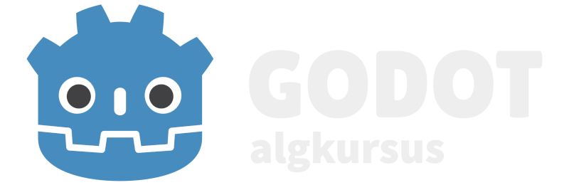

Tere tulemast Godot algkursusele!

Selle kursuse eesmärgiks on õpetada selgeks Godot mängumootori põhitõed ja selle iseseisev kasutamine.

Kasutaja peaks oskama enne kursuse alustamist:

-   eesti keelt
	-   kursuse tekst on kirjutatud eesti keeles
-   inglise keelt
	-   nii kood kui ka Godot programm/redaktor on inglise keeles
-   programmeerimist
	-   tead algteadmisi nagu mis on muutuja, konstant, funktsioon, tsükkel
	-   tead objektorienteeritud programmeerimisest, mis on klassid ja pärimine

Kursus koosneb 5 peatükist. Kolmes peatükis loome oma projekte, mis annab praktilist kogemust. Vajaduse korral saad alla laadida valmis projektide failid kas lehekülje üleval paremal asuvast nupust või [siit lingilt](https://github.com/taavippp/godot-algkursuse-projektid){:target = "_blank"}.

-   [Godot tutvustus](./tutvustus/index)
	-   mõistetega tutvumine
	-   Godot' allalaadimine
-   [Esimene programm](./esimene-programm/index)
    -   **praktika**
    -   sõlmede (Node) kasutamine
    -   signaalide kasutamine
-   [GDScript](./gdscript/index)
    -   lähemalt tutvumine GDScript programmeerimiskeelega
-   [2D mäng](./2d-mang/index)
    -   **praktika**
    -   platvormer-mängu prototüübi loomine
    -   2D füüsikamootoriga tutvumine
    -   projekti eksportimine
-   [Laskur 2.0](./laskur-2.0/index)
    -   **praktika**
    -   eelmises peatükis alustatud mängu edasi tegemine
    -   oma klasside loomine
    -   helide kasutamine
    -   skoori süsteem