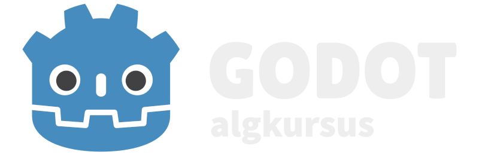

Tere tulemast Godot algkursusele!

Selle kursuse eesmärgiks on õpetada selgeks Godot mängumootori põhitõed ja selle iseseisev kasutamine.

Kasutaja peaks oskama enne kursuse alustamist:

-   eesti keelt
    -   kursuse tekst on kirjutatud eesti keeles
-   inglise keelt
    -   nii kood kui ka Godot programm/redaktor on inglise keeles
-   programmeerimist
    -   tead algteadmisi nagu mis on muutuja, konstant, funktsioon, tsükkel
    -   tead objektorienteeritud programmeerimisest, mis on klassid ja pärimine

Järgmisele lehele saad navigeerida teksti all olevale lingile vajutades.
Kui soovid muus järjekorras navigeerida, saad seda teha küljeribalt, mis on arvutis vasakul või telefonis üleval peidus.

[Godot tutvustus](https://taavippp.github.io/godot/tutvustus/)