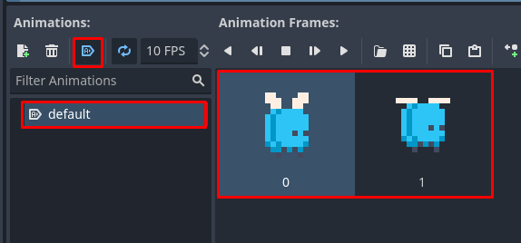
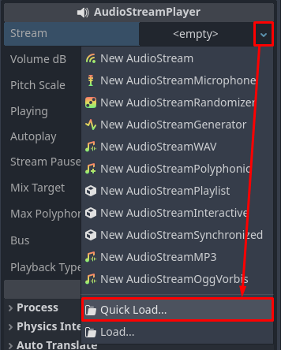
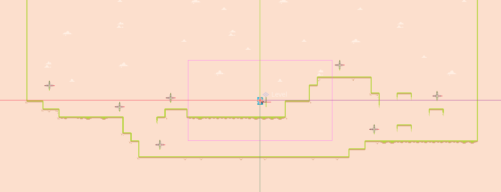

See peatükk on töös!
{: .todo }

# Helid

Selles alapeatükis loome juurde veel ühe vastase, kes liigub Tweeniga loodud animatsiooni abiga, õpime Godot's helisid kasutama ja loome vastaseid haldava stseeni, mis vastaseid pidevalt juurde tekitab.

## Lendaja

Teeme juurde veel ühe vastase, kes lennata suudab. Loo uus stseen, kus juursõlmeks on Entity nimega `Flyer` (meie loodud klass). Järgime sama töövoogu, mis varem ja lisa juurde AnimatedSprite2D.

Sellel tegelasel on vaid **üks animatsioon**, mis **automaatselt** mängima hakkab. Kasutame ikka sama spraidilehte `tilemap.png`, millel oli **10 horisontaalset**, **6 vertikaalset** kaadrit ja **1-piksline kaadrite vahe**. Flyeri kaks kaadrit asuvad viimases reas, kollase putuka omade kõrval. Mina panin selle animatsiooni kaadrisageduseks 10 FPS.



Lisa juurde CollisionShape2D, mille kujuks on RectangleShape2D ja Hitbox, mille CollisionShape2D kujuks on CircleShape2D. Määra neile suurused ise. Salvesta stseen `entities` kausta nagu teistegi olemustega. **Ära unusta sõlmede füüsikakihid** - juursõlm on *enemy* kihil ja põrkab kokku *level*iga, Hitbox peab ainult *player* kihti tuvastama.

Nüüd oleks vaja ta liikuma panna. Loo juurde skript `flyer.gd`. Lendaja on kogu aeg õhus ja lendab vaikselt üles-alla. Kuigi ta kutsub `_process(delta)` funktsioonis välja ikka `move_and_slide()`, siis tema liikumise loogika läheb tegelikult `_ready()` funktsiooni. Skript tuleb välja selline:

```gdscript
extends Entity

const MAX_Y_VELOCITY: float = 24.0

@export var sprite: AnimatedSprite2D

func _ready() -> void:
	super() # Entity klassil on ka _ready funktsioon, super() kutsub seda
	sprite.flip_h = direction < 0.0
	var tween = create_tween()
	# paneb Tweeni animatsiooni korduma
	# vajaduse korral saab argumendiks arvu anda
	tween.set_loops()
	tween.tween_property(
		self,
		"velocity:y", # muudab velocity.y väärtust
		MAX_Y_VELOCITY,
		1.0 # võtab 1 sekund
	)
	# toimub peale eelmise tween_property lõppu
	tween.tween_property(
		self,
		"velocity:y",
		-(MAX_Y_VELOCITY),
		1.0
	)

func _process(delta: float) -> void:
	move_and_slide()
```

Nagu siit skriptist näha, on Tweenid lihtne ja võimas töövahend. Tavaline AnimatedSprite2D ega isegi AnimationPlayer sõlm ei suudaks `velocity` muutujat animeerida.

AnimationPlayer sõlm suudab küll muutujaid Tweenile sarnaselt animeerida, aga ainult **eksportmuutujaid**. AnimationPlayeri pluss on see, et see pakub graafilist kasutajaliidest animatsioonide loomiseks.
{: .tip }

Kui nüüd lisad paar lendajat põhistseeni, peaksid nad vaikselt üles-alla lendama. Nende liikumine peatub, kui nad maapinnaga kokku põrkavad, aga nad jätkavad liikumist, kui `velocity.y` taas negatiivse väärtuse saab.

## Peategelase helid

Meie mängus saab olema kaks erinevat heli ja mõlemad neist kuuluvad peategelasele.

-	`jump.wav` - hüppamise heli
-	`shoot.wav` - kuuli laskmise heli

Ava taas peategelase stseen ja lisa kaks `AudioStreamPlayer` sõlme. Mina nimetasin nad vastavalt ümber `JumpAudioStreamPlayer`iks ja `ShootAudioStreamPlayer`iks. Kui uurid ühte neist sõlmedest inspektorist, näed et tal on `Stream` omadus. Selle väärtuseks peame määrama enda heli. Seda saab mugavalt teha klõpsates `<empty>` lahtri kõrval olevale noolele (saab ka lahtri peal parem-klõpsuga) ning avanenud menüüst `Quick Load...` valida.



Avaneb väike aken, mis kuvab kõiki selleks väärtuseks sobivaid helifaile. Mina tegelesin ennem JumpAudioStreamPlayeriga, seega valisin `sounds/jump.wav`. Enne, kui teise heli juurde liigud, kontrolli oma heli volüümi. Mina leidsin, et see on vaikimisi liiga vali, seega langetasin `Volume dB` -10 detsibelli peale. Tee sama protsess läbi ka laskmise heliga. Laskmise helil võiks muuta ka `Max Polyphony` väärtuse 5 peale - see tähendab, et 5 laskmise heli võib korraga mängida.

Kui sõlmed on ette valmistatud, siis peame viimast korda `player.gd` skripti muutma. Meie heli sõlmede jaoks on vaja eksportmuutujaid ning on vaja leida õiged read, kus AudioStreamPlayeri `play()` funktsiooni kasutada.

```gdscript
	... (muu kood)
	if (is_on_floor() and Input.is_action_just_pressed("jump")):
		velocity.y = -jump_strength
		jump_audio.play() # hüppamise heli
	
	# sätib markeri asendi õigeks olenevalt suunast
	bullet_marker.position.x = abs(bullet_marker.position.x) * direction
	if (Input.is_action_just_pressed("shoot")):
		shot_projectile.emit(
			# kasutame global_position, sest position on suhteline juursõlmega
			bullet_marker.global_position,
			direction
		)
		shoot_audio.play() # laskmise heli
	... (muu kood)
```

## Vastaste haldur

Praegu tundub meie projekt ikka rohkem nagu prototüüp kui tõeline mäng. Seda saame parandada uue süsteemiga, mis vastaseid pidevalt põhistseenis juurde tekitama hakkab. Niimoodi on mängijal pidevalt vaja vastaseid hävitada ja mäng on kaasahaaravam.

Loo uus stseen, kus tavaline Node2D on juursõlm ja tema ainus laps-sõlm on **Timer** (eesti keeles taimer). Timer sõlme me pole veel kasutanud, aga tema funktsionaalsus on päris ilmne - see võtab aega ja mingi aja möödudes lõpetab oma töö.

Loo juursõlmele uus skript nimega `enemy_manager.gd`. Kohe ei pea sinna midagi kirjutama, kuid Timeri `timeout()` signaali kasutamiseks on vaja skripti, millega seda ühendada. Määra taimeri `Wait Time` väärtuseks inspektoris 2 sekundit ja ühenda siis tema `timeout()` signaal skriptiga.

EnemyManager stseen peab teadma, kuhu loodud vastaseid asetada. Teeme nii, et Marker2D sõlmed märgivad kohti, kuhu vastane saab tekkida. Teeme seda ilma eksportmuutujata - skript leiab kõik Marker2D sõlmed, mis on juursõlme all. Nii saaks vabalt markereid juurde lisada ilma, et inspektoris ka veel neid kuskile massiivi lisama peaks. Need Marker2D sõlmed peaks üles leidma `_ready()` funktsioonis.

Skript tuleb siis selline välja praeguseks:

```gdscript
extends Node2D

var spawn_markers: Array[Marker2D] = []

func _ready() -> void:
	# get_children tagastab massiivi kõigi laps-sõlmedega
	for child in get_children():
		if (child is not Marker2D):
			continue
		spawn_markers.append(child)

func _on_spawn_timer_timeout() -> void:
	pass # Replace with function body.
```

### Ülesanne 5

Nüüd, kus skript kogub Marker2D sõlmed kõik massiivi, peame nendega midagi peale ka hakkama. Taimeri signaalile reageeriv funktsioon `_on_spawn_timer_timeout()` peab valima uuest **vastaste stseenide massiivist** ühe suvalise stseeni, sellest isendi looma ja siis valima suvalise Marker2D, mille kohta see vastane asetada. Massiivist suvalise elemendi valimiseks eksisteerib `Array.pick_random()` funktsioon.

Lisaks vastase suremisel levitab EnemyManager uut `spawned_enemy_died` signaali.

[Ülesande lahendus](../lahendused/ulesanne-5)

Ära unusta inspektori kaudu `enemy_scenes` massiivi lisada oma kahte loodud vastast.

## Vastaste haldur, jätk

Kui nüüd põhistseeni lisad juurde EnemyManager stseeni ja selle laps-sõlmedeks paar Marker2D sõlme oma silma järgi, siis mängu käivitades peaksid vastased hakkama iga paari sekundi tagant tekkima. Sõlmi saad dubleerida stseeni dokis `CTRL + D` vajutades või parem-klõpsu menüüst `Duplicate` nuppu klõpsates. Minu põhistseen tuli lõpuks sellise välimusega:



Järgmises alapeatükis lõpetame oma Laskuri projekti. Hakkame pidama skoori hävitatud vastaste põhjal ja salvestame seda. Lisaks teeme minimaalse kasutajaliidese juurde.