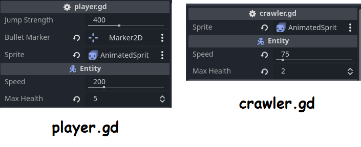

# Klassid

-	TOC
{:toc}

Kuna tegu on eelmise peatüki projekti edasiarendusega, võid juba loodud Laskuri projekti taas avada. Kui pole Laskuri projekti loodud, soovitan eelmise peatüki läbi võtta või [GitHubi repositooriumist](https://github.com/taavippp/godot-algkursuse-projektid/) see alla laadida.

Selle alapeatüki põhiline eesmärk on kirjutada oma klass nimega Entity (olend) mängu erinevate tegelastega lihtsamini töötamiseks ja klass nimega Hitbox tegelaste vahelise võitluse standardiseerimiseks.

## Organiseerimine

Praegu peaks failide dokis väikene segadus olema. Enne oma klassi loomist korrastaks neid veidi.

Uusi kaustasid/faile saad failide doki kaudu luua **parema hiire klõpsuga**.

Stseeni fail ja vastav skripti fail võiksid samas kaustas olla. Olendite jaoks võiks luua `entities` kausta, kus igal olendil on veel oma kaust. Kuul ei ole olend, sest kuulil ei tohi elupunkte olla. See tähendab, et kuul läheb oma eraldi kausta nimega `projectiles`. Loome veel ühe kausta nimega `classes`, kus hakkavad olema meie uute klasside skriptifailid.

Mina organiseerisin oma failid lõpuks niimoodi:

```
res://
├── classes
├── entities
│   ├── crawler
│   │   ├── crawler.tscn
│   │   └── crawler.gd
│   └── player
│       ├── player.tscn
│       └── player.gd
├── projectiles
|   └── bullet
│       ├── bullet.tscn
│       └── bullet.gd
├── sounds
│   ├── jump.wav
│   └── shoot.wav
├── sprites
│   └── tilemap.png
├── export_presets.cfg
├── icon.svg
├── level.tscn
├── main.gd
└── main.tscn
```

Fail `export_presets.cfg` tekkis, kui eelmises peatükis oma mängu eksportisime.

## Entity klass

Loo siis `classes` kausta uus skriptifail nimega `entity.gd`. Deklareeri uus klass nimega Entity kirjutades skripti algusesse `class_name Entity extends CharacterBody2D`.

Selle klassi loome selle eesmärgiga, et vältida koodis kordusi ja et kõik olendid järgiksid sama standardit. Meie Player olendil ja Crawler olendil on ühised järgmised omadused:

-	`speed` muutuja
-	`gravity` muutuja
-	`direction` muutuja

Lisaks kirjutame juurde veel täisarvulise eksportmuutuja `max_health`, mille väärtus olgu vahemikus 1 - 10 ja tavalise täisarvulise muutuja `health`, mis `_ready()` funktsioonis saab väärtuseks `max_health`. Meie tegelased peavad siis suutma oma elusid ka kaotada. Loome funktsiooni `take_damage()`, mille kutsumisel elupunktid langevad ühe võrra ning kui nad on nullis (või alla selle), siis see sõlm kustutab end. Kui sõlm kustutab end (ehk olend sureb), siis levitab see signaali `died`.

Kood võiks umbes selline välja näha:

```gdscript
class_name Entity extends CharacterBody2D

signal died

@export_range(0.0, 1000.0) var speed: float = 200.0
@export_range(1, 10) var max_health: int = 3

var gravity: float = 25.0
var direction: float = 1.0
var health: int

func _ready() -> void:
	health = max_health

func take_damage() -> void:
	health = health - 1
	if health <= 0:
		died.emit()
		queue_free()
```

## Koodi kaudu animeerimine

Tahame, et kui olend elupunkte kaotab, siis oleks seda visuaalselt korraks kuidagi näha. Selleks õpime animeerima kasutades Tween süsteemi. Tweenidega animeerimine töötab sujuvalt muutujate väärtuseid muutes. Tweenid hakkavad automaatselt tööle.

Meie kasutame oma animatsiooni jaoks `modulate` muutujat, mis on värvifilter sõlmede peal. See on vaikimisi valget värvi, mis tähendab, et sõlmede värvid ei ole muudetud. Meie muudame animatsiooni alguses selle läbipaistvaks ning animatsiooni jooksul taas valgeks, mis tekitab korraks haihtumise efekti.

Tegelikult saaks ka selleks animatsiooniks kasutada AnimationPlayer sõlme, aga see nõuaks rohkem tööd.
{: .tip }

Lisa `take_damage()` funktsiooni lõppu (peale elupunktide kontrolli) järgnevad koodiread:

```gdscript
func take_damage() -> void:

	... (muu kood)

	modulate = Color.TRANSPARENT # muudame sõlme läbipaistvaks
	var tween := create_tween() # loob Tweeni
	tween.tween_property(
		self,
		"modulate", # muutuja, mida animeerime
		Color.WHITE, # animeeritava muutuja lõppväärtus
		0.5 # animatsioon võtab pool sekundit
	)
```

## Olemasolevate stseenide uuendamine

Teeme failides `crawler.gd` ja `player.gd` paar muudatust ning võtame kasutusele oma Entity klassi.

Alustame `crawler.gd` skriptiga. Vaheta esimene rida `extends Entity` vastu. Koodiredaktor teatab, et muutujad `speed`, `direction` ja `gravity` juba eksisteerivad Entity klassis, seega neid pole vaja uuesti deklareerida. Kui need read eemaldad, pole vaja rohkem muuta Crawleri skriptis. Liigu Playeri skripti ja korda seal tehtut.

Nüüd, kus Player ja Crawler on Entity sõlmed, siis peame üle kontrollima nende eksportmuutujad. Crawleril on liikumiskiirus **75 px/s** ja **2 elupunkti**. Playeril on liikumiskiirus **200 px/s** ja tal on **5 elupunkti**.



Peame uuendama ka skriptis `main.gd` konstanti `PLAYER_BULLET_SCENE`, mis viitab kuuli stseenile. See fail asub nüüd `projectiles` kaustas, seega muuda viide vastavalt ümber: `preload("res://projectiles/bullet/bullet.tscn")`.

Kui nüüd projekti käivitad, peaks kõik töötama samamoodi nagu varem. See on tegelikult probleem - meie mängu tegelastel on nüüd ju elupunktid olemas, aga roomajad ikka hävinevad kohe, kui kuuliga pihta saavad. Selle parandamiseks loome veel ühe klassi.

## Hitbox klass

Loome uue klassi nimega `Hitbox`, mis laiendab Area2D klassi.

### Ülesanne 4

Hitbox klassi eesmärk on peale olendiga kokkupõrkamist tema elupunkte vähendada. Pead ühendama `body_entered` signaali **koodi kaudu** näiteks funktsiooniga `_hitbox_body_entered()`. On vaja kontrollida, et füüsikakeha, mis signaali põhjustas, on ikka meie olendi klassi isend. Peale seda vähendame selle olendi elupunkte ja levitame uut signaali nimega `hit_entity`.

[Ülesande lahendus](../lahendused/ulesanne-4)

## Hitbox klass, jätk

Peale Hitbox klassi loomist pole enam kuuli stseenis Area2D ega skriptis selle loogikat vaja, seega kustuta need. Saad lihtsalt lisada stseeni juurde Hitbox sõlme ja sellele sobiva CollisionShape2D. Tee kindlaks, et Hitbox tuvastab *enemy* (kolmandat) füüsikakihti. Selleks, et taas saavutada kuuli hävinemise efekt kokkupuutel vastasega, saad nüüd ühendada Hitboxi `hit_entity` signaali juursõlme skriptiga ja tekkinud funktsioonis kasutada `queue_free()`.

Lisame ka Crawlerile juurde Hitboxi, mis tuvastab *player* (teist) füüsikakihti. Crawler ei kustuta end kokkupuutel peategelasega, seega `hit_entity` signaali ei ole siin vaja ühendada.

Kui nüüd mängu käivitad, saad mitu korda vastaseid lasta ja vastased saavad ka sulle haiget teha. Meie Tweeniga lisatud animatsioon näitab ilusti, kui olend viga sai.

## Kaamera

Võib-olla avastasid, et kui vastased sulle küllalt viga teevad ja peategelase sõlm kustutatakse, siis kustub ka tema Camera2D laps-sõlm. Kui see kaamera sõlm kustutatakse, siis kaob temaga kaasnenud suum ja korraga ei ole põhistseenis toimuvat üldse hästi näha. Selle parandamiseks eraldame kaamera peategelase stseenist. Eemalda Camera2D sõlm Playeri stseenist ning loo uus stseen, kus Camera2D on juursõlm. Nimeta juursõlm ümber `GameCamera`ks. Muutuja `zoom` väärtus olgu taas (4, 4), aga sellele kaamerale me lisame juurde ka skripti.

Skript on tegelikult väga lihtne. Kuna see kaamera jälitab mingit sihtmärki, siis tal on eksportmuutuja `target`. Peame kontrollima, et `target`il oleks sobiv väärtus olemas, muidu tekib olematut sõlme jälitades viga. Seda kontrolli saame teha funktsiooniga `is_instance_valid(target)`. Kui sihtmärk ei eksisteeri, siis sihtmärgi jälitamist pole vaja jätkata.

Kaamera skript oleks siis järgmine:

```gdscript
extends Camera2D

@export var target: Node2D

func _process(delta: float) -> void:
	if not is_instance_valid(target):
		return
	global_position = target.global_position
```

Nüüd saad lisada põhistseeni juurde GameCamera stseeni ja `target` väärtuseks panna meie Playeri. Kui mängu käivitad ja Player sureb ehk tema sõlm kustutatakse, siis kaamera ikka püsib.

Järgmises alapeatükis loome veel ühe vastase, võtame kasutusele helid ja loome vastaste halduri. Kõik need asjad teevad meie mängu palju kaasahaaravamaks.

[Järgmine alapeatükk "Helid"](./helid)