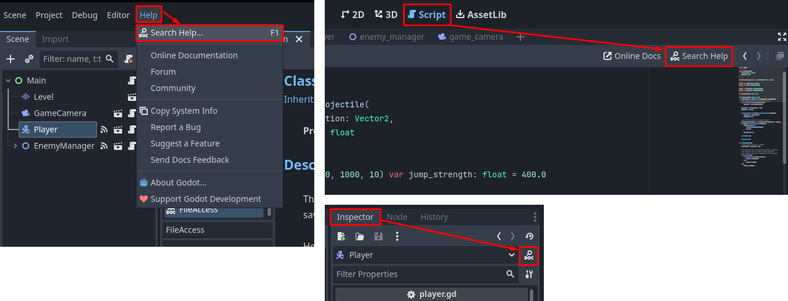
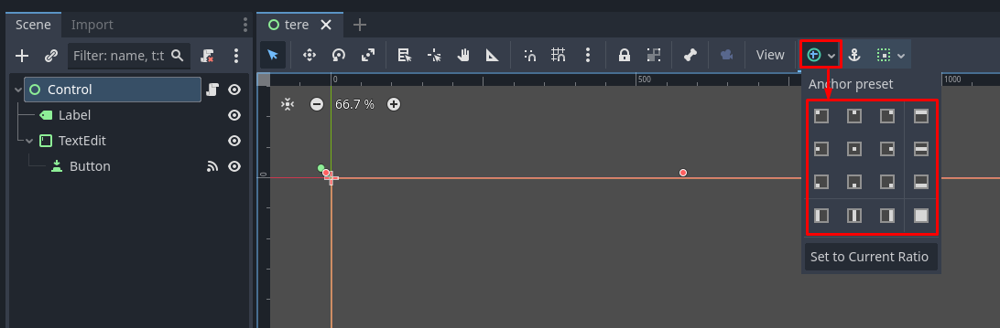
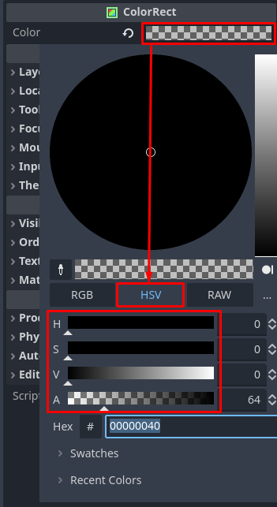
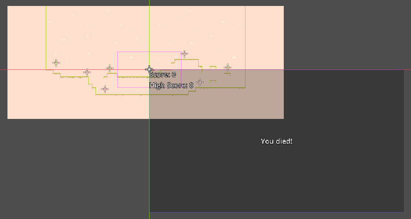
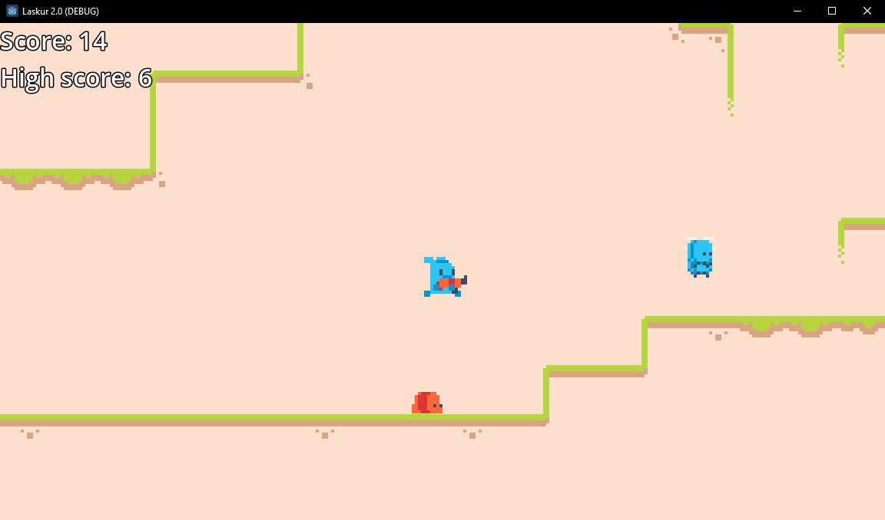

# Skoor

Selles alapeatükis lõpetame töö Laskuri projekti kallal. Selleks on vaja küllalt tööd veel teha:

-	skoori süsteem
	-	skoor tõuseb, kui tapad vastase
	-	kui saad rekordi, salvestatakse see faili
-	graafiline kasutajaliides
	-	nii praegust skoori kui ka rekordit näidatakse
	-	kui peategelane sureb, näidatakse sõnumit
		-	kui said rekordi, antakse sellest teada

## Skoori süsteem

Peame põhistseeni skriptile palju muudatusi tegema. Alustame skoori lugemise süsteemiga.

Me tahame, et skooripunktid tõuseks, kui vastane sureb ehk levitab `died` signaali. Eelmises alapeatükis lõime EnemyManager stseeni, mis levitab enda `spawned_enemy_died` signaali, kui tema vastase surmast teada saab. Seega saame lihtsalt **EnemyManageri signaali põhistseeni skriptiga ühendada**, et skooripunkte juurde lisada.

Lisa põhistseeni skripti järgnevad read juurde:

```gdscript
var score: int = 0

... (muu kood)

func _on_enemy_manager_spawned_enemy_died() -> void:
	score += 1
```

Nüüd, kus lihtne skoori lugemine on olemas, võiks kuidagi meelde jätta, mis mängija rekord on. Selleks loo juurde `high_score` muutuja, mille vaikeväärtus on ka 0. Loogiline oleks teha võrdlust praeguse skoori ja rekordi vahel siis, kui peategelane sureb. Selleks saame tema `died()` signaali ühendada skriptiga, mis tekitab `_on_player_died()` funktsiooni. Praegu saab selle funktsiooni sisuks lihtsalt lihtne `print()` käsk, kui mängija rekordi püstitab.

```gdscript
... (muu kood)

func _on_player_died() -> void:
	if score <= high_score: # kui skoor ei ole rekord, siis kõik
		return
	print("Said rekordi! Oled tõeline mängur.")
```

## Failihaldus

Nüüd, kus põhistseen skoori ja rekordeid suudab pidada, peaks parima skoori faili salvestama. Selleks kasutame FileAccess klassi. Tegeleme ennem faili kirjutamisega ehk rekordskoori salvestamisega.

### Ülesanne 6

Selleks, et iseseisvamalt Godot' õppida kasutama, pead oskama dokumentatsiooni enda kasuks sirvida. Õnneks on Godot ametlik dokumentatsioon **sisse ehitatud redaktorisse** ja kättesaadav ka **veebi kaudu** <https://docs.godotengine.org/en/stable/>. Redaktorisse sisse ehitatud dokumentatsioon on kättesaadav päris mitmel moel:

-	`F1` klahv
-	ülaribalt `Help -> Search Help...`
-	kui oled skripti redaktoris, on selle ülaosas paremal `Search Help` nupp
-	inspektoris luubi ikooniga nupp (avab valitud sõlme dokumentatsiooni)



Avanenud aknas kirjuta otsinguribasse, mis sõlme/ressurssi/klassi kohta uurida tahad ja vajuta `Open` nuppu või `Enter` klahvi.

Ülesanne on avastada, kuidas FileAccess klassiga faili avada ja põhistseeni skriptiga rekordskoor faili salvestada. Võiks kontrollida ka, et fail ikka olemas on.

[Ülesande lahendus](../lahendused/ulesanne-6)

Kui oled tähelepanelik, siis meie loodud faili asukoht algab `user://` kaustast, mitte `res://` nagu kuuli stseeniga. Neil kahel on tegelikult lihtne vahe:

-	`res://` on projekti failide kaust (see, mida redaktoris failisüsteemi dokis näed). Eksporditud projektis on see kaust kokku kompileeritud.
-	`user://` on kasutaja andmete hoimiseks (nt erinevad saavutused, skoorid). Selle kausta saad avada ülaribalt `Project -> Open User Data Folder` kaudu.

## Failihaldus, jätk

Nüüd, kus salvestame rekordskoori faili, võiks seda mängu käivitades failist ka lugeda. Teeme seda muidugi `_ready()` funktsioonis. Koodiread tulevad sarnased ülesande lahendusele, aga kasutame `FileAccess.WRITE` argumendi asemel `FileAccess.READ`. Kui fail eksisteerib, siis võtame kogu selle sisu, muudame ümber täisarvu andmetüübiks ja määrame selle `high_score` väärtuseks.

```gdscript
# loe faili et high_score saada
func _ready() -> void:
	var file = FileAccess.open(HIGH_SCORE_FILE_PATH, FileAccess.READ)
	if is_instance_valid(file):
		high_score = int(file.get_as_text())
	print("Rekord on ", high_score)
```

Kui nüüd mängu käivitad, siis `Output`is kirjutatakse, mis mängu rekordskoor on. Skoori süsteem töötab!

## Kasutajaliides

Nüüd, kus mäng suudab skoori pidada ja parimat lausa salvestada, võiks mängijale ka näidata, mis tema tulemused on.

Kui praegu põhistseeni lisad näiteks Label sõlme ja mängu käivitad, ei püsi see ekraanil ühe koha peal nagu loota võiks. See juhtub, sest Camera2D olemasolul ei tööta enam kasutajaliidese ankrute süsteem, millest peatükis "Esimene programm" õppisime. Me ei taha Camera2D kustutada ka, sest see on mängu jaoks oluline.

Appi tuleb CanvasLayer sõlm. See sõlm renderdab enda laps-sõlmi eraldi kihil teistest 2D sõlmedest. See tähendab, et kui lisame selle sõlme põhistseeni ja selle alla oma kasutajaliidese sõlmed, saame taas nende ankrute süsteemile toetuda.

Lisa siis põhistseeni juurde need sõlmed:

-	CanvasLayer
	-	Control
		-	Label nimega `ScoreLabel`
		-	ColorRect nimega `DeathBackground`
			-	Label nimega `DeathLabel`

Uus sõlm **ColorRect** ongi lihtsalt värviline kast (*color rectangle*).

Tuletame meelde, et ankrute süsteem töötas projekti akna äärte põhjal. Nt valik `Full Rect` tähendas, et Control võtab enda alla terve akna (või kui ta on teise Controli laps-sõlm, siis nii palju ruumi, kui talle antud on).

Ankrute malle saad määrata põhivaates rohelise ringi ja plussi ikooniga nupust. Kui üks neist mallidest aga ei sobi, pead ikka muutma ankrute väärtusi inspektori kaudu.



Controli ankrud olgu `Full Rect` järgi, ScoreLabeli ankrud `Top Left` järgi, ColorRect ka `Full Rect` järgi ja DeathLabel `H Center Wide` (akna laiune, keskel) järgi.

DeathBackground ja tema DeathLabel laps-sõlm moodustavad selle kuva, mida mängija näeb, kui ta sureb. Määra DeathBackgroundi värviks inspektoris mingi läbipaistev värv. Mina tegin ta näiteks mustaks.



Kirjuta Labelitele juurde mingi näidistekst (muudame seda koodi kaudu niikuinii). Anna ScoreLabelile inspektoris uus `Label Settings` väärtus. Font ise on okei, aga selle suuruseks võiks 32 px panna. Lisaks võiks olemas olla **must piirjoon** ehk *outline*, mis on 6 px suurune. Loo sama LabelSettings ressurss ka DeathLabeli jaoks (võid kopeerida ümber). DeathLabeli tekst peaks keskel olema, seega määra `Horizontal Alignment` väärtuseks `Center`.

Põhistseen näeb nüüd redaktoris päris kahtlane välja, aga kui mängu käivitad, siis ankrute süsteem hakkab õigesti tööle.



### Ülesanne 7

Nüüd on vaja kasutajaliidesele funktsionaalsus juurde anda. Selleks on vaja **põhistseeni skriptis** eksportmuutujaid ScoreLabeli, DeathBackgroundi ja DeathLabeli jaoks.

Stringis saad kuvada muutuja väärtust, kui stringi vormindad. Uuri välja, kuidas `String.format()` funktsioon töötab.

ScoreLabeli tekst peab uuenema, kui skoor tõuseb ja kuvama ka failist sisse loetud rekordit eraldi real.

DeathBackgroundi peab peitma `hide()` funktsiooniga, kui mäng tööle pannakse ja siis taas seda näitama, kui mängija sureb.

DeathLabel peab samal ajal, kui DeathBackground taas ilmub, kirjutama `Press any key to restart` ja kui mängija püstitas rekordi, siis uuel real sellest teada andma.

[Ülesande lahendus](../lahendused/ulesanne-7)

## Kasutajaliides, jätk

Viimase asjana peame nii tegema, et mängija suudab peale suremist mängu uuesti alustada. Nagu DeathLabel kirjutab, võib selleks ükskõik mis klahvi vajutada. Selle tegemiseks peame looma uue muutuja `is_player_dead`, mis mängija olemasolul silma peal hoiab. Vaikimisi on see väär, aga **kui mängija sureb, siis läheb see tõeseks**.

Selleks, et ükskõik, mis klahvivajutusele mäng reageeriks, on vaja kasutada `_input(event: InputEvent)` funktsiooni. Godot kutsub seda funktsiooni igasuguste mängija sisendite peale. Näiteks:

-	hiire liigutamine
-	hiire klõpsamine
-	klaviatuuril klahvi alla vajutamine
-	klaviatuuril klahvi lahti laskmine

Peame siis kindlaks tegema, et meie InputEvent on põhjustatud klahvivajutuse poolt.

```gdscript
func _input(event: InputEvent) -> void:
	if (is_player_dead and # kas mängija on surnud
		event is InputEventKey and # InputEventKey on klaviatuuri sisendite klass
		event.is_pressed() and # kas klahvile vajutatakse
		not event.is_echo()): # kas klahvile hakati just vajutama
			get_tree().reload_current_scene() # laeb põhistseeni uuesti
```

Kui nüüd mängu käivitad, siis peaks kõik töötama - saad korduvalt erinevaid vastaseid lasta, skoor tõuseb, rekordeid kirjutatakse faili ja kui sured, siis mäng teavitab, kuidas uuesti alustada.

**Projekt Laskur on nüüd valmis!**



## Mida nüüd?

Kuigi oled nüüd Godot'ga tuttav ja oskad nii mõndagi, on tegelikult palju viise, kuidas seda projekti edasi teha.

-	leia vahe `_process(delta)` ja `_physics_process(delta)` funktsioonide vahel ning kasuta projektis mõlemat
-	kasuta AnimationPlayer ja GPUParticles2D sõlmesid
-	lisa veel helisid juurde
	-	näiteks, kui olend viga saab
-	mängu pausile panemine kasutades SceneTree `paused` omadust (ligipääsetav `get_tree()` funktsiooniga)
-	kasuta AutoLoad sõlmesid
-	loo oma ressurssi klass
-	kasuta gruppide süsteemi (Node dokis Groups)
-	loo veel üks vastane, kes mängijat taga ajab
-	lae alla kasulikke pluginaid ülaribalt AssetLib alt
	-	näiteks mängusisene arendaja menüü ehk *developer console*