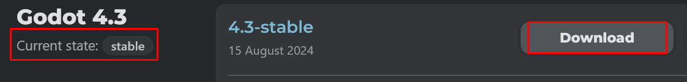
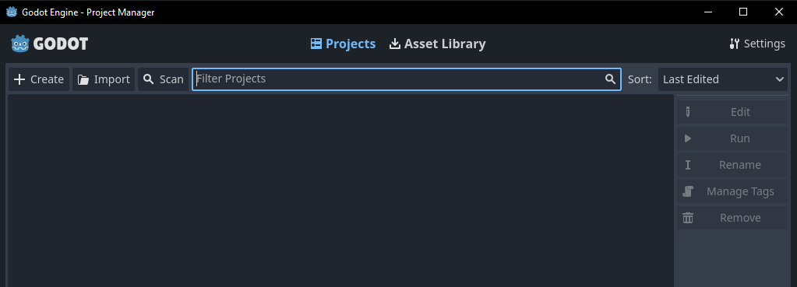

# Allalaadimine

On aeg Godot redaktor alla laadida. Järgnev link viib lehele, kus erinevad programmi versioonid on olemas.

<https://godotengine.org/download/archive/>

Sellel kursusel kasutatakse versiooni 4.3, sest see on kirjutamise ajal uusim stabiilne versioon.
Kui on uuemaid versioone olemas, siis otsi suurelt kirjutatud versiooni nimele kaasnevat teksti `Current state: stable`.
Saad arvatavasti kursusega kaasa ikka töötada, kui kasutad ükskõik mis 4. versiooni.

Vajutades nupule `Download`, satud lehele, mis pakub erinevate operatsioonisüsteemide jaoks neile vastavaid redaktori ehitusi.
Leia oma operatsioonisüsteem ja vajuta kas nupule `Standard` või `.NET`.
.NET versioon sisaldab C# keele tööriistu ja võimaldab sul kirjutada skripte C# keeles.
Sellel kursusel kasutatakse ainult GDScript keelt mis kaasneb juba standard-versiooniga, aga kui Godot kasutamine C#-ga pakub huvi, vali .NET versioon.

Kui oled vajutanud vastava versiooni nupule, hakkab veebibrauser laadima alla ZIP faili.

Allalaetud ZIP faili on pakendatud kaks faili. Need mõlemad avavad projektihalduri (mingit muud allalaadimist ei olegi), üks neist avab ka eraldi terminali akna, kuhu tulevad kõik veateated, mille otsa satud. Neid on tavalises programmis ka võimalik näha, aga mõni võib-olla eelistab näha eraldi terminali akent.

Godot'ga pole konto loomist, sisselogimist ega muud tülikat protsessi. See tähendab, et nüüd saad tööle hakata ja esimest programmi luua!