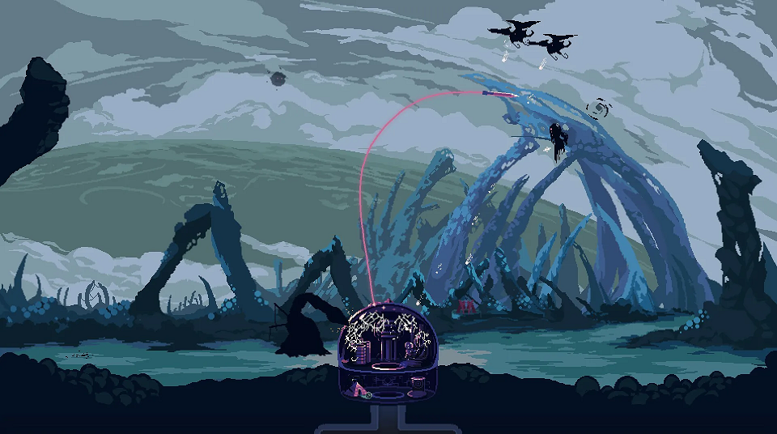

# Godot tutvustus

Godot mängumootor on vabavaraline programm, millega on võimalik mugavalt luua videomänge ja rakendusi.

Pilt videomängust Dome Keeper, mis on loodud Godot'ga.
{: .text-center .fs-3}

## Mida pakub Godot?

Godot programm/redaktor ja sellega loodud rakendused on saadaval enim kasutatud platvormidel.
Nende hulka kuuluvad:

-   Windows
-   MacOS
-   Linux
-   Android
-   veebibrauser
-   iOS (redaktorit ei saa kasutada)
-   mängukonsoolid (redaktorit ei saa kasutada)

Godot'ga saab luua nii 2D (kahemõõtmelisi) kui ka 3D (kolmemõõtmelisi) rakendusi.
Saadaval on

-   animatsiooni loomise tööriistad,
-   valgustuse ja varjude süsteemid,
-   läbi koodi kujundite joonistamine,
-   2D spraitidega töötamine,
-   2D ja 3D füüsika mootorid,
-   varjutajad (ingl *shader*),
-   koodi kirjutamine järgnevates programmeerimiskeeltes:
    -   GDScript
    -   C#
    -   GDExtension (laiendus muus keeles)
-   heli tööriistad,
-   TCP, UDP ja HTTP protokollide kasutamine,
    -   on võimalik luua mitme mängijaga (*multiplayer*) videomänge
-   graafiline kasutajaliidese süsteem