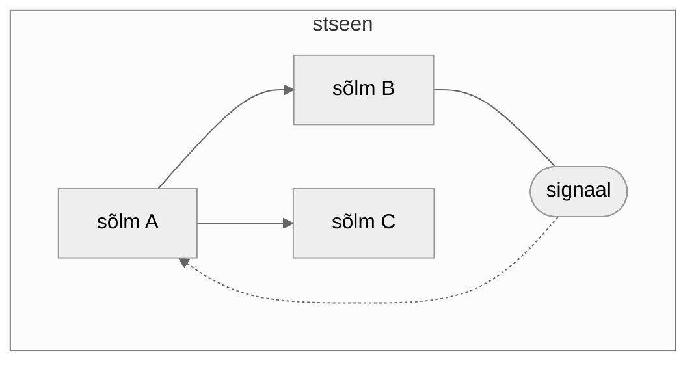

# Põhilised mõisted

Leidub kolm tähtsat mõistet, mis kaasnevad ükskõik mis Godot osaga.

Need on:

1. sõlm (inglise keeles *node*)
2. stseen (inglise keeles *scene*)
3. signaal (inglise keeles *signal*)

**Sõlmed** on Godot's kõige alus. Iga sõlm täidab oma unikaalset rolli. Näiteks sõlme *Sprite2D* kasutatakse kahemõõtmeliste piltide kuvamiseks, aga sõlm *Button* on graafilise kasutajaliidese loomise jaoks. Kui sul on ühe eesmärgi täitmiseks mitut sõlme vaja, saab nad panna kokku ühte **stseeni**.

Sõlmed on stseenis organiseeritud puu-struktuuris. See tähendab, et stseenis on üks juursõlm/vanem-sõlm ja sellel sõlmel võib olla nii palju laps-sõlmi, kui vaja. Üht valminud stseeni võid kasutada ka teises stseenis, mille korral koheldakse seda stseeni nagu mis tahes muud sõlme. Terve Godot-s loodud rakendus koosnebki **stseenipuust** (*scene tree*). Stseen on lihtsalt mugav viis panna ühise eesmärgiga sõlmed kokku.

Sõlmed saavad levitada **signaale**. Nad teevad seda siis, kui mingi märkimisväärne sündmus toimub. Eelnevalt mainitud *Sprite2D* sõlmel, mis kuvab pilte, on signaal nimega *texture_changed*, mille see sõlm siis laiali saadab, kui tema kuvatav pilt ehk tekstuur muutub.

Välja saadetud signaali saab vastu võtta sõlm, mis selle tulekut spetsiifiliselt ootab. Näiteks saab juursõlm vastavalt reageerida, kui ta saab signaali ühelt oma laps-sõlmelt. Sellist kahe sõlme vahelist suhet nimetatakse objektorienteeritud programmeerimises **vaatleja mustriks** (*observer pattern*).