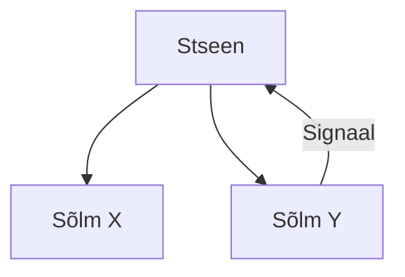

# Põhilised mõisted

Leidub kolm tähtsat mõistet, mis kaasnevad ükskõik mis Godot osaga.

Need on:

1. sõlm (*node*)
2. stseen (*scene*)
3. signaal (*signal*)

Stseen koosneb sõlmedest. Iga sõlm, mis stseenis on, täidab oma unikaalset rolli. Näiteks sõlme nimega *Sprite2D* kasutatakse kahemõõtmeliste piltide kuvamiseks, aga sõlm nimega *Button* on graafilise kasutajaliidese loomise jaoks. Sõlmed on stseenis puustruktuuris. See tähendab, et on üks vanem-sõlm/peasõlm ja sellel sõlmel võib olla nii palju laps-sõlmi, kui vaja. Üht valminud stseeni võid kasutada ka teises stseenis sõlmena.

Terve Godot-s loodud rakendus koosnebki **stseenide puust** (*scene tree*). Stseenid hargnevad omakorda lahti sõlmedeks. Stseen on lihtsalt mugav viis panna ühise eesmärgiga sõlmed kokku.

Sõlmed saavad laiali saata signaale. Nad teevad seda siis, kui mingi märkimisväärne sündmus toimub. Eelnevalt mainitud *Sprite2D* sõlmel, mis kuvab pilte, on signaal nimega *texture_changed*, mille see sõlm siis laiali saadab, kui tema kuvatav pilt ehk tekstuur muutub.

Laiali saadetud signaali saab vastu võtta sõlm, mis selle tulekut spetsiifiliselt ootab. Näiteks saab vanem-sõlm vastavalt reageerida, kui ta saab signaali ühelt oma laps-sõlmelt. Sellist kahe sõlme vahelist suhet nimetatakse objektorienteeritud programmeerimises **vaatleja mustriks** (*observer pattern*).