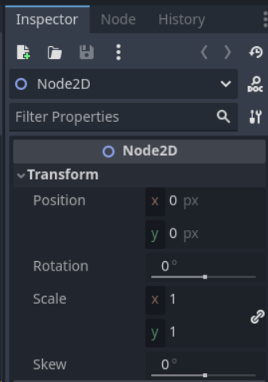
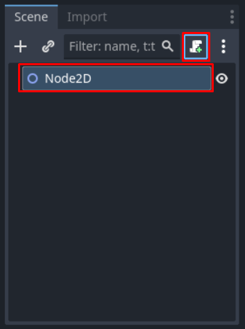
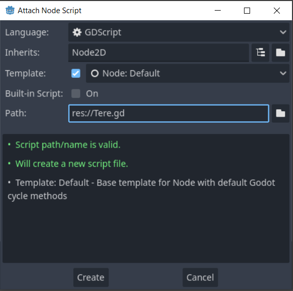
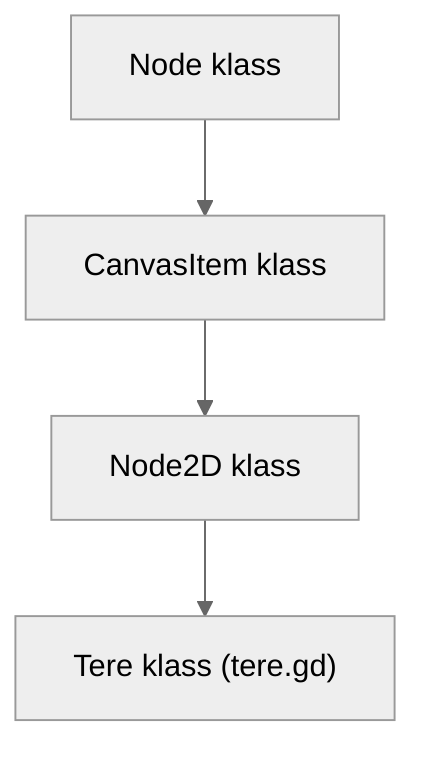
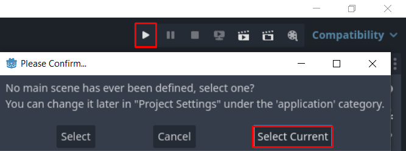
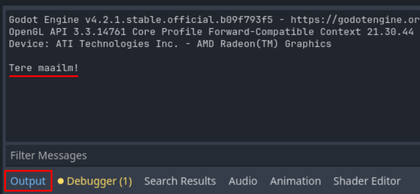
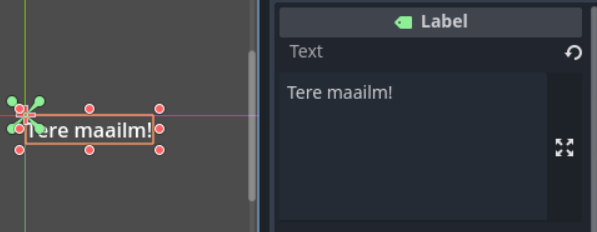

# Tere maailm

## Redaktoris ringi vaatamine

Selles osas tutvume lähemalt sõlmede ja signaalide süsteemiga ning kirjutame esimesed GDScript'i (Godot enda programmeerimiskeel) koodiread.

Kui oled vahepeal redaktori sulgenud, ava uuesti Godot programm. Avaneb taas projektide halduse leht ja nüüd peaksid sealt leidma lahtri, kus on sinu eelmises osas loodud "Tere Maailm" projekt.
Kliki enda projekti peal ja vajuta paremal olevas menüüs nuppu `Edit`. Saad edaspidi sama asja teha projekti peal lihtsalt topelt klikkides.


Leia üles koht stseeni dokis, kus on kirjas *Create Root Node* ehk loo juursõlm. Selle all on 4 nuppu. Vajuta nupule `2D Scene`. See loob sinu stseeni Node2D sõlme, millel on algelised 2D funktsionaalsused ja mõned muud asjad olemas. Põhivaade lülitus ka automaatselt 2D režiimi. Heida pilk inspektori dokki.
Näed, et see jaguneb kolmeks osaks:

1.  Node2D
2.  CanvasItem
3.  Node

Sellest struktuurist loed hiljem täpsemalt. Vajuta inspektoris Node2D all olevale `Transform` nupule, et näha Node2D unikaalseid omadusi. Näed, et sellel sõlmel on omadused nagu *position* ehk positsioon ja *rotation* ehk rotatsioon.



Liigu tagasi stseeni dokki ja vajuta oma loodud Node2D sõlme peal. Tema kohale tekkis paberilehe disainiga nupp, mis loob ja ühendab selle sõlme külge uue skriptifaili. Vajuta selle peale.



Avaneb uus aken. Programm küsib tähtsaid asju nagu mis keeles tahad oma skriptifaili kirjutada, mis **klassi** pärija see skriptifail on ja kuhu failisüsteemis Godot skriptifaili salvestab. Kasutame ikka GDScript keelt ja skriptifail on Node2D pärija. Võid skriptifaili nime muuta näiteks Tere.gd-ks. Vajuta `Create`, et see fail luua ja skripti kirjutamise vaatesse minna.



## Esimesed koodiread

Skripti vaates peaks juba järgnev kood automaatselt seal olema.

```gdscript
extends Node2D

# Called when the node enters the scene tree for the first time.
func _ready():
	pass # Replace with function body.

# Called every frame. 'delta' is the elapsed time since the previous frame.
func _process(delta):
	pass
```

Võtmesõna `extends` täpsustab, mis klassi pärija su skript on. Iga skript Godot-s on uus klass. Tere.gd fail tähendab siis, et lõid klassi nimega Tere, mis on kättesaadav ainult siis, kui selle skripti mingi sõlme külge ühendad. See tähendab, et eelnevalt mainitud Node ja CanvasItem on klassid, mille pärija on Node2D klass.



Võtmesõna `func` kuulutab funktsiooni algust. Funktsiooni nimi `_ready` on Node klassi sisseehitatud funktsioon, mis käivitub siis, kui sõlm stseenide puusse sisestatakse. Tal on ees alakriips, et märgistada seda funktsiooni privaatsena. Muidu tegelikult GDScript-is **ei ole** võtmesõnu `private` ega `public`.

Käsk `pass` tähendab, et see koodirida ei tee mitte midagi.

Funktsioon `_process` käivitub igal kaadril, mida mäng renderdab. Tal on argument `delta`, mis tähistab aega sekundites eelmise kaadri möödumisest.

Kirjuta funktsioonis `_ready` käsu `pass` asemele `print("Tere maailm!")`. Vajuta klaviatuuril `CTRL + S`, et salvestada oma tehtud töö. Tuleb ette stseeni salvestamise aken. `Save` nupu kohal võid stseeni nimeks panna näiteks `Tere.tscn`. Vajuta siis `Save` nuppu, et stseen salvestada. Skriptifail on ka automaatselt salvestatud.

Nüüd käivitame oma projekti, sest tahame näha, kuidas "Tere maailm!" väljastatakse. Tööriistariba paremal pool on kolmnurga kujuline nupp `Run Project`. Sellele vajutades palub redaktor meil peastseen valida. Vajuta nupu `Select Current` peale.



Avaneb uus aken halli taustaga. Maailma tervitust siin ei ole. Selle leiad hoopis redaktori alumiselt ribalt `Output` osast.



Tahaks ikka oma projekti aknas oma sõnumit näha. Pane see praeguseks kinni.

## Label sõlm

Selleks, et oma kirjutatud teksti projektis näha, peame ühte teist sõlme kasutama. Vajuta stseeni dokis Node2D peale ja kustuta see kas  klaviatuurilt `Delete` nupuga või parem-kliki menüüst leides `Delete Node(s)` valiku. Kinnita, et tahad seda kustutada `OK` nupule vajutades. Seekord vajuta plussmärgi-kujulisele nupule või klaviatuuril `CTRL + A`. Avaneb uus aken, mis pakub sulle kõiki sõlmi, mis saadaval on. Kirjuta ülemises osas `Search` otsingulahtrisse sõna "label". Pakutakse sõlme Label. Vajuta akna allosas olevat nuppu `Create`, et see luua.

Vajuta tööriistaribal nupu 2D peale, et tagasi liikuda 2D vaatesse. Uuel Label sõlmel pole enam Tere.gd skriptifaili küljes. Seda teeme hiljem. Vali oma loodud sõlm stseeni dokis ja heida pilk taas inspektorisse ja näed kohe, et Label sõlmel on omadus Text, kuhu saad oma sõnumi kirjutada. Kirjuta tühja tekstikonteinerisse oma sõnum.



Kui nüüd projekti uuesti tööle paned, siis avanevas aknas ongi üleval vasakul nurgas näha sinu kirjutatud sõnum. Pane tähele, et kuna Tere.gd pole Label-i külge ühendatud, siis Output-i ei saadetud enam sinu sõnum.

Järgmises osas teeme nii, et kuvatavat teksti saab muuta teiste sõlmede abil ja õpime signaale kasutama.